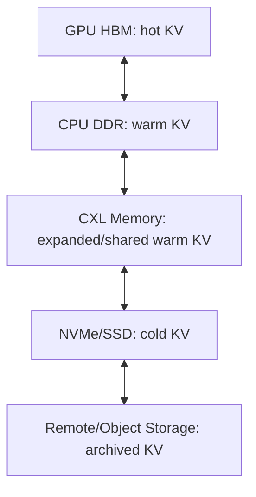

> **版本声明**：本文调研截至 2026-05-13，基于 CXL Consortium、Linux kernel/ndctl 文档、Intel/AMD/Micron/Samsung/SK hynix/Astera/Marvell/Penguin/MemVerge 等公开资料，以及 Beluga、TraCT、CXL-SpecKV、PagedAttention、Pond 等论文；除非特别说明，产品状态均按公开页面或新闻稿描述。

KV cache 正在把推理系统从“显存管理问题”推向“集群内存体系问题”。一个 LLaMA-13B 序列的 KV cache 在最大上下文下可以到 1.7GB，vLLM 当年把 PagedAttention 做成事实标准，解决的是 HBM 内部的碎片和共享问题<a href="https://blog.vllm.ai/2023/06/20/vllm.html">[1]</a>。到了长上下文、RAG、多轮 agent 和 PD 分离之后，问题变成另一件事：HBM 里只放得下 hot KV，warm KV 放在哪里、如何共享、如何迁移，开始决定 TTFT、P99 和 GPU 利用率。

CXL 的价值就在这个层级上。它不是 HBM 替代品。CXL-attached memory 的带宽、时延和访问路径都决定了它不适合直接承担 attention kernel 的主工作集；但它可以成为 HBM 之下、DDR/NVMe 之上的容量型 memory tier。对 KV cache 来说，最现实的落点是 warm KV、prefix cache、PD KV transfer、rack 内 KV cache server，以及可被框架显式管理的分层 allocator。

## 零、Executive Summary

CXL 对 AI Infra 的核心价值，是把内存扩展从“设备 DMA 或网络传输”拉近到“可被 CPU 以 load/store 语义访问的内存”。CXL 基于 PCIe 物理层，同时引入 CXL.io、CXL.cache 和 CXL.mem 三套协议；其中 CXL.mem 让 host 访问设备侧内存，Type 3 设备因此可以像远端 NUMA memory 一样暴露给系统<a href="https://computeexpresslink.org/about-cxl/">[2]</a>。在推理系统里，这个变化的意义不在于让 GPU 直接把 CXL 当 HBM 用，而在于给 KV cache 增加一个更接近内存语义的容量层。

把它放进内存层级里看会更清楚。HBM 负责 hot KV 和每 token attention 读取，延迟和带宽都最敏感；CPU DDR 适合作为本机 warm tier，容量高但被 NUMA 和 PCIe/GPU copy 路径约束；CXL memory 在 DDR 之下提供可插拔、可池化、可跨 host 规划的容量；NVMe/SSD 适合 cold KV、checkpoint、离线 prefix 数据；RDMA 仍然是跨 rack、跨故障域传输的主路径。CXL 与 RDMA 的关系也不是互斥：rack 内可尝试 memory semantics，rack 间仍然要 network semantics。

当前生态已经越过“只有规格和模拟器”的阶段，但还没进入“所有 AI server 默认可用”的阶段。CPU 侧，Intel Xeon 6 和 AMD EPYC 9005 都把 CXL 2.0 放进主流服务器叙事；设备侧，Samsung CMM-D、Micron CZ122、SK hynix CMM-DDR5、SMART/Penguin CMM-E3S 已经覆盖 EDSFF E3.S、AIC、CMM-DDR 等形态；控制器侧，Astera Leo、Marvell Structera、Montage MXC、Microchip SMC、Rambus IP 形成了完整供应链；交换侧，XConn/Marvell Structera S、Panmnesia 等把 CXL 2.0/3.x switching 和 pooling 推到 rack 级。但“能插上 Type 3 扩容”和“能稳定承载生产 KV cache server”之间还有 BIOS、NUMA、hotplug、RAS、telemetry、tenant isolation、GPU direct access 和软件 allocator 这些关口。

KVCache 场景的成熟度更早。公开产品里，Penguin Solutions 在 2026 年 3 月发布 MemoryAI KV cache server，宣称 11TB CXL-based memory、3TB DDR5 main memory 加 8 张 1TB CXL AIC，并与 NVIDIA Dynamo KV cache offloading 兼容<a href="https://ir.penguinsolutions.com/news/news-details/2026/Penguin-Solutions-Introduces-Industrys-First-Production-Ready-CXL-Based-KV-Cache-Server/default.aspx">[3]</a>。论文侧，Beluga 用 CXL 2.0 switch memory pool 把 vLLM cache-hit 场景平均 TTFT 从 RDMA baseline 的 13.00s 降到 1.36s，QPS 从 1.54 提到 11.32<a href="https://arxiv.org/abs/2511.20172">[4]</a>；TraCT 把 CXL shared memory 同时当作 PD KV transfer substrate 和 rack-wide prefix-aware KV cache，报告平均 TTFT 最高 9.8x、P99 最高 6.2x、峰值吞吐最高 1.6x 的改善<a href="https://arxiv.org/abs/2512.18194">[5]</a>。这些结果证明方向值得追，但它们仍然是产品发布、实验系统和研究原型并存的阶段。

后续最值得深入研究的方向有三条。第一，框架级显式 allocator：KV block manager 必须知道 HBM、DDR、CXL、NVMe 的 tier、NUMA 距离和迁移成本，透明 page migration 很难给出稳定 P99。第二，PD 分离的 transfer path：CXL 的短期价值可能先出现在 prefill 写、decode 读的 rack 内共享路径，而不是 decoder 每步跨 CXL 读 hot KV。第三，KV cache server 的一致性与隔离：CXL 2.0 多 host 场景没有天然跨 host CPU cache coherence，系统要把 metadata、锁、flush、DDIO、poison、AER、reset 和 tenant security 当成一等设计对象。

## 一、CXL 基础

CXL 可以被理解成 PCIe 之上的一致性与内存语义扩展。PCIe 本身擅长配置、I/O、DMA 和设备枚举；CXL 在相同物理层上增加了 cache-coherent interconnect 的能力，让 CPU、accelerator 和 memory expander 之间可以共享更接近内存的访问模型。CXL.io 负责设备发现、配置、中断、MMIO 等 PCIe 类路径；CXL.cache 让设备缓存 host memory；CXL.mem 让 host 访问 device-attached memory。Type 1 设备通常是没有大容量本地内存的 coherent accelerator；Type 2 设备带本地内存，例如 GPU、FPGA、DPU；Type 3 设备则是 memory expansion 或 pooling 设备，KV cache 讨论里最常见的就是 Type 3。

memory expansion、pooling 和 sharing 是三个容易混在一起的词。Expansion 是一台 host 通过 CXL.mem 扩展自己的内存容量，最接近“再插一块远端 NUMA memory”。Pooling 是多个 host 背后共享一组 memory devices，通过 fabric manager、switch 和分配策略把容量切给不同 host。Sharing 更进一步，同一段 memory 可以在多个 host 或 device 之间被协作访问，这时一致性、同步和访问权限会变成系统设计主线。对 KV cache 来说，单 host expansion 已经能做 PoC；PD 分离和 KV cache server 更依赖 pooling/sharing。

Linux 里的暴露方式也会影响上层设计。CXL Type 3 memory 可以通过 platform firmware 标记为 EFI_MEMORY_SP 这类 Soft Reserved memory，再由 device-dax 暴露成 `/dev/daxX.Y`；也可以通过 `daxctl reconfigure-device --mode=system-ram` 热插成普通内存，让 page allocator 和 NUMA policy 接管<a href="https://pmem.io/ndctl/daxctl/daxctl-reconfigure-device.html">[6]</a>。前者适合显式 KV allocator，后者适合快速验证容量扩展，但透明性会牺牲控制力。

| CXL 版本 | 主要能力 | 和 KVCache 的关系 | 当前成熟度 |
|---|---|---|---|
| CXL 1.1 | 基于 PCIe 5.0，支持 CXL.io/cache/mem，主要面向 direct-attach 设备 | 可做单 host Type 3 memory expansion，把 CXL memory 暴露为 NUMA tier | CPU 与早期 Type 3 设备已存在，switching/pooling 能力有限 |
| CXL 2.0 | 引入 switching、memory pooling、fabric manager、IDE 等能力 | rack 内 KV pool、PD KV transfer、KV cache server 的第一批实物基础 | 2025-2026 年进入产品和 Demo 密集期，BIOS/OS/管理栈仍需验证 |
| CXL 3.0/3.1 | 基于 PCIe 6.x，256B flit，multi-level switching，增强 fabric、memory sharing、MLD、PBR/HBR 等 | 更接近真正 rack-scale shared KV tier，可减少点对点绑定 | 控制器和 switch 开始采样/展示，生产部署仍早 |
| CXL 4.0 | 带宽从 64GT/s 提升到 128GT/s，支持 bundled ports，增强 memory RAS，保持向后兼容<a href="https://computeexpresslink.org/about-cxl/">[2]</a> | 给 Type 2/accelerator 和共享 memory tier 提供更高上限 | 规格可用，产品生态尚在后续周期 |

这里有一个工程边界必须先写清楚。CXL 的 load/store semantics 主要是 host 访问 device memory 的语义，不自动等价于 GPU attention kernel 可以像读 HBM 一样读 CXL memory。GPU 访问 CXL memory 还会受到 root complex、P2P、IOMMU、BAR mapping、DMA engine、vendor driver、cacheability 和 topology 限制。论文原型可以把 GPU-CXL direct copy 或 custom CUDA kernel 做出来，生产系统还要逐台服务器验证。

## 二、CXL 硬件生态

硬件生态已经形成从 CPU root port 到 memory device、controller、switch、server/appliance 的链条。真正影响 AI server 的因素不止“某个器件支持 CXL”这一个点，还包括 root port 数量、PCIe lane 分配、BIOS 选项、NUMA 拓扑、机箱能否容纳 E3.S/AIC、GPU 与 CXL device 是否在同一 PCIe switch/Root Complex 下，以及故障和热插拔路径能不能被运维系统接住。

### 2.1 CPU / Host Platform

| 平台 | CXL 支持 | Type 3 memory expansion | switching / pooling | 对 AI server 的实际意义 |
|---|---|---|---|---|
| Intel Sapphire Rapids / 4th Gen Xeon | CXL 1.1，PCIe 5.0，Intel 文档明确要求按 CXL 1.1 DVSEC 与设备交互<a href="https://www.intel.com/content/www/us/en/developer/articles/technical/fourth-generation-xeon-scalable-family-overview.html">[7]</a> | 可接早期 Type 3 设备 | 主要受限于 CXL 1.1 时代平台 | 适合早期扩容验证，不是 rack-scale pooling 的理想基线 |
| Intel Xeon 6 / Granite Rapids | Intel 产品简报写到最高 12 memory channels，并把 Flat Memory Mode 与 CXL 2.0 DDR memory 结合为统一内存区域<a href="https://www.intel.com/content/www/us/en/products/docs/xeon-6-product-brief.html">[8]</a> | 明确面向 Type 3 扩容 | 与 CXL 2.0 switch/pooling 更匹配 | 适合做 CXL+KVCache PoC 的主流 Intel 平台 |
| AMD EPYC 9004 / Genoa | 12 DDR5 channels、128 PCIe Gen5 lanes；公开页面主要强调平台 I/O 与内存容量<a href="https://www.amd.com/en/products/processors/server/epyc/9004-series.html">[9]</a> | 可作为 CXL 1.1/早期 CXL 平台验证，取决于 OEM BIOS | pooling 能力依赖平台和 switch | lane 多，适合 GPU+NIC+CXL 混插，但要逐机型确认 root port |
| AMD EPYC 9005 / Turin | AMD datasheet 写明 CXL 2.0 capabilities、12 DDR5-6400 channels、128 PCIe Gen5 lanes<a href="https://www.amd.com/content/dam/amd/en/documents/epyc-business-docs/datasheets/amd-epyc-9005-series-processor-datasheet.pdf">[10]</a> | 面向 CXL 2.0 memory-intensive workload | 与 Micron/Astera/Marvell 等生态验证密集 | AI server 做 CXL KV tier 的另一个主流基线 |

AI server 的难点在 lane budgeting。一个 8-GPU 节点已经要为 GPU、NIC、NVMe、BMC、storage HBA 分配大量 PCIe lanes；CXL memory 如果以 E3.S 或 AIC 插入，会占用 x8/x16 链路，并改变 NUMA 距离。KV cache PoC 不能只看 CPU 是否支持 CXL，还要画出 GPU 到 CXL memory 的 PCIe tree：同一 root complex、跨 socket、跨 switch，性能会是三种系统。

### 2.2 CXL Memory Device

| 厂商 | 产品 | 容量 | 带宽 | CXL 版本 | 形态 | 状态 | 资料来源 |
|---|---|---|---|---|---|---|---|
| Samsung | CMM-D / MD220 | 128GB、256GB | 页面标注 speed up to 6.4Gbps，DDR5 | CXL 2.0 | EDSFF E3.S 2T | 公开产品页 | Samsung CMM-D<a href="https://semiconductor.samsung.com/cxl-memory/cmm-d/">[11]</a> |
| Micron | CZ122 | 128GB、256GB | 最高 37GB/s；AI data center 页写 36GB/s、24% increased server memory bandwidth | CXL 2.0 | E3.S，PCIe Gen5 x8 | qualification samples，CZ120 volume production/shipping | Micron CZ122 blog 与产品页<a href="https://www.micron.com/about/blog/applications/data-center/introducing-micron-cz122-and-red-hat-certification-of-memory-expansion-portfolio">[12]</a><a href="https://www.micron.com/products/memory/cxl-memory">[13]</a> |
| SK hynix | CMM-DDR5 | 96GB；128GB 在客户验证中 | 36GB/s，较既有 DDR5 module 带宽提升 30% | CXL 2.0 | CMM-DDR5 | 96GB 完成客户验证 | SK hynix Newsroom<a href="https://news.skhynix.com/sk-hynix-completes-customer-validation-of-cxl-based-ddr5/">[14]</a> |
| SMART / Penguin | CMM-E3S | 64GB、96GB、128GB | 未在产品页稳定公开统一数字 | CXL 2.0 | E3.S，PCIe Gen5 x8 | 公开产品页 | SMART CMM-E3S<a href="https://www.smartm.com/product/cmm-cxl-memory-module-e3s">[15]</a> |
| SMART / Penguin | CXL AIC / MemoryAI 组合 | Penguin 新闻稿写 8 张 1TB CXL AIC，总 CXL memory up to 11TB appliance | 新闻稿声称比 NVMe-based approaches 快 10x | CXL memory | AIC / appliance | 生产就绪 KV cache server 发布 | Penguin MemoryAI<a href="https://ir.penguinsolutions.com/news/news-details/2026/Penguin-Solutions-Introduces-Industrys-First-Production-Ready-CXL-Based-KV-Cache-Server/default.aspx">[3]</a> |

Memory device 的关键差异不只在容量。CXL memory module 背后有 controller、DRAM channels、ECC/RAS、poison handling、firmware、telemetry、security、thermal envelope。KV cache 对小块读写、scatter/gather、页粒度迁移非常敏感，同样 256GB 的 CXL device，如果 controller 对读写混合、并发 queue、预取、write combining 的处理不同，端到端 TTFT 会差很多。

### 2.3 CXL Controller

| 厂商 | 产品 | 后端内存 | 能力重点 | AI / KVCache 相关性 |
|---|---|---|---|---|
| Astera Labs | Leo CXL Smart Memory Controller | DDR5 RDIMM，A1000 AIC 最高 4 个 DDR5 RDIMM、2TB | memory expansion、pooling、sharing，COSMOS telemetry/RAS，CXL 1.1/2.0 | 页面直接列 AI inferencing demo、DLRM demo，适合构建 CXL memory appliance<a href="https://www.asteralabs.com/products/leo-cxl-smart-memory-controllers/">[16]</a> |
| Marvell | Structera A / X | A: DDR5 + Arm Neoverse V2 near-memory accelerator；X: DDR5/DDR4 expander | CXL 2.0，最高 200GB/s，LZ4 inline compression，security module，secure boot | Structera X 面向 capacity expansion，Structera A 面向 bandwidth/near-memory compute，可用于 KV compression/prefetch 方向探索<a href="https://www.marvell.com/products/cxl.html">[17]</a> |
| Montage | M88MX5891/5851、M88MX6852 | DDR4/DDR5；M88MX6852 dual-channel DDR5 up to 8000MT/s | Type 3 MXC，CXL 2.0/3.1，PCIe 6.2 x8 64GT/s，支持 split x4 | Samsung CXL module 生态合作，CXL 3.1 controller 采样说明下一代 memory expander 进入器件阶段<a href="https://www.montage-tech.com/MXC/M88MX6852">[18]</a> |
| Microchip | SMC 2000 / PM8702/PM8712 | DDR4/DDR5 | CXL 1.1/2.0 Type 3，PCIe 5.0，低时延 smart memory controller | workstation/server AIC 与早期 Type 3 扩容常见控制器路线<a href="https://www.microchip.com/en-us/products/memory/smart-memory-controllers">[19]</a> |
| Rambus | CXL Controller IP | 取决于 SoC 集成，可配合 DDR/HBM/GDDR/LPDDR IP | CXL 2.0/3.1 controller IP，支持设备类型、PIPE、SR-IOV、buffer/latency 参数化 | 对自研 ASIC、FPGA、accelerator memory device 是基础 IP，而不是整机产品<a href="https://www.rambus.com/interface-ip/cxl/">[20]</a> |

KVCache 方向最值得关注的 controller 能力是 compression、telemetry 和 near-memory compute。KV cache 天然可压缩、可量化、可稀疏化；如果 CXL controller 或 near-memory accelerator 能在不改变 CXL.mem 接口的前提下降低有效带宽压力，CXL memory 才有机会从“容量层”进一步变成“KV 处理层”。TRACE 这类研究已经沿着这个方向给出结果：它在 CXL tier 内部改变张量表示和压缩路径，报告 BF16 KV footprint 降低 46.9%，GPT-OSS-120B-MXFP4 在 128K tokens 下 throughput 从 16.28 tok/s 提到 68.99 tok/s<a href="https://arxiv.org/abs/2509.03377">[21]</a>。

### 2.4 CXL Switch / Fabric

| 厂商 | 产品/方案 | 版本与规模 | Type 2 / Type 3 | 关键能力 | 与 PD / KV sharing 的关系 |
|---|---|---|---|---|---|
| XConn / Marvell | XC50256 / Structera S 20256 | PCIe 5.0 / CXL 2.0，Beluga 论文使用 256 lanes、2TB/s forwarding capacity | 面向 Type 3 memory pool，亦可连接多类 PCIe/CXL endpoint | switching、memory pooling、多 host 接入 | Beluga 直接基于该类 CXL 2.0 switch 构建 8TB pool<a href="https://arxiv.org/abs/2511.20172">[4]</a> |
| Marvell | Structera S 30260 | 260-lane CXL switch，面向 rack-level memory pooling | 面向 CPU、GPU、XPU、accelerator 的 rack memory pool | 通过 XConn 技术进入 switch 产品线，强调 AI memory wall | 公开新闻稿把它定位成 rack 级 memory pooling 设备<a href="https://www.marvell.com/company/newsroom/marvell-next-gen-cxl-switch-memory-pooling-breaks-ai-memory-wall.html">[22]</a> |
| Panmnesia | CXL / PCIe Fusion Switch | 公开资料强调 CXL 3.x / PCIe fusion | 面向 Type 2/Type 3 混合 fabric | PBR/HBR/MLD 等 CXL 3.x fabric 能力 | 更接近长期 KV sharing 与 accelerator-memory composability |
| Fabric Manager | vendor + OS + BMC 管理组合 | CXL 2.0 起成为 pooling 的必要控制面 | 管理 host、switch、device decoder | 分配、隔离、hotplug、RAS、telemetry | KV cache server 必须把 fabric manager 视作控制平面的一部分 |

CXL switch 对 KVCache 的潜在意义，是让“同一份 warm KV”不再固定属于某台 prefill host 或某张 GPU。PD 分离里，prefill 产生 KV，decode 消费 KV；如果中间路径是 RDMA，系统要管理 NIC queue、network congestion、copy engine、serialization 和 locality routing。如果中间路径是 CXL shared memory，系统可以把 transfer 问题改写成“谁拥有某些 CXL block，谁可以读，读之前怎么同步”。这不会让复杂性消失，但复杂性的位置发生了变化。

### 2.5 Server / Cloud / Appliance

| 系统/厂商 | 产品/方案 | CXL 用法 | 与 AI/KVCache 的关系 | 成熟度 | 资料来源 |
|---|---|---|---|---|---|
| Lenovo | ThinkSystem CXL memory module 支持 | ThinkSystem V3/V4 服务器支持 CXL memory option | 适合企业服务器扩容与 PoC，AI GPU 机型还要看拓扑 | OEM option 级别 | Lenovo Press<a href="https://lenovopress.lenovo.com/lp1912-thinksystem-cxl-memory-modules">[23]</a> |
| Supermicro / Dell / HPE / Inspur / Giga Computing | 多数以 Xeon 6 / EPYC 9005 平台和 EDSFF/AIC 扩展交付 | 提供 root port、slot、BIOS、thermal 与系统认证 | 真正落地取决于具体 SKU，而不是品牌名 | 机型碎片化，需逐型号确认 | OEM 产品页与平台手册 |
| Microsoft Azure / Pond | Pond CXL memory pooling research | 8-16 sockets 小池化，load/store access pool memory | 云平台 memory pooling 的系统证据，间接支撑 KV cache server 的 rack 范围选择 | 论文/云内研究，非通用公测产品 | Microsoft Research Pond<a href="https://www.microsoft.com/en-us/research/?p=887910">[24]</a> |
| Penguin Solutions | MemoryAI KV cache server | 3TB DDR5 + up to eight 1TB CXL AIC，11TB memory appliance | 明确面向 KV cache offload、TTFT、TPOT、GPU 利用率，与 NVIDIA Dynamo 兼容 | 新闻稿称 production-ready，已有客户部署 | Penguin News<a href="https://ir.penguinsolutions.com/news/news-details/2026/Penguin-Solutions-Introduces-Industrys-First-Production-Ready-CXL-Based-KV-Cache-Server/default.aspx">[3]</a> |
| MemVerge | Memory Machine X / GISMO | CXL fabric-attached memory，shared memory object API | 可把跨节点共享对象用于 cache/AI 框架；更像软件层共享内存 substrate | 产品/方案阶段 | MemVerge GISMO<a href="https://memverge.ai/memory-machine-cxl-fabric-attached-memory/">[25]</a> |
| NVIDIA Dynamo | KVBM、KV cache offloading | 当前公开文档主要描述 CPU/disk tier、NIXL transport 与 KV-aware routing | CXL appliance 可作为底层 tier 或外部 KV memory server 接入 | 软件框架成熟度提升中，CXL 依赖硬件集成 | NVIDIA Dynamo docs<a href="https://docs.nvidia.com/dynamo/v1.0.2/components/kvbm">[26]</a> |

这张表说明一个现实：CXL + KVCache 目前不是单一产品形态。它可能是一台 appliance，可能是一组 CXL AIC，可能是 GPU server 里的 E3.S memory devices，也可能是 MemVerge 这类软件把 CXL shared memory 封装成 object store。后续做 PoC 时，先要选择验证对象：验证 memory tier、KV transfer、prefix sharing，还是完整 cache server。

## 三、CXL 软件栈

Linux CXL 栈的中心是 firmware、ACPI、kernel driver、DAX、ndctl/cxl-cli/daxctl 和 NUMA/memory tiering 的组合。kernel 文档把这件事说得很直白：CXL device configuration 是 platform、OS early boot、kernel driver 和 user policy 之间的复杂交接，涉及 CEDT、SRAT、HMAT、SLIT、decoder programming、memory hotplug、NUMA node、memory tiers、DAX device、page allocator、demotion 和 huge pages<a href="https://docs.kernel.org/driver-api/cxl/index.html">[27]</a>。这不是一个“插上就等于普通内存”的接口。

| 模式 | 说明 | 优点 | 缺点 | 适合 KVCache 吗 |
|---|---|---|---|---|
| devdax | 应用显式 mmap `/dev/daxX.Y`，把 CXL memory 当作 direct-access device memory | allocator 可控，可按 KV block、prefix、tenant 做布局；便于做一致性和 telemetry | 需要框架改造，必须处理页大小、alignment、NUMA、failure、recovery | 适合显式 KV allocator 和 cache server |
| system-ram | 通过 daxctl 把 DAX device hotplug 成普通 system RAM，成为 memory-only NUMA node | 对应用透明，可快速验证扩容、Linux page placement、numactl/mempolicy | page migration 不懂 KV 热度；P99、eviction 和 prefetch 难控 | 适合通用扩容或轻量 PoC，不适合作为最终 KV control plane |

对 KV cache 来说，显式 allocator 通常比透明 page migration 更可控。原因很简单：KV block 有明确语义，框架知道某个 block 属于哪层、哪段 prompt、哪个 tenant、热度如何、下一步是否会被 decode 读取。Linux page migration 只能从 page fault、access bit、NUMA balancing、tiering policy 里推断热度，它不知道这个 page 是马上要读的 decode KV，还是永远不会再命中的 prefix tail。把这样的语义丢给透明系统，平均值也许好看，P99 很容易失控。

CXL NUMA 距离、页大小、TLB、prefetch 和 DMA mapping 都会进入性能路径。devdax 默认 alignment 常见为 2MB，应用如果按 16-token KV block 这种小粒度组织，需要在虚拟地址、block metadata 和大页之间做映射；system-ram 模式下，CXL memory 可能被放在 memory-only NUMA node，`numactl --membind` 或 cgroup/mempolicy 可以控制放置，但无法保证只放 KV。GPU 侧还要验证 DMA mapping：GPU copy engine、GDS、P2P、IOMMU、ATS/PRI、BAR aperture 和同 root complex 拓扑都可能成为瓶颈。

框架感知 CXL tier 的合理方式，是在 KV block manager 里引入 tier descriptor。每个 tier 至少包含 capacity、latency、bandwidth、NUMA node、page size、transfer engine、failure domain、eviction cost、tenant policy 和 telemetry handle。vLLM、SGLang、TRT-LLM、Dynamo 这类系统已经有 block manager 或 KV connector 概念；CXL 的接入应该进入这个抽象，而不是伪装成“更慢一点的 malloc”。

## 四、KVCache 背景与痛点

LLM 推理里的 KV cache 来自 attention。prefill 阶段，模型对输入 prompt 做前向计算，把每层 attention 的 key/value 存下来；decode 阶段，每生成一个 token，query 会和历史 token 的 K/V 做 attention，历史 K/V 不再重复计算。单 token KV 大小可以写成：

```text
bytes_per_token = 2 * num_layers * num_kv_heads * head_dim * bytes_per_element
total_kv_bytes = bytes_per_token * active_tokens * batch_or_concurrency
```

其中 `2` 代表 K 和 V。batch size、context length、layer 数、KV heads、head_dim、dtype 都会线性放大 KV cache。GQA/MQA 会减少 `num_kv_heads`，MLA 会改变公式里的隐变量；但对系统来说，结论没有变化：上下文越长、并发越高、请求越能复用前缀，KV cache 越会从“临时激活”变成“必须被管理的数据对象”。

HBM 容量会限制并发，HBM 带宽会限制 decode。TTFT 主要受 prefill 计算和 KV 复用/加载路径影响；TPOT 受每步 decode 的权重读取、KV 读取、attention kernel 和调度影响；P99 latency 则会被 cache miss、跨 tier 迁移、metadata lookup、GPU idle 和网络/CXL contention 放大。PagedAttention 把 KV 管理从连续分配改成 block/page 分配，减少碎片并支持共享<a href="https://arxiv.org/abs/2309.06180">[28]</a>；prefix cache、KV reuse、offload、quantization、compression、eviction、prefetch、hierarchical KV cache 和 PD separation，则是在不同层次上继续控制容量和迁移成本。



这张层级图里，CXL 最自然的位置在 DDR 与 SSD 之间，也可以和 DDR 并列为本机或 rack 内 warm tier。它离 HBM 不够近，不能承担每步 attention 的主读路径；它又比 NVMe 更接近内存，可以放 prefix cache、命中过的长上下文 KV、PD transfer 中间态，以及跨请求共享的 warm blocks。系统真正要做的是让 hot/warm/cold 边界可预测。

## 五、CXL 与 KVCache 的结合方式

CXL + KVCache 可以分成五类。第一类是单机扩容：CXL Type 3 memory 作为 CPU DDR 之外的 NUMA memory，KV offload 从 HBM 落到 DDR/CXL。这个路径实现最简单，收益取决于上下文长度、命中率和 GPU-CXL transfer path。第二类是显式 warm tier：KV block manager 把不在当前 decode critical path 上的 block 放到 CXL，命中时异步 prefetch 回 HBM。第三类是 prefix cache：长系统 prompt、RAG 文档、agent 固定上下文的 KV 放在 CXL pool，让多个请求复用。第四类是 PD KV transfer：prefill 节点写 CXL shared memory，decode 节点读，减少 RDMA hop 或 host bounce buffer。第五类是 KV cache server：一台或一组 CXL memory appliance 维护全局 block namespace、metadata 和 eviction policy，推理框架通过 connector 访问。

Beluga 是目前最直接的系统证据。它用 CXL switch 连接最多 16 台服务器和 8TB memory pool，目标聚合带宽 1TB/s；在 vLLM cache-hit 场景中，Beluga-KVCache 相比 RDMA-based MoonCake 把平均 TTFT 从 13.00s 降到 1.36s，QPS 从 1.54 提到 11.32<a href="https://arxiv.org/abs/2511.20172">[4]</a>。这里的核心不只是“CXL 容量更大”，更关键的是 CXL memory pool 让细粒度 KV gather/scatter 和 metadata RPC 更接近共享内存路径。


*图 1：Beluga-KVCache 把共享 memory pool、global index 和 scheduler 放在同一套 CXL 访问语义下处理。CXL 的价值不只在容量，也在于减少 RDMA 式远端访问路径里的 bounce buffer、RPC 和 completion 开销。来源：Beluga arXiv HTML Figure 9。*

TraCT 进一步把这个思路推到 PD 分离。它把 CXL shared memory 同时用作 KV-transfer substrate 和 rack-wide prefix-aware KV cache，并在 Dynamo 框架上实现。论文报告，在静态和合成 workload 上，相比 RDMA 和 DRAM cache baseline，TraCT 平均 TTFT 最高 9.8x、P99 最高 6.2x、峰值 throughput 最高 1.6x<a href="https://arxiv.org/abs/2512.18194">[5]</a>。这类结果提示一个更具体的路线：CXL 的第一优先级应放在减少 prefill 到 decode 的 KV transfer 成本，decoder 每步跨 CXL 读 hot KV 反而是更危险的路径。

## 六、适合做什么，不适合做什么

CXL 适合放 warm KV。warm KV 的特点是容量大、复用概率高、马上不在 attention kernel critical path 上，但命中时重算成本很高。RAG 场景里的大文档 prefix、agent 多轮任务里的固定 repo 上下文、企业助手里的长系统 prompt、PD 分离里的 prefill output，都符合这个特征。Penguin 的 MemoryAI 新闻稿也把目标 workload 写成实时金融新闻解析、10-K 数据集 RAG 和监管合规分析这类大窗口、低延迟企业任务<a href="https://ir.penguinsolutions.com/news/news-details/2026/Penguin-Solutions-Introduces-Industrys-First-Production-Ready-CXL-Based-KV-Cache-Server/default.aspx">[3]</a>。

CXL 不适合直接替代 GPU HBM 做 attention 主存储。decode 每步都会读历史 KV，访问模式虽然可预测，但吞吐和尾延迟对 HBM 带宽非常敏感。跨 PCIe/CXL 读 hot KV，会把每 token critical path 拉长，还会和 GPU copy、NIC、NVMe、其他 CXL 设备竞争 I/O fabric。CXL 更合理的工作方式是提前把可能马上使用的 KV prefetch 回 HBM，或者让 CXL 承担 cache-hit 的恢复路径，而不是让所有 attention read 都跨出 GPU。

它也不适合替代跨 rack RDMA。CXL fabric 的现实部署半径更像 rack 内或机箱内 memory fabric；跨 rack 的故障域、布线、拥塞控制、租户隔离和运维模型仍然是网络系统的世界。更实际的架构是 rack 内 CXL pool + rack 间 RDMA/以太网，KV cache server 在每个 rack 内维护 warm tier，跨 rack 做 coarse-grained replication 或 fallback。

最容易踩坑的是“透明扩容”。把 CXL memory hotplug 成 system-ram，然后期待 Linux 自动把 KV 放到合适位置，可以快速看容量上限，但很难回答生产问题：哪个 tenant 的 prefix 被驱逐了，哪个 block 应该 prefetch，哪个页迁移导致 P99 抖动，哪个 CXL device poison 影响了正在生成的请求。真正要把 CXL 用好，KV block 的生命周期必须回到框架手里。

## 七、公开产品、Demo、论文与开源软件

| 类型 | 名称 | 做了什么 | 成熟度判断 |
|---|---|---|---|
| 产品 | Penguin MemoryAI KV cache server | 11TB CXL-based memory appliance，兼容 NVIDIA Dynamo，面向 KV cache offload、TTFT/TPOT/throughput | 最接近公开产品化，但性能数据仍以厂商口径为主<a href="https://ir.penguinsolutions.com/news/news-details/2026/Penguin-Solutions-Introduces-Industrys-First-Production-Ready-CXL-Based-KV-Cache-Server/default.aspx">[3]</a> |
| 软件/产品 | MemVerge GISMO / Memory Machine X | 用 CXL fabric-attached memory 暴露共享 memory object API，强调跨节点 IO-free data sharing | 可作为 shared memory substrate，不是专门的 KVCache 框架<a href="https://memverge.ai/memory-machine-cxl-fabric-attached-memory/">[25]</a> |
| 框架 | NVIDIA Dynamo KVBM / KV cache offloading | KVBM 管理异构/分布式 KV blocks；offloading 文档描述 CPU/disk tier、NIXL transport、KV-aware routing | CXL appliance 的上层接入口，但公开文档中 CXL 仍依赖硬件方案集成<a href="https://docs.nvidia.com/dynamo/v1.0.2/components/kvbm">[26]</a> |
| 论文 | Beluga | CXL switch memory pool + KV cache management + CXL-RPC，优化 RDMA 式 offload | 最贴近 CXL+KVCache 的完整系统原型<a href="https://arxiv.org/abs/2511.20172">[4]</a> |
| 论文 | TraCT | CXL shared memory 作为 PD KV transfer 与 rack-wide prefix-aware KV cache | 直接瞄准 PD 分离的 CXL 路线<a href="https://arxiv.org/abs/2512.18194">[5]</a> |
| 论文 | CXL-SpecKV | FPGA + CXL memory disaggregation + speculative KV prefetch + compression/decompression | 更偏长期的 device-side acceleration 路线，报告最高 3.2x throughput、2.8x memory cost reduction<a href="https://arxiv.org/abs/2512.11920">[29]</a> |
| 论文 | TRACE | 在 CXL controller 路径上做 KV-specific transform、lossless compression 与 precision-proportional fetch | 证明“容量层 + 近内存处理”对 LLM inference 有潜力<a href="https://arxiv.org/abs/2509.03377">[21]</a> |
| 论文 | Predictive Multi-Tier KV | 把 HBM、CPU DRAM、CXL、NVMe、RDMA、parallel FS 纳入统一 KV tiering 问题 | 更偏策略层，强调 predictive placement 与 MLA sizing<a href="https://arxiv.org/abs/2604.26968">[30]</a> |
| 基础系统 | vLLM PagedAttention / Mooncake / LMCache | Paged KV block、distributed KV sharing、RDMA/NIXL/CPU/disk offload | 多数不是 CXL-native，但提供 CXL connector 的上层对象模型<a href="https://github.com/kvcache-ai/Mooncake">[31]</a> |


*图 2：Beluga 用 Qwen-32B GQA 展示了 KV cache transfer 的碎片性：一个 16-token block 会展开成跨 layer 与 K/V 的大量非连续片段。CXL 的优势来自更适合细粒度 gather/scatter 的共享内存路径，而不是单纯更大的容量。来源：Beluga arXiv HTML Figure 10。*

这组材料需要分层理解。Penguin 是产品化信号，说明 CXL-based KV cache server 已经进入供应商销售话术和客户试用。Beluga、TraCT 是系统研究信号，说明 CXL shared memory 可能改变 PD/KV transfer 的成本模型。CXL-SpecKV、CXL-NDP 是器件侧路线信号，说明 controller/FPGA/near-memory accelerator 可能在 KV compression、prefetch、NDP 上做更多事。Dynamo、Mooncake、LMCache 则是软件抽象信号，说明上层框架已经把 KV block 当作可迁移对象管理，只差把 CXL 纳入 tier。

## 八、技术路线：短期、中期、长期

短期路线是单机或单 rack PoC。最稳的做法是选一台 Xeon 6 或 EPYC 9005 服务器，插入 Micron CZ122、Samsung CMM-D、SMART CMM-E3S 或 Astera/Marvell/Microchip 控制器的 AIC，把 CXL memory 暴露成 devdax 或 system-ram。先实现 CPU DDR 与 CXL 的 KV tier，对比 HBM-only、HBM+DDR、HBM+DDR+CXL。这个阶段不要急着做全局 cache server，先把 NUMA 距离、page size、copy bandwidth、prefetch hit rate 和 P99 量清楚。

中期路线是 PD 分离与 rack 内 sharing。prefill worker 把 KV block 写入 CXL shared memory，decode worker 按 block id 拉取；metadata server 维护 prefix tree、block refcount、tenant salt、eviction policy 和 ownership。这个阶段需要 CXL switch、fabric manager、两级同步、cache flush/uncacheable policy、failure handling。TraCT 和 Beluga 的共同启发是，CXL 可以先替代 PD transfer 的一段 RDMA 路径，而不是替代全部网络。

长期路线是 KV cache server 和近内存处理。KVCache 会逐渐像数据库 buffer pool：有全局 namespace、热度统计、压缩格式、版本、租户隔离、prefetch 计划、异步回写、故障恢复。CXL 3.x/4.0、Type 2/Type 3 混合 fabric、controller-side compression、NDP、FPGA speculative KV prefetch 都会进入同一条路线。届时判断 CXL 产品的关键指标不会只是“多少 TB”，还会包括每瓦有效 KV bandwidth、每次 cache-hit 恢复延迟、metadata QPS、poison recovery 时间和跨 tenant side-channel 风险。

## 九、PoC 与研究实验设计

PoC 的第一条原则是把变量拆开。不要一开始就比较“CXL 系统 vs 旧系统”，那会把容量、命中率、prefetch、网络、调度和模型差异混在一起。更合理的对照组是：HBM-only；HBM+CPU DDR offload；HBM+DDR+NVMe；HBM+DDR+CXL devdax；HBM+DDR+CXL system-ram；如果有 switch，再加 HBM+CXL shared memory pool；如果有 RDMA baseline，再加 Mooncake/LMCache/Dynamo 的 RDMA or NIXL path。

实验 workload 至少要覆盖三类。第一，短 prompt 低复用，验证 CXL 不会拖垮基础 TPOT。第二，长上下文高复用，例如 32K/64K/128K RAG 和固定系统 prompt，验证 warm KV 命中收益。第三，PD 分离 workload，prefill 和 decode 分布在不同 GPU/host，测 KV transfer 对 TTFT/P99 的影响。每类 workload 都要扫 batch size、concurrency、context length、output length、prefix hit rate、eviction pressure。

指标不要只看 throughput。核心指标应包括 TTFT、TPOT、P50/P95/P99 latency、QPS、GPU SM utilization、HBM usage、HBM bandwidth、CXL read/write bandwidth、CXL tail latency、CPU utilization、copy engine utilization、NUMA remote access、page fault、TLB miss、cache hit ratio、prefetch accuracy、eviction regret、metadata lookup latency、AER/poison/hot reset 事件。KV cache server 还要测 per-tenant isolation、故障恢复时间和 metadata consistency。

实现路径可以分三步。第一步用 system-ram 模式完成容量和基准吞吐验证，尽快确认硬件、BIOS、Linux、NUMA、GPU copy 路径可用。第二步切到 devdax，实现显式 KV allocator，把 CXL memory 切成固定 block arena，metadata 放 DDR，数据放 CXL，支持异步 prefetch 回 HBM。第三步加入跨 host 或 PD 分离：prefill 写 CXL pool，decode 读，metadata server 做 prefix-aware routing。每一步都要保留上一阶段对照组，否则无法判断收益来自 CXL 语义、容量扩展，还是单纯来自更高 cache hit。

一个最低可行 PoC 的成功标准可以设得很具体：在 32K+ context、prefix hit rate ≥ 50% 的 workload 下，CXL tier 相比 HBM+DDR baseline 降低 TTFT P95，同时 TPOT P95 不劣化超过 5%；在 cache-hit 场景下，CXL warm restore 要明显快于 NVMe cold restore；在 cache-miss 场景下，CXL metadata 与 eviction 不应让 GPU utilization 下降。达不到这些标准，CXL 仍然可能有容量价值，但不应被包装成 KVCache 性能优化。

## 十、结论

CXL + KVCache 的主线可以压缩成一句话：CXL 给 LLM 推理增加了一个可池化、可共享、比 NVMe 更接近内存的 warm tier。它不替代 HBM，也不消灭 RDMA；它把一部分 rack 内 KV 数据从网络请求模型推进到内存访问模型。这个变化对长上下文、prefix cache、PD 分离和 KV cache server 很重要，对短上下文、低复用、hot attention path 帮助有限。

当前最适合投入的方向，是建立可观测的分层 KV block manager，而不是直接让 GPU attention 读 CXL：HBM 放 hot KV，DDR/CXL 放 warm KV，NVMe 放 cold KV；PD transfer 优先在 rack 内验证 CXL shared memory；跨 rack 继续使用 RDMA/NIXL；metadata、tenant、RAS 和 telemetry 与数据路径同等重要。只要这条边界守住，CXL 就会从硬件规格变成推理系统真正能用的内存层。

---

## 参考资料

[1] [vLLM: Easy, Fast, and Cheap LLM Serving with PagedAttention](https://blog.vllm.ai/2023/06/20/vllm.html)

[2] [About CXL - Compute Express Link](https://computeexpresslink.org/about-cxl/)

[3] [Penguin Solutions Introduces Industry's First Production-Ready CXL-Based KV Cache Server](https://ir.penguinsolutions.com/news/news-details/2026/Penguin-Solutions-Introduces-Industrys-First-Production-Ready-CXL-Based-KV-Cache-Server/default.aspx)

[4] [Beluga: A CXL-Based Memory Architecture for Scalable and Efficient LLM KVCache Management](https://arxiv.org/abs/2511.20172)

[5] [TraCT: Disaggregated LLM Serving with CXL Shared Memory KV Cache at Rack-Scale](https://arxiv.org/abs/2512.18194)

[6] [daxctl-reconfigure-device Documentation](https://pmem.io/ndctl/daxctl/daxctl-reconfigure-device.html)

[7] [4th Gen Intel Xeon Scalable Family Overview](https://www.intel.com/content/www/us/en/developer/articles/technical/fourth-generation-xeon-scalable-family-overview.html)

[8] [Intel Xeon 6 Product Brief](https://www.intel.com/content/www/us/en/products/docs/xeon-6-product-brief.html)

[9] [AMD EPYC 9004 Server CPUs](https://www.amd.com/en/products/processors/server/epyc/9004-series.html)

[10] [AMD EPYC 9005 Series Processor Datasheet](https://www.amd.com/content/dam/amd/en/documents/epyc-business-docs/datasheets/amd-epyc-9005-series-processor-datasheet.pdf)

[11] [Samsung CMM-D CXL Memory](https://semiconductor.samsung.com/cxl-memory/cmm-d/)

[12] [Introducing Micron CZ122 and Red Hat Certification of Memory Expansion Portfolio](https://www.micron.com/about/blog/applications/data-center/introducing-micron-cz122-and-red-hat-certification-of-memory-expansion-portfolio)

[13] [Micron CXL-Based Memory](https://www.micron.com/products/memory/cxl-memory)

[14] [SK hynix Completes Customer Validation of CXL 2.0-based DDR5](https://news.skhynix.com/sk-hynix-completes-customer-validation-of-cxl-based-ddr5/)

[15] [SMART Modular CMM-E3S CXL Memory Module](https://www.smartm.com/product/cmm-cxl-memory-module-e3s)

[16] [Astera Labs Leo CXL Smart Memory Controllers](https://www.asteralabs.com/products/leo-cxl-smart-memory-controllers/)

[17] [Marvell CXL Near-Memory Compute and Expansion](https://www.marvell.com/products/cxl.html)

[18] [Montage M88MX6852 CXL Memory eXpander Controller](https://www.montage-tech.com/MXC/M88MX6852)

[19] [Microchip Smart Memory Controllers](https://www.microchip.com/en-us/products/memory/smart-memory-controllers)

[20] [Rambus CXL Controller IP](https://www.rambus.com/interface-ip/cxl/)

[21] [TRACE: Unlocking Effective CXL Bandwidth via Lossless Compression and Precision Scaling](https://arxiv.org/abs/2509.03377)

[22] [Marvell Launches Next-generation CXL Switch for Memory Pooling](https://www.marvell.com/company/newsroom/marvell-next-gen-cxl-switch-memory-pooling-breaks-ai-memory-wall.html)

[23] [Lenovo ThinkSystem CXL Memory Modules](https://lenovopress.lenovo.com/lp1912-thinksystem-cxl-memory-modules)

[24] [Pond: CXL-Based Memory Pooling Systems for Cloud Platforms](https://www.microsoft.com/en-us/research/?p=887910)

[25] [MemVerge CXL Fabric Memory and GISMO](https://memverge.ai/memory-machine-cxl-fabric-attached-memory/)

[26] [NVIDIA Dynamo KVBM Documentation](https://docs.nvidia.com/dynamo/v1.0.2/components/kvbm)

[27] [Linux Kernel Compute Express Link Documentation](https://docs.kernel.org/driver-api/cxl/index.html)

[28] [Efficient Memory Management for Large Language Model Serving with PagedAttention](https://arxiv.org/abs/2309.06180)

[29] [CXL-SpecKV: A Disaggregated FPGA Speculative KV-Cache for Datacenter LLM Serving](https://arxiv.org/abs/2512.11920)

[30] [Predictive Multi-Tier Memory Management for KV Cache in Large-Scale GPU Inference](https://arxiv.org/abs/2604.26968)

[31] [Mooncake: A KVCache-centric Disaggregated Architecture for LLM Serving](https://github.com/kvcache-ai/Mooncake)
