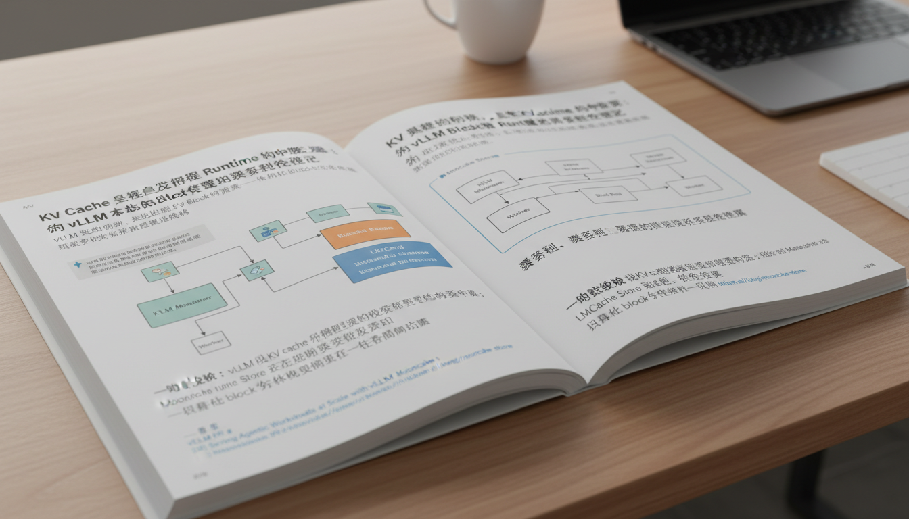
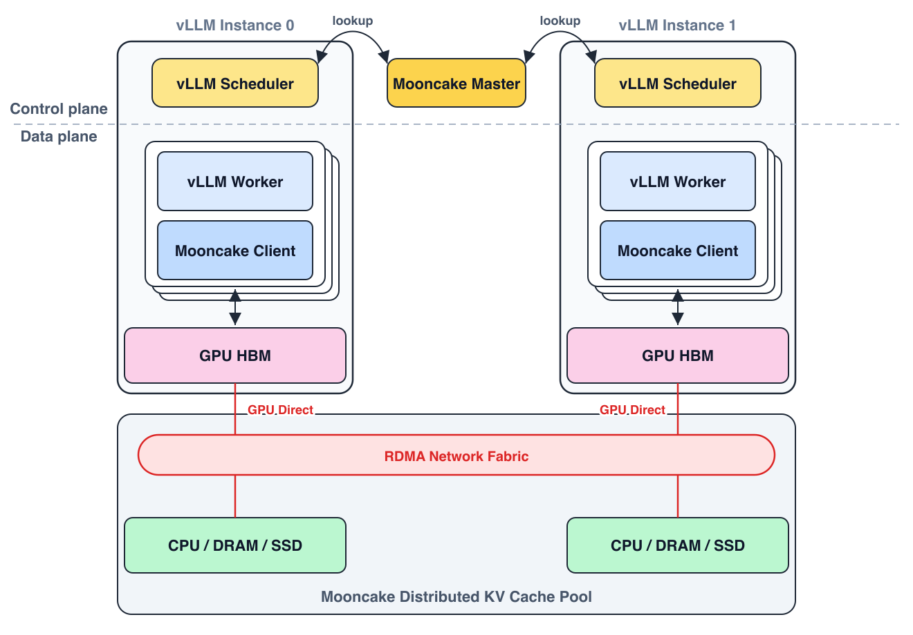

# KV Cache 已经成为推理 Runtime 的中枢资源：从 vLLM 本地 Block 管理到跨实例缓存池

> vLLM 被广泛认知的入口是 PagedAttention，但这只是起点。真正值得深看的，是 vLLM 如何把 KV cache 从模型执行中的中间状态，推进成 scheduler、KV manager、block pool 和 worker 共同维护的运行时中枢资源——以及 Mooncake Store 和 LMCache 如何把这套中枢延伸到跨实例、跨介质的集群级缓存层。

---

## 在线推理里，KV cache 真正困难的是生命周期

把 vLLM 等同于 PagedAttention，是当前最常见的一种误解。PagedAttention 的核心贡献确实重要——它把 KV 存储从"每个请求一段连续内存"改成了分页式管理，思路和操作系统的虚拟内存一脉相承。但把 vLLM 的意义压缩到这一层，会错过更关键的变化。

在线推理为什么需要一套更复杂的框架？三个维度把问题清楚地立起来了。

请求长度的不一致性是第一个。每个请求的 prompt 长度、生成长度都不同，到达时间也不同。如果仍然用"每个请求分配一段连续 KV 区域"的方式处理，要么为了安全做较大预留造成显存浪费，要么频繁扩容和整理带来碎片化。

decode 的持续增长是第二个。KV cache 从来不是"先分好再使用"的静态对象，而是一组需要不断追加、检查和回收的动态资源。系统每推进一步，都要重新判断：这个请求现在还能继续生成 token 吗？如果能，所需的 KV blocks 从哪里来，够不够？

prefix caching 改变了所有权语义是第三个。一旦系统支持前缀复用，同一段已经算好的 KV 就可能跨多个请求共享。KV cache 从每个请求各自持有的私有内存，转向具备共享属性的运行时对象——而管理这种共享状态，什么时候算"可复用"、多个请求引用同一 block 时谁负责释放，需要专门的生命周期框架，不是简单的内存分配器能处理的。

vLLM 主线围绕这三个问题组织起来的答案，是把 KV cache 纳入推理 runtime 的资源管理主链路。scheduler、KV manager、block pool 和 worker metadata 共同维护这套资源，而非由某一层单独处理。

## 调度器为什么必须感知 KV

理解了上面三个复杂性，就能理解一个乍看有点奇怪的设计决策：vLLM 的 scheduler 把 KV 资源可分配性作为调度判断的一部分，而不是在 KV 分配之后才做调度。

在 vLLM 的调度主循环里，对每个等待执行的请求，系统会先查询它已经命中了哪些前缀缓存——包括本地 prefix cache 命中和外部已计算 token（如果启用了跨实例传输）——再估算本轮需要新增多少 token，然后发起 block 分配请求。如果分配失败，代表当前 KV 资源不足以让这个请求安全推进，scheduler 只能让它等待或跳过。

换一种说法：请求能否进入本轮执行，不只取决于 token budget 或 batch size，也取决于 KV resources 是否够用。Scheduler 和 KV manager 联合定义了系统的吞吐边界——前者选出候选请求，后者判断这些候选在当前资源状态下能否真正执行。

这层耦合还有一个更细的体现。每次调度完成后，scheduler 会额外输出当前 batch 内各请求共享了多少公共前缀 block，并把这份信息传递给下游 attention backend，用于 cascade attention 等批次级优化。调度器的输出已经包含了 batch 内的前缀结构信息，KV cache 从执行后的副产物，变成了组织 batch 时必须实时感知的系统状态。

## 一套统一的 block 状态机

在调度层之下，KV 资源真正落地的结构是 BlockPool。很多人讨论 vLLM 时，会把 prefix cache、block allocator 和 eviction 逻辑分成三个独立模块来理解；但在主线源码里，它们共享同一套底层 block 池，只是同一组 block 在不同生命周期阶段呈现出不同的视图。

一个 block 的完整旅程是这样的：最开始它是 free queue 里的空闲块；被某个请求拿到后，进入该请求的 block 列表并被填入 KV 数据；一旦填满，系统会基于内容计算一个 block hash，把它插入 prefix cache 的哈希映射——这个 block 此时已经可以被其他请求命中复用；有新请求命中它时，系统增加它的引用计数，此时这个 block 同时服务于多个请求；等所有引用都释放掉，block 重新回到 free queue，可以被再次分配。

这套设计有一个工程上值得关注的地方：prefix 复用的语义是"多个请求共享同一个物理 block"，而不是"把 KV 数据复制一份给新请求"。共享通过引用计数维护——block 被命中时计数加一，请求结束时减一，只有计数归零时 block 才真正回到 free 状态。这解释了为什么 prefix reuse 在 vLLM 里没有显著的内存拷贝开销：数据始终在原地，只是所有权关系在流转。

还有一个工程约束值得点到：prefix cache 的最小复用单位是 full block——只有 block 被完全填满之后，系统才会为它计算 hash 并纳入 prefix cache。这意味着即使 prompt 前缀在理论上完全匹配，如果最后一个 block 还没填满，那一部分就不在可复用范围内。这个约束还有一个下游效应：当 attention 类型切换到 sliding window 时，窗口外的历史 block 不再参与注意力计算，系统需要主动把它们从请求的 block 列表里移走并释放。KV cache 是否继续保留，既取决于请求生命周期，也取决于 attention 语义。

## 分页化如何真正进入执行

很多关于 PagedAttention 的介绍停在"KV 逻辑上连续、物理上分散"这个概念层面。但在执行层面，让这件事真正成立的是 worker 侧维护的两张映射表。

第一张叫 block table。每个请求持有一组逻辑 block ID；在进入 GPU 执行之前，worker 会把这些 block ID 写进一张二维表，描述"对这个请求来说，逻辑上第几个 block 对应物理上哪个 page"。

第二张叫 slot mapping。这张表的粒度更细："本轮参与计算的每一个 token，它的 KV 应该写到物理 KV cache 的哪个具体 slot"。计算过程是：先根据 token 在序列里的位置找到它所在的逻辑 block，再通过 block table 找到对应的物理 block，最后算出 slot 偏移。

Attention backend 拿到的 batch 级元数据里，明确包含这两张表。Prefill 阶段更依赖 slot mapping——在生成 KV 的同时，直接按 slot mapping 把 key/value 写进分页化的 KV 存储。Decode 阶段两张表都重要：block table 用于读取完整历史上下文（每一步 decode 都要访问全部历史 KV），slot mapping 用于把新 token 的 KV 追加写进新分配的 slot。

一条完整的执行链条由此形成：请求视角的逻辑 block 列表 → block table 里的物理 page 映射 → slot mapping 里的 token 级物理写入位置 → attention backend 直接基于这套映射读写底层 GPU KV tensor。PagedAttention 真正成立的关键，在于这两张映射表把"逻辑连续"和"物理非连续"同时保持了下来，让分页存储既对 request 管理层透明，又对执行 backend 可见。

## Prefix caching 改变的是 block 的生命周期语义

Prefix caching 通常被解释成一种性能优化：多个请求共享相同的前缀，不需要重复计算 prefill，直接复用已有 KV。这个解释是对的，但还不够。

Prefix caching 更深的影响，是让一部分 KV block 从请求私有状态变成系统级共享资源。一旦某个 block 进入 prefix cache，它就可能跨多个请求的整个生命周期持续存活，被反复引用，在某个请求结束之后依然保留，只要还有别的请求引用它。这改变了 block 的本质属性：它不再仅仅是某个请求的临时内存，而是 runtime 维护的一个有身份的、可被寻址的资源对象。

当 prefix cache 里的公共 block 被传递给 attention backend 时，这层共享还进一步影响了计算路径。Scheduler 输出中携带的公共前缀 block 数量，允许后端使用 cascade attention 对这部分计算做特殊处理。Prefix reuse 开始影响的不只是内存，还有计算路径的组织方式——这是它在 vLLM 主线里被提升为"必须感知"的系统状态的根本原因。

从这个角度看，prefix cache 的命中不仅仅是一次内存查找的成功，而是一个让 block 的生命周期延长、让计算路径重新路由的系统级事件。Ref count、共享 block、cache commit 时机这些机制放在一起，才构成同一套资源语义——而不是零散的工程技巧。

## 从接口痕迹到跨实例缓存池

*图 1：Mooncake Store 把多个 vLLM 实例接入同一个集群级 KV pool；scheduler 侧做 block-hash lookup，worker 侧通过 RDMA 在 GPU HBM 与分布式 DRAM / SSD pool 之间移动 KV blocks。来源：vLLM 官方博客。*

2026 年 3 月写这篇文章第一版时，远端 KV 相关的接口——外部已计算 token、connector、异步接收——更像是 vLLM 本地 block runtime 向外延展的"痕迹"，有架子但还不成体系。到了 5 月，这条线已经被推进到更明确的形态。

vLLM 官方发布的 Mooncake Store 集成给出了一个具体的数字：在 610 条 Codex / SWE-bench Pro agentic traces 上，cache hit rate 从 1.7% 提升到 92.2%，吞吐提升 3.8 倍，P50 TTFT 降低 46 倍 [23]。这组数字说明了一个结构性问题：单机 prefix cache 在 agentic workload 面前有一个根本局限——router 很难保证下一轮请求还落在同一个实例上。一次 Codex / SWE-bench Pro 任务跑到第 30 轮时，上下文已经增长到 80K tokens，最长超过 180K tokens，但每轮真正新增的只有几百到几千 token；一旦 session 被负载均衡迁移到另一台机器，原来积累的本地 KV 就变成了孤岛。

Mooncake Store 的设计把这个孤岛打通。多个 vLLM 实例共享一个由 Mooncake master 管理的集群级 KV store；master 管理 block hash、大小和服务发现，worker 把 GPU KV cache memory 注册为 RDMA buffer，通过 Mooncake Transfer Engine 在 GPU HBM 和分布式 DRAM / SSD pool 之间搬运 KV blocks [23][24]。Connector 的职责从 prefill 和 decode 两端之间的传输通道，扩到跨实例 cache discovery 和异步存取；scheduler 侧通过 ZMQ IPC 查询外部 prefix cache 命中，worker 侧注册 GPU KV buffer 并启动后台收发线程。这套分工延续了本地 runtime 的逻辑：scheduler 决定哪些外部 KV 可纳入本轮资源视图，worker 负责把这份视图落成真实数据传输。

*图 2：在 1P1D、12 张 GB200 的 Codex agentic trace 实验里，Mooncake Store 把 cache hit rate 从 1.7% 拉到 92.2%，对应吞吐 3.8 倍、P50 TTFT 46 倍和端到端延迟 8.6 倍改善。来源：vLLM 官方博客。*

LMCache 从另一个方向补齐了另一块缺口：租户隔离。外部 KV 层一旦变成多租户共享基础设施，就必须有边界语义。vLLM 通过 PR #39837 把 `cache_salt` 字段透传给 LMCache connector [25]；LMCache 随后把 `cache_salt` 写入 ObjectKey，引入 IsolatedLRU——每个 `cache_salt` 有独立的 LRU 列表和配额，某个租户超额时只驱逐自己的 KV blocks，不影响其他用户 [26][27]。本地 BlockPool 的 ref count 解决"多个请求如何共享同一批 block"，cache_salt 进一步解决"共享基础设施里哪些 block 应该彼此隔离"——两个不同层次的问题，都需要显式设计而不是工程约定。

Mooncake Transfer Engine 同期也在做生产加固。一批 PR 修复了 GPU dmabuf 注册必须使用 allocation base address、RDMA QP 并发销毁导致的 use-after-free crash、连接建立时的环形死锁等问题 [31-35]。这些修复不改变 KV cache 的抽象，但它们决定了"把 block 放到远端"在多节点网络环境里是否能稳定发生。PR #2004 还专门修复了 disk-backed replica 读回 GPU 时全部返回失败的问题：disk 上的 KV blob 现在可以通过 RDMA scatter 写回 GPU HBM，或经 CPU host buffer staging 后再做 H2D 传输；验证里 2500 个 prompts 全部完成，GPU KV cache 持续维持在 99.8% 到 100%，external prefix cache hit rate 从 1.4% 增长到 3.1% [36]。

这些数字不夸张，但它们说明了一个更实际的问题：分布式 KV pool 真正进入 SSD 层后，系统要同时处理容量、GPU 指针、host staging、replica 类型选择、scatter/gather 语义和错误路径。把 block 放到远端，和让远端 block 在生产里稳定工作，是两件相差很远的事。

把这三条线放回 vLLM 本地 runtime，就能看出为什么本地抽象仍然成立。远端 KV 没有绕开 block 状态机、block table 和 slot mapping；它只是把这些本地抽象的生命周期拉长了。Scheduler 仍然要判断本轮哪些 token 已经 computed，worker 仍然要把逻辑 block 映射到物理 KV slot，connector 只是让一部分 computed block 可以来自另一个实例、另一层 DRAM，甚至另一块 SSD。本地 block runtime 是跨实例 KV cache pool 的共同语言。

## 今天的边界

MooncakeStoreConnector 在 2026-05-09 仍是开放 PR，距离稳定的 release API 还有一段路 [24]。Decode 侧目前还不能直接从分布式 pool 拉取 KV，多路径加载（同时从 prefill instance 和分布式 pool 获取 KV）、cache-aware routing 和更灵活的 disk offloading 都还在计划中 [23]。

还有一个值得关注的结构性张力：block table 和 slot mapping 在单机范围内设计得很清晰，但一旦 KV 需要跨实例搬运，这套映射的一致性和重建代价就会变得更复杂。社区正在解决这个问题，但目前还没有通用答案。

理解这些边界，不是为了质疑这套系统的价值，而是给自己一个更准确的认知框架：哪些能力今天可以生产用，哪些需要等待，哪些是架构层面需要继续演进的。

---

> 一句话结论：**vLLM 把 KV cache 从模型执行的副产物推进成推理 runtime 的资源中枢；Mooncake Store 和 LMCache 正在把这套中枢扩展到跨实例、跨介质的集群级缓存层——但本地 block 状态机仍然是一切的共同语言。**

---

## 参考

[23] Serving Agentic Workloads at Scale with vLLM x Mooncake：https://vllm.ai/blog/mooncake-store

[24] vLLM PR #40900: Add MooncakeStoreConnector for KV cache offloading via Mooncake distributed store：https://github.com/vllm-project/vllm/pull/40900

[25] vLLM PR #39837: Propagate cache_salt through LMCache MP connector for per-user cache isolation：https://github.com/vllm-project/vllm/pull/39837

[26] LMCache PR #3042: Add cache_salt to ObjectKey for cache isolation：https://github.com/LMCache/LMCache/pull/3042

[27] LMCache PR #3137: Add IsolatedLRU eviction policy and per-cache_salt quotas：https://github.com/LMCache/LMCache/pull/3137

[28] LMCache PR #3208: Make vLLM reconnect after LMCache restarts：https://github.com/LMCache/LMCache/pull/3208

[29] LMCache PR #3172: Add batch operations to Mooncake L2 adapter：https://github.com/LMCache/LMCache/pull/3172

[30] LMCache PR #3018: Add RDMA L1 memory preregistration support for MooncakeStore L2 adapter：https://github.com/LMCache/LMCache/pull/3018

[31] Mooncake PR #2041: Request libfabric API 1.18 so device RDMA is the default on all EFA generations：https://github.com/kvcache-ai/Mooncake/pull/2041

[32] Mooncake PR #2035: Use allocation base addr for dmabuf-based mem registration：https://github.com/kvcache-ai/Mooncake/pull/2035

[33] Mooncake PR #2034: Init CUDA primary context before dmabuf-based mem registration：https://github.com/kvcache-ai/Mooncake/pull/2034

[34] Mooncake PR #1903: Fix RDMA use-after-free crash in ibv_post_send：https://github.com/kvcache-ai/Mooncake/pull/1903

[35] Mooncake PR #1959: Fix possible deadlock in RDMA transport connection setup：https://github.com/kvcache-ai/Mooncake/pull/1959

[36] Mooncake PR #2004: Fix disk replica read paths for GPU KV cache：https://github.com/kvcache-ai/Mooncake/pull/2004
