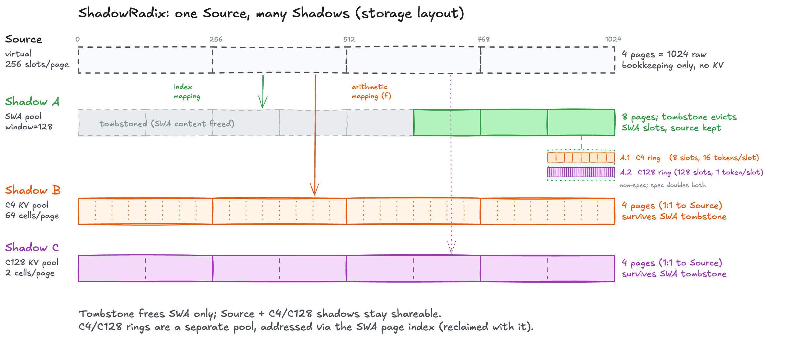

# SGLang 如何管理 KV Cache：从 RadixAttention 到 HiCache 的底层技术主线

> 前不久，SGLang 团队公布了一组让人瞩目的数字：在 DeepSeek-V4 上，从 4K 拉到 90 万 token 的上下文，decode 吞吐仅下降不到 10%。这不是靠堆卡或运气做到的——它依赖的，是一套从第一天起就把「共享前缀」当作第一资产来管理的缓存哲学。这篇文章，我们就来梳理这条从 RadixAttention 到 HiCache、再到 HiSparse 与 ShadowRadix 的底层技术主线。

---

## 一本书被反复借阅时，不必每次都从头读起

想象一个场景：你拿着一本书走进图书馆，想看第三章。如果管理员要求你每次都从第一章开始重新读，直到翻到你想要的章节，你会觉得这很荒唐。但 LLM 推理系统早期面对的正是这个问题——每次模型调用都要把整段上下文从头算一遍，哪怕其中大部分和前一次完全相同。

SGLang 最先意识到的，不是单个人单次能读多快，而是很多人手里拿着的其实是同一本书。few-shot 提示、多轮对话、self-consistency 投票、tree-of-thought 分支——这些典型场景的本质都是**同一套 prompt 骨架被反复复用**。如果系统每次都从头做 prefill（预填充），大量计算其实是在重复消费已经出现过的上下文[1]。

核心洞察由此分叉：与其把 KV 看成"每个请求各自的一份草稿纸"，不如先问"哪些历史段落值得长期保留、并在后续请求里直接命中"。SGLang 的 KV Cache 主线，正是从这个问题出发，逐渐长成了一棵树。

---

## RadixAttention：把共享前缀变成一棵可生长的树

SGLang 给出的第一个系统性答案叫 RadixAttention。名字里虽然有 "Attention"，但它的关键不是一个更快的计算内核，而是一种**围绕共享前缀组织缓存与复用**的机制[1]。

*图 1：RadixAttention 把共享前缀组织成一棵 radix 树。树里每个节点不只是"某段文本"的索引，还直接绑定了这段文本对应的缓存状态——它在哪、有没有被锁住、最近是否被访问过、淘汰时优先级如何[1]。*

用一个更日常的类比：传统的缓存系统像一排各自独立的储物格，每个请求找到一个空格子，把自己的东西放进去，用完了清空格子。RadixAttention 则像一棵图书馆的分类树——"文学 > 小说 > 科幻 > 硬科幻"——当后续有人也想借同一本书时，系统不是新开一个格子复制一份，而是直接沿着树走到已有的节点，看看这段"前缀"是否还挂在那儿。

这棵树里藏着三个让人点头的设计细节。第一个细节是命名空间隔离：两个请求即使有相同的 token 前缀，如果来自不同的 LoRA adapter 或不同的租户空间，系统也会把它们分到不同的分类分支里，避免缓存串扰。第二个细节是动态切割：匹配过程中如果命中了一段已有分支的中间节点，系统会主动把这段共享边界"切"出来，让树变得更精细，提高后续匹配的命中率。第三个细节是增量插入：新请求插入树时，系统会尽量复用已有的共享路径，只为真正新增的后缀创建新节点。

**换句话说，SGLang 管理的不是一组彼此独立的 request-local 草稿纸，而是一棵会不断显式化共享边界、并用节点生命周期表达复用关系的树。**

---

## 调度器也学会了"看树说话"

仅仅把前缀存进树里还不够，真正有意思的是这棵树如何进入请求的生命周期与调度决策。

在 SGLang 的调度器里，等待队列中的每个请求都会先去树上走一圈，计算自己命中了多少前缀。调度器不会把这当作一个无关紧要的底层细节，而是把它变成**显式的调度依据**。如果一个请求命中了很长的共享前缀，调度器会倾向于优先给它发显卡资源；如果一批请求在共享路径上高度重叠，调度器会把它们尽量凑在一起批量处理，从而在一整批请求里最大化前缀复用的收益。

这种思路还被进一步外推到多机路由层：请求不再只按平均负载分发到不同的 worker 上，而是尽量落到"那棵树上最可能已有你要的前缀"的 worker 上[5]。一旦承认"共享前缀是系统资产"，那么从单机调度到多机路由，整个系统都会围绕"哪里最可能命中已有前缀"来组织请求流。

---

## HiCache：从桌边抽屉扩展到书架和仓库

如果前面的判断成立，那么 HiCache 的登场就顺理成章。RadixAttention 只用 GPU 显存做缓存层——离处理器最近、速度最快，但容量最小，相当于所有"书"都只能摊在面前的桌上。一旦桌子满了，哪怕某本书很快会被再次借阅，也只能被清走。HiCache 做的就是把这张桌子扩展成三层存储体系。

桌面旁边是一张更大的书架，也就是主机内存。它容量大得多，但取阅需要走 CPU 搬运，速度比桌面慢一个级别。更远处的仓库则是分布式存储，几乎无限，但按需取用，往返时间最长。树上的每个节点从此不再只是"有没有"的问题，而是"现在在哪一层"的问题。匹配到一段前缀时，系统会先翻桌面，没有就查书架，书架也没有才派人去仓库调取。prefill 完成后再把新生成的高价值前缀逐层沉淀下去，像个不断蓄水的蓄水池。

*图 2：HiCache 不是简单地把缓存搬到别处，而是沿"先匹配共享前缀，再决定从哪一层取回和写回数据"的主线扩展。树上每个节点仍然代表一段共享前缀，但多了一个属性——这段前缀现在位于 GPU、CPU 还是仓库里[6]。*

这个设计在实际部署里的效果很直接。2025 年 9 月 LMSYS 公布的实测数据显示：Novita AI 在服务 Qwen3-Coder-480B 时，首 token 响应时间（TTFT）平均降低 56%，吞吐量提升 2 倍，缓存命中率从 40% 提升到 80%。Ant Group 在 DeepSeek-R1-671B 上，TTFT 相比全量重新计算的基线降低了 84%[8]。

数字背后是这样一个变化：以前缓存复用的边界被 GPU 显存死死框住，现在只要前缀有价值，系统就会想办法让它留在某个层级里，等待下一次被命中。

HiCache 还重新设计了跨层数据移动的方式。GPU 计算时数据按"层"组织，而搬运到主机内存或分布式存储时按"页"组织更省带宽——两种格式之间的转换本身就被设计成了优化对象。

---

## HiSparse：有些书页其实不需要一直摊在桌上

传统注意力的世界里，每个 token 对应的 KV 在 decode 阶段都要参与计算；但稀疏注意力只精确处理一小部分 token，大量历史 token 实际上处于"不活跃"状态，只是默默地占着显存。

HiSparse 的核心做法做得非常朴素：**主动把不活跃 KV 从 GPU 搬到主机内存里，只保留一个热点子集在桌面上**。当 GPU 需要某个被搬走的条目时，再按需拉回[9]。

过去也有人尝试过类似思路，但 HiSparse 的高明之处在于，它不依赖外部调度器来做决策，而是在 GPU 内核层面一次性完成三件事：判断哪些条目缺失了、选出该淘汰谁、更新地址映射并触发搬运。这样一来，内存管理的决策和执行被压进了同一个时刻，减少了反复同步的开销。

*图 3：HiSparse 让 GPU 端只保留热点 KV，非活跃条目按 LRU 推到主机内存。在 256 并发请求的长上下文场景下，GLM-5.1-FP8 的吞吐量提升了 3–5 倍[9]。*

需要注意的是，这个红利主要出现在**高并发的长上下文场景**。低并发时，I/O 本身的开销反而可能被放大。但这恰恰说明 HiSparse 不是放之四海而皆准的银弹，而是找到了一个特定压力窗口下的突破口。

---

## ShadowRadix：一本书三种笔记，如何共用同一棵分类树

DeepSeek-V4 的注意力架构比稀疏注意力更复杂：每个 token 同时对应三条不同的计算路径——一条保留最近的原始 token，一条做 4:1 压缩后的稀疏检索，一条做 128:1 压缩后的全局密集注意力。三条路径对显存的压力不同，能复用的前缀窗口也不同。

如果强行把它们塞进同一棵树，就会出现一个尴尬的问题：某条路径淘汰了一个条目，连带把另外两条路径还在用的条目也一起清了。这相当于在图书馆里，文学区的管理员把一本书撤了，结果导致哲学区和历史区也找不到同一本书。

ShadowRadix 的解法很优雅。**它让分类树保留一棵统一的"虚拟全索引"，但底下映射到三个独立的物理存储池。** 每个存储池自己决定哪些条目该保留、哪些该淘汰，彼此互不干扰。上层的请求仍然只走一棵树做前缀匹配，只是匹配结果的具体存放位置被分别导向不同的池子[10]。

*图 4：ShadowRadix 并没有引入新的树结构，而是用虚拟坐标轴把三个独立的物理存储池接进同一棵前缀树里，各自管理生命周期[10]。*

结果非常直观：从 4K 到 90 万 token 的上下文长度，H200 上的 decode 吞吐量仅从 266 tokens/s 降到 240 tokens/s，下降不到 10%。在纯密集注意力下，长到这种程度的上下文几乎不可能高效服务，但在 ShadowRadix 与混合注意力的组合下，它变成了日常部署能hold住的事。

HiSparse 在 DeepSeek-V4 中也同样参与了其中一条路径的内存卸载。ShadowRadix 负责索引与生命周期隔离，HiSparse 负责非活跃条目的跨层搬运，两者协同工作。

---

> 一句话结论：**SGLang 的关键在于先定义"共享前缀"，再围绕它组织整个 KV runtime。从一棵树到三层书架，再到主动卸载和多池隔离，这条演进线一直在回答同一个问题——当共享前缀被当作第一资产时，新的模型架构和部署约束要求系统做出怎样的调整。**

---

## 参考

[1] Fast and Expressive LLM Inference with RadixAttention and SGLang：https://lmsys.org/blog/2024-01-17-sglang/

[5] SGLang v0.4: Cache-Aware Load Balancing and Efficient Structured Outputs：https://lmsys.org/blog/2024-12-04-sglang-v0-4/

[6] HiCache: Fast Hierarchical KV Caching — SGLang 官方文档：https://docs.sglang.ai/advanced_features/hicache.html

[8] SGLang HiCache: Fast Hierarchical KV Caching with Your Favorite Storage Backends：https://lmsys.org/blog/2025-09-10-sglang-hicache/

[9] HiSparse: Turbocharging Sparse Attention with Hierarchical Memory：https://lmsys.org/blog/2026-04-10-sglang-hisparse/

[10] DeepSeek-V4 on Day 0: From Fast Inference to Verified RL with SGLang and Miles：https://lmsys.org/blog/2026-04-25-deepseek-v4/
