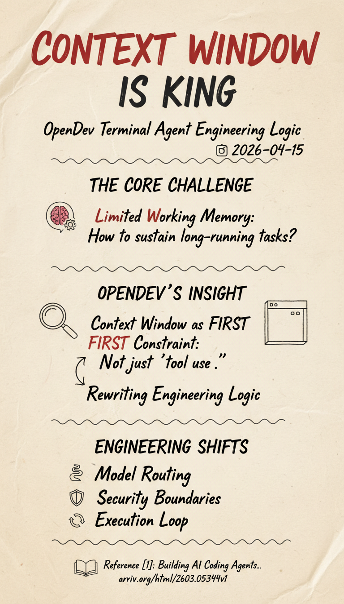

# 上下文窗口是第一约束：OpenDev 终端代理的工程逻辑

**📅 2026-04-15**

> OpenDev 最值得记住的判断是：终端 AI 编程代理首先要解决的，不是“会不会调用工具”，而是“有限的工作记忆，怎么支撑一个会跑几小时的任务”。

---

## 一、OpenDev 先回答了一个更难的问题

这篇报告[1]讨论的是终端原生 AI coding agent，但它关心的重点，并不是今天已经很常见的那几个问题，比如工具怎么封装、Shell 怎么执行、界面怎么做。作者先盯住了一个更难、也更容易被忽视的约束：模型的上下文窗口始终有限，而真实的软件任务却可能很长。

这件事一旦想明白，很多设计就会跟着变。OpenDev 不把上下文当成一块可以无限追加的黑板，而把它当成一笔必须精打细算的预算。静态身份声明和长期规则尽量放到可缓存段里，让 provider 级缓存重复命中；动态任务状态、最近观察结果和活跃记忆，则按轮次重建。这样做的目的很朴素，就是不让一段会话越聊越贵，最后贵到根本跑不下去。

连工具输出的处理也服从同一个逻辑。文件太长，不直接塞回模型，而是落到临时文件里只回传路径；Shell 输出超限，就截断并提示后续怎么取剩余部分。换句话说，OpenDev 不是把这些当成体验优化项，而是把它们视作代理能否持续运行的生死线。

## 二、上下文压缩不是补丁，而是骨架

*图 1：OpenDev 把一次代理会话组织成 session、agent、workflow、LLM 四层结构，每一层都在为“上下文如何分配”服务，而不是单纯为了模块划分。*

报告里最值得注意的机制叫 Adaptive Context Compaction，也就是自适应上下文压缩[1]。它不是等上下文爆满以后再做一次粗暴截断，而是在逼近预算时，对更老的轮次逐步压缩，越旧的内容压得越狠，越近的内容保留得越完整。

这个设计很像缓存分层。系统默认认为，近期信息比远期信息更可能直接影响接下来的推理，因此应当尽量把近期观察的细节保住，把更久之前的过程抽象成摘要。与其说这是一个压缩技巧，不如说这是对模型注意力分布的一种工程利用。

这也解释了为什么 OpenDev 的系统提示、工具返回、工作流切分，看起来都在围着 token 预算打转。因为一旦把上下文当成第一约束，代理架构的主线就不再是“能力越多越好”，而是“什么信息必须保留，什么信息可以推迟、压缩或者外置”。

## 三、五个模型角色，本质上是在分配认知预算

OpenDev 没有让一个模型承担所有事情，而是拆成了五个角色：Normal、Thinking、Critique、VLM 和 Fast[1]。表面看，这是多模型路由；往深一层看，它真正分配的是不同任务的认知成本。

Normal 负责日常推理和行动决策，Thinking 用在长链路推理，Critique 负责回头挑错，VLM 处理视觉输入，Fast 则处理那些没必要浪费昂贵模型的短平快任务。这里最关键的，不是“系统支持多少模型”，而是它把不同认知模式的切换做成了显式架构，而不是靠一条 prompt 让同一个模型自己判断什么时候该多想一步。

这样做有两个直接好处。第一，昂贵的长推理不会污染整场会话的 token 开销。第二，失败和回退的策略也能做得更清楚。某个角色失效时，系统可以在 provider 层自动切换备用模型，而不需要把容错逻辑写回 prompt 里。

这背后其实还是同一个工程判断：上下文窗口既然有限，认知预算也就有限。既然有限，就不能把所有任务都交给同一种推理强度去处理。

## 四、安全不能只靠“请你小心一点”

*图 2：OpenDev 的 Harness 把扩展版 ReAct 循环嵌进一套更大的控制框架里，安全、上下文管理和工具治理不是外围补丁，而是主循环的一部分。*

终端代理最敏感的地方在于，它拥有真实执行能力。只要能写文件、跑 shell、调用外部工具，它就不再是一个“回答问题”的模型，而是一套会行动的系统。OpenDev 在这里的选择很明确：不要把安全寄托在系统提示里，而要做结构化防线。

报告给出了五层机制[1]。最外层当然还是 prompt 里的规则，但再往里还有 schema 级工具限制、运行时审批系统、工具层验证，以及生命周期 hook。Plan Mode 尤其有代表性。在这个模式里，代理只能读和分析，不能写、不能执行破坏性命令；用户先看计划，再批准进入 Normal Mode 执行。这样一来，“决定要做什么”和“真的去做什么”被拆成了两段。

这套设计反映的是一个相当克制的态度：作者并不相信模型会永远记住规则，也不相信一条 prompt 能长期抵抗复杂会话里的指令衰减。既然不相信，就把关键约束下沉到基础设施层。换句话说，安全不是请模型自觉，而是让系统在模型出错之前就能拦住。

## 五、扩展版 ReAct，解决的是“冲动执行”

大多数代理都在讲 ReAct，但 OpenDev 在经典的 Reason-Act-Observe 之外，又多拆了两个阶段：Thinking 和 Critique[1]。一个负责在行动之前多走一步推理，一个负责在行动之后立刻回头检查有没有遗漏和错误。

这当然会增加延迟和 token 开销，但作者显然觉得这笔账是划算的。对终端编程任务来说，错误的第一步往往代价很高。一次误删、一次错误改写、一次在错误目录下执行命令，后面补救的成本可能远高于多花几秒钟进行额外思考。

另一个很有现实感的设计是 doom-loop 检测。代理如果开始重复执行同样的工具调用、掉进相同的错误处理循环，系统不会任它把预算烧光，而会主动中断并请求用户介入。这类机制听起来不起眼，但真正长时间跑过代理的人都知道，它决定的是系统会不会在深夜里悄悄把自己拖死。

## 六、这篇报告最有价值的地方，也恰好是它的边界

我觉得 OpenDev 最有价值的地方，在于它把很多人已经模模糊糊感受到的问题，第一次用一套完整工程语言讲清楚了：上下文窗口管理不是后期优化，而是终端代理的骨架。多模型角色、安全分层、扩展版 ReAct、工具输出治理，这些看似分散的结构，其实都在回答同一个问题。

但这篇报告也有清楚的边界。它更像一份系统设计复盘，而不是一篇带严格量化结论的实验论文。我们知道它为什么这样设计，却还不知道这些机制分别带来了多大的任务完成率提升，也不知道五层安全防线比单纯 prompt guardrails 多挡住了多少真实风险[1]。所以，它更适合作为工程方法论来读，而不是当作已经被 benchmark 充分证明的最终答案。

这并不削弱它的价值。恰恰相反，在今天这个阶段，很多代理系统真正缺的不是又一个 demo，而是把“为什么要这样搭架子”讲清楚的文档。OpenDev 的意义，大概正在这里。

---

> 一句话结论：**OpenDev 这篇报告真正讲清楚的，不是一个代理能做多少事，而是如果把上下文窗口当成第一约束，整个终端 agent 的工程逻辑会怎样被迫重写。**

---

## 参考

[1] Building AI Coding Agents for the Terminal: Scaffolding, Harness, Context Engineering, and Lessons Learned：https://arxiv.org/html/2603.05344v1
