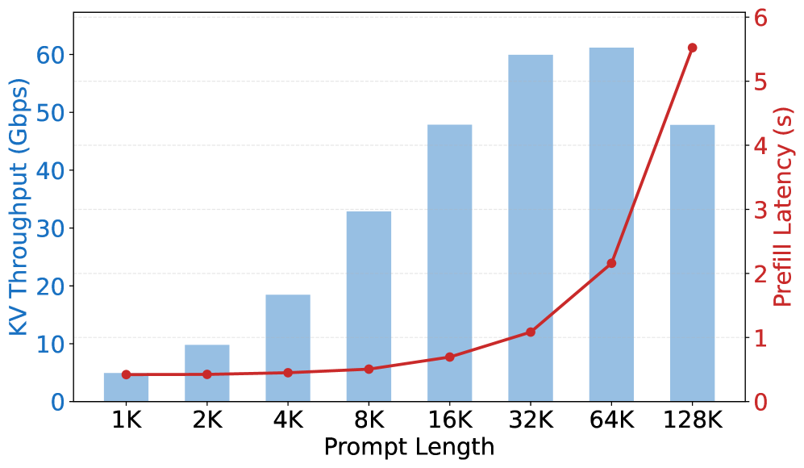
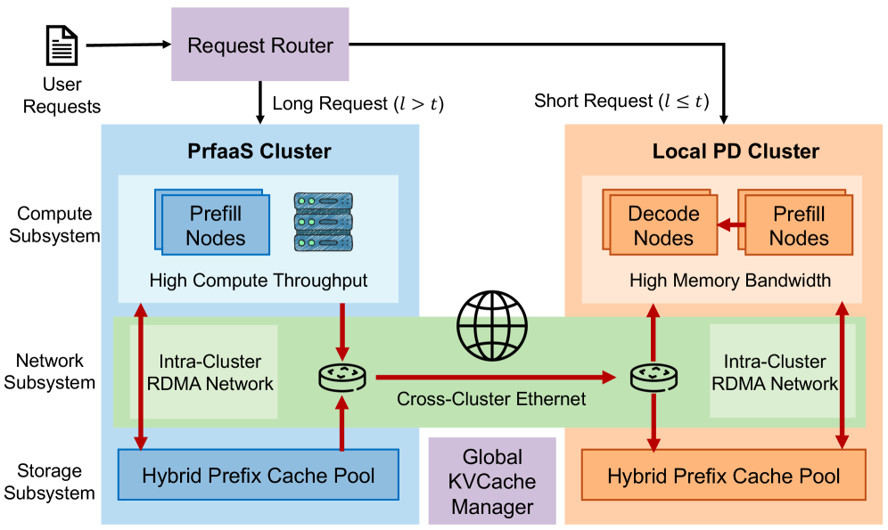
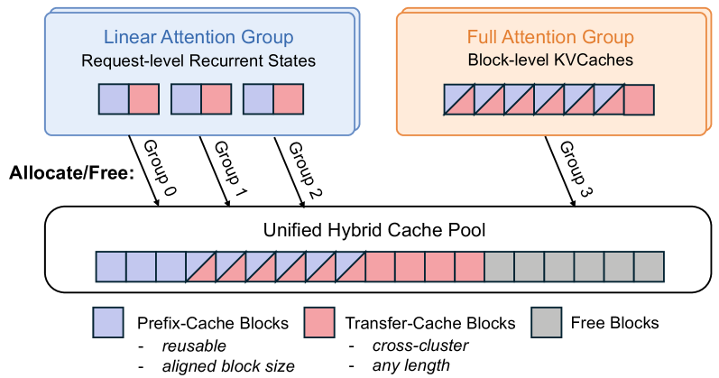

# Prefill-as-a-Service：LLM 推理的部署边界，为什么开始越过数据中心

**📅 2026-04-19**

> 这篇论文最值得记住的判断是：下一代模型先把 KVCache 变小，系统才第一次有机会认真讨论“跨数据中心做 prefill”。

---

## 为什么这不是一篇普通调度论文

过去一年，大家已经很熟悉 PD disaggregation 了。prefill 更吃算力，decode 更吃显存带宽，把两段拆开跑，资源利用率更高，这条路本身已经没有太大争议[2]。但现实里，绝大多数系统仍然把这件事限制在同一个数据中心、同一个高带宽网络域里。

原因也不复杂。prefill 做完以后，会吐出一大块 KVCache 给 decode。只要这块状态大到离谱，系统就不会愿意把它搬远。分布式系统几十年来都遵循同一个规律：状态一旦太贵，架构就会自然收缩到“尽量本地解决”。

这篇论文[1]真正往前推了一步。它不是在问“调度器能不能再聪明一点”，而是在问另一个更根本的问题：如果模型架构已经把 KVCache 压缩到原来的十分之一甚至更低，那么 prefill 和 decode 的物理边界，是不是也该重新画了？

---

## 真正把系统锁死在单数据中心的，是 KV throughput

论文里有一个很关键的指标，叫 KV throughput[1]。简单地讲，就是单个 prefill 实例每秒会产出多少必须传给 decode 的状态。这个数字决定了网络是不是瓶颈。

在 dense attention 模型上，这个数字高得很吓人。论文拿 MiniMax-M2.5 做例子，32K 输入长度时，单实例的 KV throughput 大约已经接近 60 Gbps；到 64K 时还在 61 Gbps 左右[1]。这意味着什么？意味着一台机器只要把自己刚算出来的 KVCache 往外送，就几乎能把常见跨数据中心链路吃满。

*图 1：dense attention 模型的 KV throughput 会随着输入长度迅速上升。问题不在于系统愿不愿意跨数据中心，而在于很多模型在网络账上根本算不过去。*

把视角再拉到集群级，结论更直接。论文估算，一个 512 张 H200 的 prefill 集群，如果跑 MiniMax-M2.5，大约需要 3.8 Tbps 总出口带宽；即便是 Qwen3-235B，也还要 2.1 Tbps[1]。到这个量级，所谓“异构部署”就很容易变成一句空话。你不是不能分，而是分了以后网络先撑不住。

这也是为什么过去很多 PD 架构看上去已经“拆开”了，但真正的部署边界却没有离开单个 RDMA 岛。问题不在代码，而在账本。

---

## hybrid attention 把“不可能”改写成了“有条件地可能”

如果说这篇论文有什么最重要的前提，那就是近一代模型正在集体朝 KV-friendly 的方向演化。Kimi Linear、MiMo-V2-Flash、Qwen3.5-397B、Ring-2.5-1T 这些模型，用线性注意力、滑窗注意力，或者更低比例的 full attention，把需要完整 KVCache 的层数压了下去[1][3]。

论文里的 Table 3 很能说明问题。32K 输入长度下，Kimi Linear 的 KV throughput 是 3.87 Gbps，MiMo-V2-Flash 是 4.66 Gbps，Qwen3.5-397B 是 8.25 Gbps，Ring-2.5-1T 甚至只有 2.59 Gbps；对照组里的 MiniMax-M2.5 和 Qwen3-235B，则分别是 59.93 Gbps 和 33.35 Gbps[1]。

这不是小幅优化，而是量级变化。Kimi Linear 自己的技术报告也给出相近结论：它用 KDA 和 MLA 的混合结构，把 KV cache 使用量最高压到原来的 25%，在 1M 上下文下 decode throughput 最高做到 6 倍[3]。

这里最值得记住的一句话是：**hybrid attention 没有自动解决跨数据中心 serving，但它第一次把这件事从“不现实”改写成了“值得系统工程去做”。**

---

## PrfaaS 的关键，不是把所有 prefill 都送远端

很多人看到标题里的 Prefill-as-a-Service，容易以为作者想把所有 prefill 都挪到另一个集群。其实不是。论文最聪明的地方，恰恰在于它只把“足够长、足够值、而且当前网络也扛得住”的请求送去远端[1]。

作者设计的架构很清楚：短请求留在本地 PD cluster，长请求里那些未命中足够 prefix cache 的部分，才被送到独立的 PrfaaS cluster 做 prefill。前者更依赖高带宽 decode 硬件，后者更依赖高算力加速器。换句话说，它不是强迫异构芯片共处一室，而是让不同集群在合适的地方承担各自最擅长的工作。

*图 2：PrfaaS 不是简单“远端算、本地接”，而是先做请求分流，再把长请求的 prefill 变成一条可选择的远程路径。*

这套设计背后还有一个容易被忽略、但其实很有工程含量的点：hybrid model 的状态并不统一。线性 attention 的 recurrent state 更像 request-level state，需要精确匹配；full attention 的 KVCache 则更像 block-level state，可以做部分 prefix 复用[1]。因此，缓存池也不能再像过去那样把所有东西当成一种 KV block 来管理。

论文在这里给出了一套 hybrid prefix cache pool：一边管理 prefix-cache blocks，一边管理只为跨集群传输存在、传完就丢的 transfer-cache blocks[1]。这听上去像实现细节，其实非常关键。因为到了跨数据中心这一步，缓存不再只是“能不能复用”，还要回答“哪些块应该保留，哪些块只负责过路”。

*图 3：到了 hybrid attention 模型里，缓存不再是一种统一对象。prefix-cache block 和 transfer-cache block 的生命周期不同，这正是跨集群 KV 管理开始变复杂的地方。*

---

## 这组数字好看，但更重要的是它们说明了什么

论文的 case study 用的是内部 1T 参数 hybrid 模型，结构遵循 Kimi Linear 的 KDA:MLA 3:1 设计；远端 PrfaaS cluster 用 32 张 H200，本地 PD cluster 用 64 张 H20，两边通过大约 100 Gbps 的 VPC 网络连接[1]。

最关键的结果有四个。

第一，最优路由阈值大约是 19.4K token，此时差不多 49.6% 的请求会被送到 PrfaaS 集群[1]。这说明系统并没有把远端路径用满，而是在刻意挑请求。

第二，跨集群 egress 负载大约只有 13 Gbps，只占 100 Gbps 链路的 13%[1]。这比很多人想象中低得多，也正因为如此，作者才敢说 commodity Ethernet 已经开始够用了。

第三，整体吞吐达到 3.24 req/s，相比 homogeneous PD baseline 的 2.11 req/s 提高了 54%；相比 naive heterogeneous baseline 的 2.45 req/s，也高出大约 32%[1]。

第四，P90 TTFT 从 9.73 秒降到 3.51 秒，降幅 64%；均值从 4.44 秒降到 2.22 秒[1]。这说明受益最大的，其实是那些长上下文请求。

但我更看重的是另一层含义：PrfaaS 的优势，并不是“远端 H200 比本地 H20 快”，而是它只把最值得外包的那部分请求送出去，然后把本地资源腾出来给 decode 和短请求。论文里的 naive heterogeneous baseline 就很说明问题。你如果把所有 prefill 都压到快卡上，局部延迟可能更低，但整条流水线不一定更优[1]。这很像工厂排产，单台机器跑得快，不代表全厂吞吐就高。

当然，这里也要把边界讲清。论文的证据强在方向判断和量级测算，弱在公开可复现实装。它主要依赖 measured profiling data 加 throughput model 求解，而不是完全开源、可长期复验的生产系统[1]。另外，作者虽然用了“cross-datacenter”这个词，实验网络本质上仍更接近松耦合集群，而未必等同于真正的跨城 WAN。

所以，最值得相信的不是“54%”这个单点数字，而是那个拐点本身：**当 KV throughput 从几十 Gbps 降到几 Gbps，系统设计的自由度就会突然变大。**

---

> 一句话结论：**Prefill-as-a-Service 真正改变的，不是一条调度策略，而是 LLM serving 的部署边界开始松动了。**

---

## 参考

[1] Prefill-as-a-Service: KVCache of Next-Generation Models Could Go Cross-Datacenter：https://arxiv.org/abs/2604.15039

[2] Mooncake: A KVCache-centric Disaggregated Architecture for LLM Serving：https://arxiv.org/abs/2407.00079

[3] Kimi Linear: An Expressive, Efficient Attention Architecture：https://arxiv.org/abs/2510.26692
