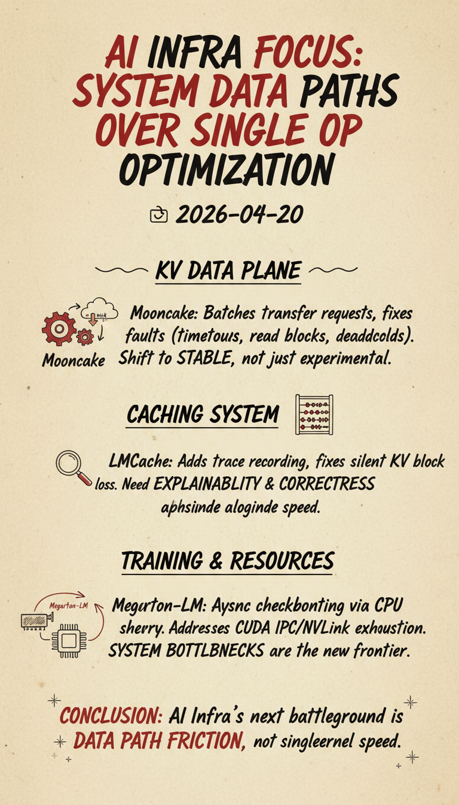

# 今日焦点：系统级数据路径开始压过单点算子优化

**📅 2026-04-20**

> 这轮更新最值得盯的，不是“又快了多少”，而是大家终于开始把真正卡住生产系统的那条数据路径翻出来修。

---

## 推理侧

**Megatron-LM 把 FlashAttention 4 接进 inference 主路径[1]**，**TensorRT-LLM 扩展了 FP4 quant + rms_norm kernel 的维度覆盖范围[2]**。这当然还是性能优化，但比“又加一个快 kernel”更重要的是，主干项目已经不满足于 demo 能跑，而是要把这些能力往默认可交付路径里塞。

**vLLM 直接处理多模态调度器的 CPU 热点[3]**，把 `get_num_embeds` 相关开销收掉，减少调度线程对 GPU 重叠执行的拖累。PR 给出的结果很硬：Gemma 4 多图场景里，请求吞吐提升约 26.9%，TPOT 下降约 27.3%。这说明推理侧的竞争，已经不只是 kernel 本身谁更快，而是谁先把整条执行链路里的空转时间磨掉。

**SGLang 在 AMD NSA indexer 上继续减少冗余 kernel[4]**，把原来拆开的 cast、GEMM fallback 和 cache store 收成更紧凑的路径，属于 **[持续更新]**。

---

## KV 数据面

**Mooncake 把 transfer request 批量化到 `cudaMemcpyBatchAsync`[5]**。它要解决的是分离式 serving 里最典型的痛点：prefill 和 decode 使用不同 TP 布局时，会冒出大量 token-size 的小传输请求，调度和运行时开销本身就会吞掉收益，属于 **[持续更新]**。

**Mooncake 又补了一组 production 暴露出来的 transfer/store 故障[6]**，包括超时判断错误、peer 挂住导致读阻塞、IB 异步事件死锁风险。这个变化没有炫技意味，但它说明 KV 数据面已经进入“必须稳定上线”的阶段，而不是停在实验性能。

**LMCache 一边给 storage manager 加了 trace 录制能力[7]，一边修掉会让 KV block 静默丢失的 MP connector 记账错误[8]**。前者是补可观测，后者是补正确性，两件事放在一起看，意思很清楚：缓存系统现在不仅要快，还得能解释自己做了什么，且不能悄悄做错。

---

## 训练与系统资源

**Megatron-LM 新增 `--async-ckpt-use-cpu-shm`[9]**，把异步 checkpoint 里的 GPU tensor 先落到 CPU shared memory，再交给后台 worker。它针对的是 MNNVL 系统里 CUDA IPC 和 NVLink fabric handle 被耗尽的问题。

这类改动以前常被当成“边角工程”，现在却开始进主干。原因很简单：当训练和推理都走到大规模生产阶段，真正决定系统上限的，往往不是模型算得动，而是整条数据路径能不能稳稳地把状态和数据搬过去。

---

> 一句话结论：**AI Infra 的下一轮主战场，正在从单点 kernel 速度转向整条数据路径的摩擦系数。**

---

## 参考

[1] Megatron-LM 为 inference 接入 FlashAttention 4：https://github.com/NVIDIA/Megatron-LM/pull/4186

[2] TensorRT-LLM 扩展 FP4 quant 与 rms_norm kernel 的维度支持：https://github.com/NVIDIA/TensorRT-LLM/pull/13033

[3] vLLM 降低多模态调度器与 get_num_embeds 的 CPU 开销：https://github.com/vllm-project/vllm/pull/40143

[4] SGLang 在 AMD NSA indexer 上减少冗余 kernel：https://github.com/sgl-project/sglang/pull/22850

[5] Mooncake 使用 cudaMemcpyBatchAsync 批量处理 transfer request：https://github.com/kvcache-ai/Mooncake/pull/1890

[6] Mooncake 修复生产部署中暴露的 transfer 与 store 稳定性问题：https://github.com/kvcache-ai/Mooncake/pull/1895

[7] LMCache 为 storage manager 增加 trace 录制能力：https://github.com/LMCache/LMCache/pull/3063

[8] LMCache 修复 MP connector 导致 KV block 静默丢失的记账错误：https://github.com/LMCache/LMCache/pull/3012

[9] Megatron-LM 为异步 checkpoint 增加 CPU shared memory handoff 选项：https://github.com/NVIDIA/Megatron-LM/pull/4355
