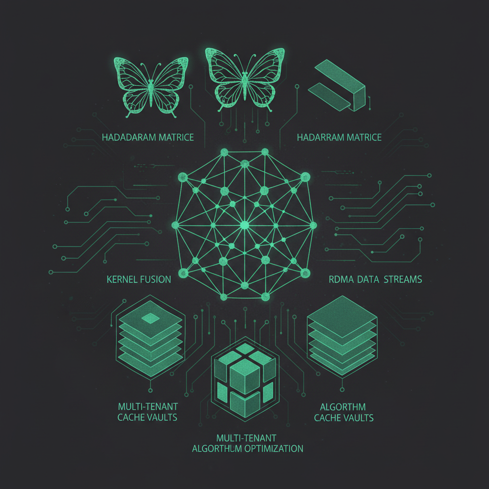

# 今日焦点：推理投产前的集中加固

**📅 2026-05-06**

> TRT-LLM 一天合并六七个性能 PR 砍 FMHA JIT 开销，Mooncake 24 小时修五个多节点传输故障，llama.cpp 用 FWHT 把 KV rotation 复杂度降到 O(N log N)——都不是探索新方向，而是让已选路径真正跑稳跑快。

---

## 推理侧

**TRT-LLM FMHA JIT 重编译修复[1]** - eager generation 路径下 FMHA kernel 选型与 CUDA graph warmup 不对齐，每次冷启动多出约 6 秒 JIT 重编译；修复方案是导出 cubin 并对齐选型逻辑，直接砍掉这笔开销，对 TTFT 有立竿见影的改善，属于 **[持续更新]**。

**TRT-LLM MoE cubins 更新[2]** - 更新了 MoE 推理 kernel 的 cubins，影响所有 MoE 模型在 TRT-LLM 上的推理吞吐。

**TRT-LLM Qwen3.5 GDN kernel fusion[3]** - 为 Qwen3.5 的 GDN 层引入三个 Triton kernel：sigmoid 融入 gating、split QKV + transpose 融合、rotary embed split 融合。逐模型定制 kernel fusion 是投产前典型操作，通用路径已经够快，现在压特定模型瓶颈。

**TRT-LLM decode 路径优化[4][5][6]** - #13748 优化 beam search 从 prefill 切到 decode 的 handoff 开销；#13012 用四个定向改动减少 decode step 的 Python/C++ API 调用开销，直接贡献 decode throughput；#13574 修复 piecewise CUDA graph capture 漏掉 num_tokens 值的静默失败。

**llama.cpp FWHT 替换 KV rotation[7]** - 用 Fast Walsh-Hadamard Transform 替换 KV cache rotation 的矩阵乘法实现，复杂度从 O(N²) 降到 O(N log N)。巧妙利用 ggml_unary 中 SILU_BACK 的槽位，对边缘推理框架来说算法层降级的收益上限远高于逐 kernel 调参。

**llama.cpp RMS_NORM + MUL 融合[8]** - CPU 后端新增融合 kernel，单 pass 完成 RMS_NORM + MUL 计算，避免中间结果 materialization，对 Apple Silicon 等内存带宽受限平台有直接收益。

**llama.cpp 新模型与启动优化[9][10]** - 加入 IBM granite-4.0-1b-speech 语音模型支持（Conformer encoder + QFormer projector）；修复延迟加载 backend 问题，减少启动时不必要的库加载。

**Megatron MoE 推理后端与通信重叠[11][12][13]** - 引入 vLLM 的 grouped gemm kernel 作为 MoE 推理后端；将 allgatherv 和 MoE 预处理隐藏在 shared expert 计算背后实现通信-计算重叠；将推理上下文 bookkeeping 从 GPU 搬到 pinned CPU 并引入 ContextGPUView 减少显存占用——这是 Megatron 从训练框架走向独立推理服务的关键步骤，属于 **[持续更新]**。

---

## 生产部署侧

**Mooncake RDMA use-after-free 修复[14]** - 修复 QP 并发销毁导致 ibv_post_send 段错误的崩溃，生产环境多节点部署必现。

**Mooncake EFA 硬件 RDMA 降级修复[15]** - Mooncake 请求 libfabric API 1.14 时 EFA provider 对低于 1.18 的调用者强制关闭 device RDMA，所有 EFA 代际静默降级到软件路径；升级到 1.18 后硬件 RDMA 才真正启用。这类版本兼容性 bug 在生产环境极难定位。

**Mooncake P2P 握手死锁修复[16]** - 三个 TransferEngine 实例可形成 T0→T1→T2→T0 的环形等待死锁，修复了握手逻辑打破等待环。

**Mooncake dmabuf 注册修复[17][18]** - 修正 dmabuf 注册地址边界问题（cuMemGetHandleForAddressRange 要求精确 allocation 边界而非用户地址）；确保注册前 CUDA primary context 已初始化。

**Mooncake 其他修复[19][20]** - 修复 extend_group_size_to 后 dist.get_world_size 不反映更新值的问题（根因是继承的非虚方法 getSize）；统一 nvlink 和 ubshmem allocator 入口。

**LMCache 多租户隔离[21]** - 引入 IsolatedLRU 驱逐策略，不同 cache_salt（用户）之间互不驱逐并支持配额配置。KV cache 正从单租户优化工具向共享基础设施演进。

**LMCache HuggingFace 内置后端[22]** - 将 HuggingFace Buckets 作为内置远程存储后端，降低对外部 S3/MinIO 的依赖门槛。

**LMCache Blend KV cache 静默 bug 修复[23][24]** - 提取共享 RawBlockCore 在多进程场景复用 raw-block L2 适配器；修复 CB 查找正确性问题——cb_store_final 从未在指纹表中注册 chunk，导致 CB 命中率恒为 0%，属于存在已久的静默 bug。

---

## 训练侧

**Megatron 梯度损坏修复[25]** - 修复 --overlap-param-gather + layerwise distributed optimizer 下的梯度损坏 bug，属于训练稳定性关键修复。

**Megatron chunked MLP 扩展到训练[26]** - 将 chunked MLP 从推理扩展到训练阶段，属于 **[持续更新]**。

**Megatron legacy A2A dispatcher 修复[27]** - 为 legacy A2A dispatcher 重新启用 EP sync 并禁用其 decode 阶段 cudagraph。

---

> 一句话结论：**推理基建正在经历投产前集中加固——不是探索新方向，而是让已选路径真正跑稳跑快；同时 KV cache 正从单租户工具变成需要租户隔离的独立基础设施层。**

---

## 参考

[1] Drop cubin and eliminate ~6s FMHA JIT recompile in eager generation：https://github.com/NVIDIA/TensorRT-LLM/pull/13505

[2] Update TRTLLM MoE cubins：https://github.com/NVIDIA/TensorRT-LLM/pull/12440

[3] Fuse GDN elementwise ops and split/transpose kernels：https://github.com/NVIDIA/TensorRT-LLM/pull/12966

[4] Reduce beam-search prefill->decode handoff cost：https://github.com/NVIDIA/TensorRT-LLM/pull/13748

[5] AutoDeploy: reduce C++ dispatch overhead in decode scheduling loop：https://github.com/NVIDIA/TensorRT-LLM/pull/13012

[6] Broader capture of piecewise cudagraph：https://github.com/NVIDIA/TensorRT-LLM/pull/13574

[7] ggml: implement fast walsh-hadamard transform for kv rotation：https://github.com/ggml-org/llama.cpp/pull/22631

[8] ggml-cpu: fuse RMS_NORM + MUL on CPU backend：https://github.com/ggml-org/llama.cpp/pull/22423

[9] mtmd: add granite-speech support：https://github.com/ggml-org/llama.cpp/pull/22101

[10] common: only load backends when required：https://github.com/ggml-org/llama.cpp/pull/22290

[11] Add vLLM grouped gemm backend for MoE inference：https://github.com/NVIDIA/Megatron-LM/pull/4566

[12] Enable shared expert overlap with allgatherv in inference：https://github.com/NVIDIA/Megatron-LM/pull/4570

[13] Move inference context bookkeeping to CPU with ContextGPUView：https://github.com/NVIDIA/Megatron-LM/pull/4306

[14] rdma: fix use-after-free crash in ibv_post_send：https://github.com/kvcache-ai/Mooncake/pull/1903

[15] fix(efa): request libfabric API 1.18 for device RDMA：https://github.com/kvcache-ai/Mooncake/pull/2041

[16] Fix possible deadlock in RDMA transport connection setup：https://github.com/kvcache-ai/Mooncake/pull/1959

[17] Use allocation base addr for dmabuf-based mem registration：https://github.com/kvcache-ai/Mooncake/pull/2035

[18] Init CUDA primary context before dmabuf-based mem registration：https://github.com/kvcache-ai/Mooncake/pull/2034

[19] Inherit ProcessGroup to fix dynamic getSize() after extend_group_size_to：https://github.com/kvcache-ai/Mooncake/pull/2040

[20] Unify fabric allocator plumbing：https://github.com/kvcache-ai/Mooncake/pull/2028

[21] Add IsolatedLRU eviction policy + per-cache_salt quotas：https://github.com/LMCache/LMCache/pull/3137

[22] Add Hugging Face Buckets as a built-in remote storage backend：https://github.com/LMCache/LMCache/pull/3060

[23] Add raw_block MP L2 adapter support via shared RawBlockCore：https://github.com/LMCache/LMCache/pull/3119

[24] Fix CB lookup correctness, thread safety, and store-complete race：https://github.com/LMCache/LMCache/pull/3179

[25] Fix gradient corruption with layerwise param all-gather overlap：https://github.com/NVIDIA/Megatron-LM/pull/4609

[26] Add logic to enable chunked MLP during training：https://github.com/NVIDIA/Megatron-LM/pull/3656

[27] Re-enable EP syncs for legacy A2A dispatcher + simplify ep_sync：https://github.com/NVIDIA/Megatron-LM/pull/4587
