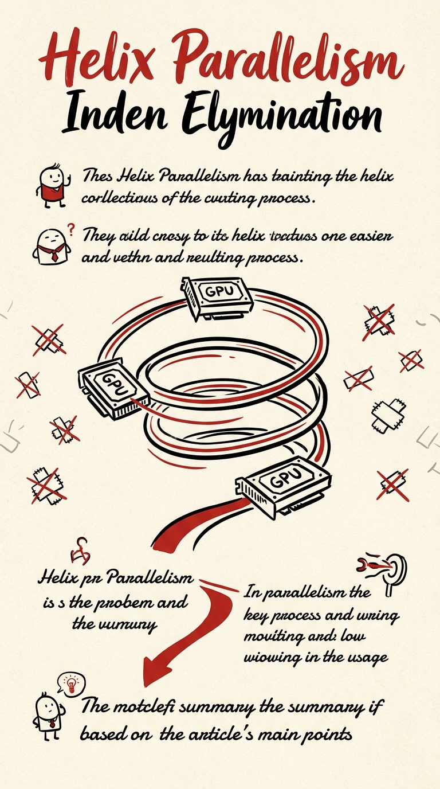

# 今日焦点：推理框架的竞争点从"能跑新模型"转向"通用路径上跑稳"

**📅 2026-05-07**

> TRT-LLM 去掉 Llama 4/Qwen3 系列模型专用补丁，SGLang 将 P2P 权重传输从实验分支迁入主线，vLLM 修了 PP 并发 token 丢失——三大框架同一天的动作指向同一个方向。

---

## 推理侧

**TRT-LLM Helix Parallelism 博文合入[1]** — NVIDIA 在 TP/PP/EP/CP 之外提出新的多维度并行策略 Helix Parallelism，官方博文作为 PR 合入主仓库，标志着并行策略布局有了新的叙事。同时 Sparse FMHA 加入 multi-cta-kv 支持[6]，MoE cubins 更新[5]，底层 kernel 覆盖面持续扩展。

**TRT-LLM AutoDeploy 去掉模型专用补丁[2]** — PR #13247 去掉了 Llama 4 / Qwen3 Next / Qwen3 MoE 的特殊补丁，这些此前需要逐个手写的 special case 现在走通用部署路径。配合 decode 调度路径的 C++ 开销优化[3]和 Qwen3.5 GDN 的 elementwise kernel fusion[4]，部署管线正在从"为每个模型写补丁"收敛到"通用路径自洽"。新模型上线时间会越来越短，维护成本越来越低。

**SGLang P2P 权重传输迁入主线[7-12]** — 同一天连续 cherry-pick 6 个 weight_checker 相关 PR 从实验分支 sglang-miles 到 main，涵盖 FP8 dequant 修复、non-persistent buffer 跳过、buffer pattern 重构、checksum 支持和端到端测试。P2P 实时权重更新能力从实验阶段正式进入主线——对需要不停服更新模型的推理场景（如热切换 checkpoint）是关键的成熟度信号。

**SGLang PD 分离部署故障链路收紧[13-15]** — abort 状态传播修复覆盖了所有 KV backend[13]，状态被意外清除的问题被修复[14]，KV transfer metrics 修复让监控链路闭合[15]。此外 HiSparse FP8 KV cache 路由到 flashmla_kv backend[16]、SWA HiCache 加入 unified radix cache[17]、CP KV cache allgather symmetric memory 注册[18]等 PR 在推进 KV cache 的多 backend 统一。

**vLLM 修 PP 并发 token 丢失[31]** — Pipeline Parallelism 模式下并发请求导致 token 丢失，在 Qwen3-8B GSM8K 评测中暴露（精度从 0.8741 下降），token 在 pipeline 阶段间传递时被丢弃。这是典型的只有生产并发流量才会触发的 bug，单请求测试根本发现不了。属于 **[持续更新]**。

**vLLM HF tokenizer 线程安全修复[32]** — HuggingFace fast tokenizer 的 `RuntimeError: Already borrowed` 并发问题被修复，加了线程安全 wrapper。此外 Qwen3 streaming content routing 修复[33]、DeepSeekV32/v4 string attribute 和 argument unwrap 修复[34]、torchtitan rl 场景 codegen 修复[35]也在同天合入。多用户并发是推理框架正确性的试金石。

---

## 训练侧

**Megatron-LM 修 layerwise param all-gather overlap 梯度损坏[19]** — 使用 Muon 等分布式优化器时梯度在 overlap 过程中被破坏，导致训练结果静默出错。这种 bug 不会 crash，只会让模型效果悄悄变差，尤其危险。

**Megatron-LM SHA-256 替换 polynomial rolling hash 做 prefix caching[21]** — 消除了哈希碰撞风险，polynomial rolling hash 在 prefix 空间巨大时确实存在碰撞概率，换成 SHA-256 是正确性优先的选择。

**Megatron-LM FlashInfer sampling[20]** — 采样路径从自定义实现切换到 FlashInfer，可能对解码性能有正面影响。同时 legacy GPT 代码被整体删除[22]，CSA/HCA hybrid attention prototype 进入 HybridModel[23]，代码库在加速清理历史包袱。

---

## 生产部署侧

**Ray K8s 1.35 原地 Pod 扩缩容[27]** — 基于 1.35 IPPR（In-Place Pod Resizing）实现 Pod 原地扩缩容，不需要杀 Pod 重调度就能调整 CPU/内存资源，对在线推理服务的弹性伸缩有直接价值。

**Ray LLM 组件升级 vLLM 到 0.20.0[28]** — 切换到 CUDA 13 + Python 3.12 镜像。HAProxy ingress request router 进入第四阶段[29]，Ray Train + torchft 的 replica group restart hang 问题被修复[30]。

---

## 工具链

**DeepSpeed v0.19.0 发布[24]** — 版本号 bump PR 在 release 前后各有一笔[25][26]，属于连续迭代中的新稳定版本，具体功能变更等官方 release notes 补充。

---

> 一句话结论：**推理框架的护城河正在从"能跑新模型"转向"在通用路径上跑稳"，分布式训练的正确性仍然是比性能更优先的问题。**

---

## 参考

[1] TRT-LLM Helix Parallelism blog post：https://github.com/NVIDIA/TensorRT-LLM/pull/13547

[2] TRT-LLM AutoDeploy remove model patches：https://github.com/NVIDIA/TensorRT-LLM/pull/13247

[3] TRT-LLM AutoDeploy decode scheduling C++ overhead optimization：https://github.com/NVIDIA/TensorRT-LLM/pull/13012

[4] TRT-LLM Qwen3.5 GDN elementwise kernel fusion：https://github.com/NVIDIA/TensorRT-LLM/pull/12966

[5] TRT-LLM MoE cubins update：https://github.com/NVIDIA/TensorRT-LLM/pull/12440

[6] TRT-LLM Sparse FMHA multi-cta-kv support：https://github.com/NVIDIA/TensorRT-LLM/pull/13410

[7] SGLang weight checker FP8 dequant fix cherry-pick：https://github.com/sgl-project/sglang/pull/24532

[8] SGLang weight checker non-persistent buffer pattern cherry-pick：https://github.com/sgl-project/sglang/pull/24533

[9] SGLang weight checker fp32 buffer skip cherry-pick：https://github.com/sgl-project/sglang/pull/24534

[10] SGLang weight checker unit test and e2e test：https://github.com/sgl-project/sglang/pull/24536

[11] SGLang weight checker checksum support：https://github.com/sgl-project/sglang/pull/24537

[12] SGLang weight checker buffer pattern refactor：https://github.com/sgl-project/sglang/pull/24538

[13] SGLang PD abort state propagation fix：https://github.com/sgl-project/sglang/pull/24522

[14] SGLang PD prevent update_status from cleared entries：https://github.com/sgl-project/sglang/pull/24539

[15] SGLang PD KV transfer metrics fix：https://github.com/sgl-project/sglang/pull/24416

[16] SGLang HiSparse FP8 KV cache：https://github.com/sgl-project/sglang/pull/23013

[17] SGLang SWA HiCache for unified radix cache：https://github.com/sgl-project/sglang/pull/23391

[18] SGLang CP KV cache allgather symmetric memory registration：https://github.com/sgl-project/sglang/pull/24040

[19] Megatron-LM fix layerwise param all-gather overlap gradient corruption：https://github.com/NVIDIA/Megatron-LM/pull/4609

[20] Megatron-LM FlashInfer sampling：https://github.com/NVIDIA/Megatron-LM/pull/2456

[21] Megatron-LM SHA-256 prefix caching：https://github.com/NVIDIA/Megatron-LM/pull/4612

[22] Megatron-LM delete legacy GPT code：https://github.com/NVIDIA/Megatron-LM/pull/4322

[23] Megatron-LM CSA/HCA hybrid attention prototype：https://github.com/NVIDIA/Megatron-LM/pull/4569

[24] DeepSpeed v0.19.0 release：https://github.com/deepspeedai/DeepSpeed/releases/tag/v0.19.0

[25] DeepSpeed version bump pre-release：https://github.com/deepspeedai/DeepSpeed/pull/7995

[26] DeepSpeed version bump post-release：https://github.com/deepspeedai/DeepSpeed/pull/7996

[27] Ray K8s 1.35 in-place Pod resizing：https://github.com/ray-project/ray/pull/55961

[28] Ray LLM upgrade vLLM to 0.20.0：https://github.com/ray-project/ray/pull/62970

[29] Ray HAProxy ingress request router dispatch path：https://github.com/ray-project/ray/pull/62669

[30] Ray Train + torchft fix hang on replica group restarts：https://github.com/ray-project/ray/pull/62651

[31] vLLM fix PP mode token loss：https://github.com/vllm-project/vllm/pull/41133

[32] vLLM HF fast tokenizer thread safety wrapper：https://github.com/vllm-project/vllm/pull/41181

[33] vLLM Qwen3 streaming content routing fix：https://github.com/vllm-project/vllm/pull/40820

[34] vLLM DeepSeekV32/v4 string attribute and argument unwrap fix：https://github.com/vllm-project/vllm/pull/41801

[35] vLLM codegen for unqualified names fix：https://github.com/vllm-project/vllm/pull/40726
