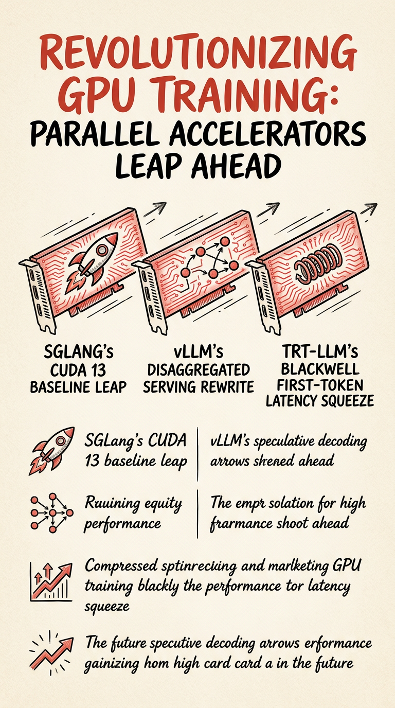

# 今日焦点：推理框架三线并进量产准备——新模型、新硬件、核心架构同时收口

**📅 2026-05-08**

> 三大推理框架几乎在同一时间窗口完成关键架构升级，speculative decoding 在三天内被适配到三个完全不同的模型家族——新模型、新硬件、核心架构三条线同步进入量产冲刺。

---

## 推理侧

**SGLang v0.5.11 扶正 CUDA 13 基线[1]** — CUDA 版本从 12 提到 13.0、PyTorch 从 2.9 升到 2.11，成为推理框架生态里第一个把 CUDA 13 作为默认基线的 major release。同日合并三个 reasoning parser PR：自动检测（`--reasoning-parser auto`）[2]、两阶段 grammar + `--enable-strict-thinking`[3]、配置字段兼容修复[4]。竞争力从底层 kernel 上移到上层接口设计。属于 **[持续更新]**。

**DeepSeek-V4 MXFP4 推理路径落地[5]** — Marlin MoE kernel 搬到 JIT 编译框架，MXFP4 从实验性支持走向可用。配套修复同步推进：attn kernel early exit 加 cuda-graph 支持[6]、NSA prefill context parallel 修复 CP 进程组引用错误导致的 crash[7]。TRT-LLM 侧也在做 DeepSeek-V4 的 dis-agg CI（GB200 only）[8]和 indexer compressed lengths 修复[9]。两个框架同时在 DeepSeek-V4 上做稳定性打磨，推理部署已进入工程收敛期。属于 **[持续更新]**。

**vLLM 路由架构重写——disaggregated serving 地基重铺[10]** — 用 device-cache 方案替换原有 routing replay 机制，解决了 CUDA graphs、多节点 TP 和 data parallelism 场景下的正确性问题，新方案通过 device cache + async D2H pipeline 让路由逻辑正确适配这些场景。nixl transfer design 重构 PR 同日合并[11]。SGLang 侧也在做 KV 传输异步化[12]，两个框架几乎同时在 disaggregated serving 路径上做架构级清理，背后很可能是大规模部署中暴露的性能和正确性瓶颈在倒逼重构。

**TRT-LLM v1.3.0rc14——Blackwell 首 token 延迟系统性压缩[13]** — 在 Blackwell SM100+ 上集成 FP4 indexer 用于 DSA[14]；SWA prefill 引入 scratch slots 做内存复用，窗口外 KV block 在 prefill 结束后立即释放[15]；KvCacheAwareRouter 把 tokenize + block-hash offload 到独立线程，从关键路径移除约 50ms CPU 开销[16]；Llama 8B decode 三重优化——silu_mul backend 切换、quant+silu_mul fusion、QKV passthrough[17]。所有改动指向同一目标：从量化到内存管理到计算内核，每一层都在挤出 Blackwell 首 token 延迟。

## 推理加速

**Speculative decoding 正在变成新模型首发标配** — 三天内三个框架分别给不同模型家族加了 speculative decoding 支持：SGLang 给 Gemma 4 加了 MTP（Multi-Token Prediction）[18]；vLLM 给 Qwen3.5 加了 Mamba 混合模型支持（Model Runner V2）[19]；vLLM 给 Laguna 加了 DFlash[20]。TRT-LLM 也在 v1.3.0rc14 里给 Mamba 混合模型（含 Qwen3.5）加了 prefix caching[13]，SGLang 还做了 TRT-LLM draft extend 的 decode kernel 适配[21]。MTP、Mamba 混合、DFlash——三种完全不同的加速策略，三个不同的模型家族，同步落地。这不是巧合，而是趋势确认：speculative decoding 已从"少数模型的实验性特性"变成"每个新模型首发时必须考虑的推理路径"。

## 生产部署侧

**Ray Serve 完成直接流式转发架构[22]** — 用 5 个 PR 完成核心改造：HAProxy ingress router 把请求 pin 到具体 replica，绕过原来的 Serve proxy 转发层，减少中间环节[23]。在架构层面让流式推理更直接。

**Mooncake 触角伸向 AMD CDNA4[24]** — 给 Tent 子系统加了 AMD CDNA4（ROCm/HIP）支持，同时做了 EP comprehensive test 去除对 DeepEP 的依赖[25]。在硬件层面把 KV cache 传输搬到 AMD 平台，扩展推理部署的硬件选择面。

---

> 一句话结论：**推理框架正在新模型、新硬件、核心架构三条线上同步做量产准备，speculative decoding 已从后置优化变成新模型推理路径设计第一天的必修课。**

---

## 参考

[1] SGLang v0.5.11 Release：https://github.com/sgl-project/sglang/releases/tag/v0.5.11

[2] SGLang Reasoning parser auto-detect：https://github.com/sgl-project/sglang/pull/23952

[3] SGLang Two-phase reasoning grammar：https://github.com/sgl-project/sglang/pull/23953

[4] SGLang reasoning.enabled mapping fix：https://github.com/sgl-project/sglang/pull/23951

[5] SGLang MXFP4 Marlin MoE JIT kernel：https://github.com/sgl-project/sglang/pull/24490

[6] SGLang DeepSeek-V4 attn kernel early exit with cuda-graph：https://github.com/sgl-project/sglang/pull/24584

[7] SGLang NSA prefill context parallel crash fix：https://github.com/sgl-project/sglang/pull/24560

[8] TRT-LLM DeepSeek-V4 dis-agg CI：https://github.com/NVIDIA/TensorRT-LLM/pull/13803

[9] TRT-LLM DeepSeek-V4 indexer compressed lengths fix：https://github.com/NVIDIA/TensorRT-LLM/pull/13802

[10] vLLM Replace routing replay with device cache：https://github.com/vllm-project/vllm/pull/39917

[11] vLLM Nixl refactor: new transfer design：https://github.com/vllm-project/vllm/pull/40731

[12] SGLang Nixl async transfer：https://github.com/sgl-project/sglang/pull/23967

[13] TRT-LLM v1.3.0rc14 Release：https://github.com/NVIDIA/TensorRT-LLM/releases/tag/v1.3.0rc14

[14] TRT-LLM FP4 indexer for DSA on Blackwell：https://github.com/NVIDIA/TensorRT-LLM/pull/13340

[15] TRT-LLM SWA prefill memory reuse：https://github.com/NVIDIA/TensorRT-LLM/pull/13368

[16] TRT-LLM KvCacheAwareRouter tokenize+block-hash offload：https://github.com/NVIDIA/TensorRT-LLM/pull/13377

[17] TRT-LLM Llama 8B decode triple optimization：https://github.com/NVIDIA/TensorRT-LLM/pull/12507

[18] SGLang Gemma 4 MTP speculative decoding：https://github.com/sgl-project/sglang/pull/24436

[19] vLLM Qwen3.5 Mamba hybrid for Model Runner V2：https://github.com/vllm-project/vllm/pull/35520

[20] vLLM Laguna DFlash speculative decoding：https://github.com/vllm-project/vllm/pull/41880

[21] SGLang TRT-LLM draft extend decode kernel：https://github.com/sgl-project/sglang/pull/24566

[22] Ray Serve direct streaming proxy (5/5)：https://github.com/ray-project/ray/pull/63167

[23] Ray Serve HAProxy ingress request router：https://github.com/ray-project/ray/pull/62669

[24] Mooncake AMD CDNA4 platform support：https://github.com/kvcache-ai/Mooncake/pull/2021

[25] Mooncake EP comprehensive test：https://github.com/kvcache-ai/Mooncake/pull/1695
