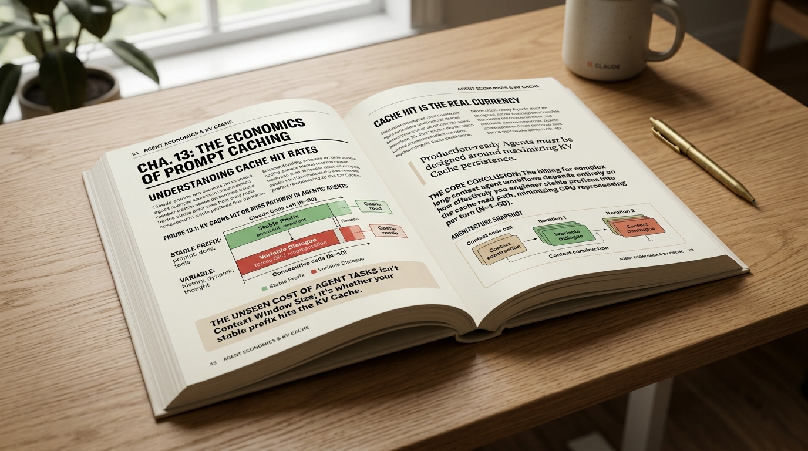
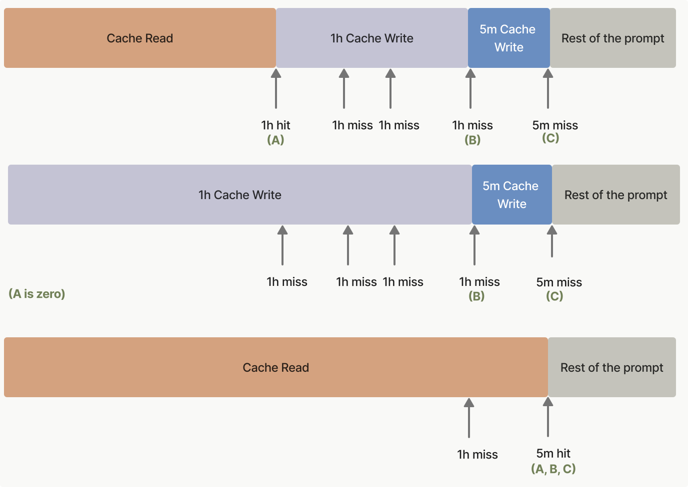

> Codex 进入 Slack、IDE 和云端，Claude Code 开始跑 Web 版多任务，Cursor 云端 agent 直接产出可验证 PR[18][19][20]。coding agent 的竞争已经从“会不会写代码”推进到“能不能长时间、低成本、可观测地跑完任务”——这背后真正决定账单的，是 KV cache。

---

## 一、Agent 的上下文为什么这么贵

Agent 是 LLM 推理里最极端的一类工作负载。普通 chat 可能只有 2K token，一问一答之后就结束；一次 Claude Code 任务却可能连续跑 50 次模型调用，每次都带着 30K 以上的固定前缀，工具结果还会在过程中不断追加。**把 prefill 当成一次性成本来理解，生产级 agent 的经济账很快就会崩掉。**

Manus 团队给过一个很直白的判断：**KV cache 命中率是生产级 agent 的单一最重要指标**[1]。原因不玄学。Claude Sonnet 的缓存读价格是 **0.30 美元/MTok**，未命中的输入价格是 **3 美元/MTok**，差了 **10 倍**[4]。如果一个任务 50 轮，每轮都重新读 30K token，仅固定前缀就会带来非常可观的成本；一旦同一段前缀稳定命中 cache read，这部分成本立刻降到另一个数量级。

输入输出比例也在强化这件事。Manus 公开的平均输入/输出 token 比是 100:1[1]。模型每步可能只生成几十到几百个 token，却要读进去上一步留下的几万 token。生产级 agent 的优化重心自然会从“怎么生成更快”转向“怎么少算已经读过的东西”。

这也是 Claude Code 上下文工程的真实底色。它表面上是在设计提示词、工具 schema、自动压缩和会话恢复，底层统一目标却很简单：**让更多 token 走 cache read，让更少 token 走全量 prefill。**

## 二、Anthropic 缓存接口把应用层锁成了 prefix 工程

Claude Code 的缓存设计首先要服从 Anthropic API 的 prompt caching 规则[4]。这层规则非常硬：**缓存匹配是 prefix 字节级精确匹配。** 空格、标点、JSON key 顺序、工具定义的微小变化，只要改变了请求开头到 cache breakpoint 之间的字节序列，就会得到一条新的 prefix。

这和很多人直觉里的“语义相似就能复用”完全不同。Prompt cache 复用的是已经算好的 KV，不是检索相似文本。它要求前缀内容从第一个字符开始保持一致。对 Claude Code 这种工具密集型 harness 来说，工具 schema、系统提示词、消息历史的排列顺序都变成了性能路径上的一部分。

Anthropic 的层级失效结构也决定了上层写法。**`tools` → `system` → `messages` 是一条级联失效链。** 工具定义一变，系统提示词和消息缓存都会被连带失效；系统提示词一变，messages 层从后面开始失效；最后一条 user 消息变化，影响范围最小。这个顺序解释了为什么 Claude Code 会对工具描述、动态段落和系统提示词边界格外敏感。



*图 1：同一请求里同时使用 5 分钟与 1 小时 TTL 时，会形成 cache read、1 小时 cache write、5 分钟 cache write 三段计费边界。来源：Anthropic 官方文档。*

TTL 又给这套结构加了一层时间约束。默认缓存 5 分钟，写入成本是基础输入价的 1.25 倍；扩展到 1 小时，写入成本变成 2 倍；两档读取都是 0.1 倍[4]。这意味着 **1 小时 TTL 不是白送的预付费缓存**，它只有在长任务、多轮调用、固定前缀足够大时才划算。Claude Code 之所以会围绕 1 小时 cache 做大量 latching，本质上是在避免会话中途的小变化把这笔预付成本浪费掉。

## 三、Claude Code 如何把提示词拆成稳定结构

Claude Code 的系统提示词不是一个大字符串，而是一组被注册、缓存、拼接的段落[6]。每段通过 `systemPromptSection(name, compute)` 进入注册表，计算结果被 memoize 到会话状态里。需要每轮重算的内容必须显式走 `DANGEROUS_uncachedSystemPromptSection`，还要写明理由。**这个 API 名字本身就是工程约束：打破 cache 的动作不能像随手加一句提示词一样轻。**

`SYSTEM_PROMPT_DYNAMIC_BOUNDARY` 是更关键的分割线。边界之前的内容必须完全静态，可以进入 global cache；边界之后才放会话相关的动态内容。原因很现实：边界之前每多一个会话变量，prefix hash 的变体数量就会膨胀。**系统提示词越靠前，越应该低频、稳定、可共享。**

`splitSysPromptPrefix()` 负责把这套结构落到实际请求里。first-party 标准路径会把提示词拆成 attribution、prefix、static、dynamic 几块，最大化跨用户复用。遇到 MCP 工具时，global cache 会降级，因为 MCP 工具列表本身是会话相关的，不能污染全局池。第三方 provider 则走更保守的单块 org 级缓存路径。

工具描述也被当成 micro-harness。BashTool 的描述会告诉模型哪些操作应该交给专用工具，FileEditTool 的描述会强调“先读后改”。**这些文字不是文档装饰，而是 prefix 的一部分。** 它们一旦频繁变化，代价会沿着 `tools` 层级向下传播。

SkillTool 的预算限制更能说明问题。可用 skill 列表被硬限制在 context window 的 1% 左右，200K 窗口下大约 8,000 字符，单条 skill 描述也有上限[10]。技能生态可以增长，但不能让增长悄悄推高每次调用的固定前缀。

## 四、自动压缩不是省略上下文，而是控制 cache break 的外科手术

当会话接近窗口上限，Claude Code 会触发 autoCompact。对 200K context window 的 Sonnet 4.x，最终触发点大约是 **167K token**[7]。这个数字来自三层缓冲：给压缩输出预留 20K token，再留 13K 的安全缓冲，最后还有 3K 的硬底线。它的目标不是把窗口塞满，而是保证压缩请求本身不会再次触发压缩。

压缩模板也很工程化。它要求模型按时间顺序恢复用户意图、关键技术概念、文件与代码片段、错误和修复、待办事项、当前工作和下一步。文件部分要求“完整代码片段”，而不是只保留 diff。因为压缩后的摘要不是给人看的会议纪要，它要支撑下一轮模型继续干活。

真正有生产味道的是断路器。Claude Code 曾经遇到过真实事故：1,279 个会话出现连续 50 次以上压缩失败，最长一个会话连续失败 3,272 次，全网每天浪费约 25 万次 API 调用[7]。最后系统把规则写死：**连续 3 次自动压缩失败，就停止自动压缩。** 用户仍然可以手动 `/compact`，自动路径不再继续烧钱。

压缩后的恢复也没有追求“全量还原”。系统会重新读取最近访问的文件，但最多 5 个文件，单文件 5,000 token，总预算 50,000 token。Skill 恢复也有类似预算。更有意思的是，`sentSkillNames` 在压缩后不会重置。重新发送完整 skill 描述大约要 4K token，收益有限；**系统选择接受技能发现能力轻微下降，换取每次压缩少付一段固定前缀。**

## 五、微压缩和 context_management：小手术比大手术更常见

自动压缩是大手术，但大多数会话更常遇到的是小手术。第一种是时间触发型裁剪：连续 60 分钟以上没有活动后，下一次请求只保留最近 5 个工具结果，旧结果替换成占位文本。默认 5 分钟 TTL 早已冷却，旧工具输出重新发送也很难带来命中收益，**直接减少输入更划算。**

第二种是 `cache_edits`。本地消息数组可以保持不动，服务端从已经缓存的 KV 序列里删除特定区间。这个设计的关键在于，**本地结构不动，prefix key 的计算基础也不动；清理发生在缓存侧。** 代价是后续 token usage 会下降，cache break 检测必须知道这是预期下降，不能误报成缓存失效。

第三种是 Anthropic 的 `context_management` API[2]。典型配置长这样：

```json
{
  "context_management": {
    "edits": [{
      "type": "clear_tool_uses_20250919",
      "trigger": { "type": "input_tokens", "value": 30000 },
      "keep": { "type": "tool_uses", "value": 3 },
      "clear_at_least": { "type": "input_tokens", "value": 5000 },
      "exclude_tools": ["web_search"]
    }]
  }
}
```

含义是输入超过 30,000 token 后，按时间顺序清理旧工具结果，至少清掉 5,000 token，同时保留最近 3 次 tool use。`clear_at_least` 这个参数很重要：**清理会造成 cache prefix 失效，必须一次清够，才值得为新的缓存写入付费。**

Anthropic 后来又推出 `compact_20260112`，把服务端压缩做成 API 策略[8]。它默认 150,000 token 触发，生成 `compaction` block，再由下次请求带回。对很多应用来说，这能省掉自建压缩模板、重试和断路器的成本。但 Claude Code 仍然保留客户端压缩，因为它需要控制恢复细节，比如最近文件、skill 状态和计划文件的再注入。

## 六、cache break 检测：90% 的失效来自服务端

缓存失效无法完全避免，关键是要知道它为什么发生。Claude Code 里有一份专门的 `promptCacheBreakDetection.ts`，大约 728 行代码，只做 cache break 记录和归因[9]。

这套系统分两步。请求前记录系统提示词、工具 schema、模型设置、cache control、beta header 等状态；响应后再看 cache read token 是否显著下降。判定条件有两个门槛：相对下降超过上一次基线的 5%，同时绝对下降超过 2,000 token。双门槛能过滤掉小波动，也能避免低基线误报。

它维护的状态非常细，包括 `systemHash`、`toolsHash`、`cacheControlHash`、每个工具单独的 hash、模型、fast mode、global cache 策略、beta header、额外 body hash、上一轮 cache read token 和调用次数。子 agent、SDK、主线程还会按 tracking key 隔离，避免不同来源互相污染。

这套观测得出过一个很改变优化方向的结论：**约 90% 的 cache break 来自服务端路由或驱逐，而不是客户端改动**[9]。如果大多数失效不受客户端控制，客户端优化就应该集中在那 10% 可控变化上，把工具 schema、系统提示词、feature flag、日期和用户路径这些变量锁到最稳定。

另一个数字同样关键：**77% 的工具 schema 变化是单工具变化**[9]。这解释了为什么系统要做 `perToolHashes`。粗粒度 hash 只能告诉你“工具集变了”，工具粒度 hash 才能定位是哪一个工具破坏了 prefix。

## 七、七种模式：把会变的东西关到尾部

Claude Code 的 latching 机制就是把可控变化锁死[10]。会话开始时决定能否使用 1 小时 TTL，之后用户额度状态翻转也不改变序列化出的 cache control。GrowthBook allowlist 在会话内冻结，避免远程配置中途翻转。AFK Mode、Fast Mode、Cache Editing 这类 beta header 一旦在会话中打开，也会保持打开，直到 `/clear` 或 `/compact` 解锁。**latching 的本质是用会话内稳定性换 cache key 稳定性。**

日期也被处理成稳定变量。`getLocalISODate` 在会话开始时 memoize，过了午夜可能仍然用旧一天日期。这个代价可以接受，因为每天零点全网系统提示词重建造成的 cache 雪崩更难承受。工具提示词里的月份则进一步粗化成 “Month YYYY”，把变化频率从每天降到每月。

Agent 列表附件化是一个很有代表性的优化。原本 dynamic agent listing 如果塞进工具描述，会污染 `tools` 层；移到消息附件之后，失效范围被推到尾部。这一项消除了全队 **10.2% 的 `cache_creation_tokens`**[10]。数字不大，却足够说明层级位置的价值：**越靠前的内容越贵，越动态的内容越应该往后放。**

用户路径也要去个性化。把 `/private/tmp/claude-{UID}/` 替换成 `$TMPDIR`，可以消除用户维度差异，让同一段 BashTool 提示词从组织级缓存提升到全局缓存。**这里的“抽象”不是为了代码优雅，而是为了让更多用户共享同一条 prefix。**

工具 schema 会话缓存则体现了另一个原则：第一次渲染后，整个会话不再重算。这里曾经出过一个真实 bug：`StructuredOutput` 实例 name 相同，但每个 workflow 的 schema 不同，只用 name 做 cache key 时错误率从 5.4% 飙到 51%。修复方式是把 key 改成工具名加 schema 内容的复合 key[10]。稳定不是简单地“不要变”，而是要把该区分的状态区分清楚。

## 八、底层 KV Cache 基础设施给这套策略兑现

应用层把 prefix 设计得再稳，最后也要靠推理引擎兑现。vLLM 的 Automatic Prefix Caching 走 block-level 精确匹配，每个 KV block 按 token 序列哈希，新请求按相同分块策略查表。**应用层稳定 prefix，推理引擎才有机会把它兑现成少算一次 prefill。** 它和 PagedAttention 原生集成，适合同一批请求共享长前缀的场景。

SGLang 的 RadixAttention 更适合多轮分支和部分重叠场景。它用 radix tree 管理 prefix，天然支持共享前缀的局部命中。公开材料给过一组参考区间：少样本场景命中率 **85–95%**，多轮 chat **75–90%**，agent 循环和 repo 问答这类 workload 约 **60–85%**[11]。这类结构对工具调用结果交错的 agent 负载很友好。

Mooncake 把问题推到集群层。Moonshot AI 在 Kimi 服务中用 KVCache-centric 的 prefill/decode 分离架构，把可复用 KV 放进全局 pool。FAST'25 论文披露的生产数据很强：**A800 集群每天处理请求量提升 115%，H800 提升 107%，跨千节点每天处理超过 1000 亿 token**[12]。这是公开材料里非常少见的超大规模 KV cache 复用案例。

LMCache 走的是 GPU 外分层缓存路线。它作为 vLLM connector，把 prefix cache 持久化到 CPU 内存或 NVMe，文档给出的端到端节省是 **3–10 倍延迟和 GPU 周期**[13]。当 128K 到 1M context 进入生产路径，GPU HBM 放不下所有 KV，把热数据留在 GPU、温数据放到 CPU/NVMe，会成为越来越常见的架构。

这四类方案合在一起，刚好对应不同层级：vLLM 和 SGLang 解决请求级 prefix 匹配，Mooncake 解决集群级 KV pool，LMCache 解决 GPU 外存储层级。**Claude Code 这类应用层 harness 提供稳定 prefix，底层系统把稳定性折算成更高命中率和更低 prefill 成本。**

## 九、生产 agent 都在收敛到同一组规则

Claude Code 不是孤例。Manus 的经验里，**避免动态前缀是第一原则**：秒级时间戳不要进系统提示词，JSON key 顺序要稳定，cache breakpoint 要显式放在系统提示词后[1]。工具也不轻易动态删除，因为工具定义在缓存层级最顶端，删除会让后续观察全部失效。Manus 选择用 logit masking 屏蔽工具，而不是改工具 schema。

Manus 还有一个很重要的判断：**文件系统是无限上下文的外部记忆。** 网页、文档、工具输出可以保存成路径，需要时再读，没必要把所有 raw data 都塞进 128K 窗口。todo.md 这种复述机制则是为了对抗 lost-in-the-middle，把目标重新写到最近上下文，让 50 步以上的任务仍然保持方向。

Cursor 和 Cline 的取舍不同，但约束相似。Cursor 普通模式下会限制文件读取行数和搜索结果，MAX 模式才开放更大窗口；Cline 直接显示上下文用量，让用户看到真实 token 消耗。两者都用项目级 rules 文件承载长尾偏好，避免把用户特定偏好塞进全局系统提示词。

这些系统最后都在回答同一组问题：**怎样保持 prefix 稳定，怎样裁剪旧状态而不丢任务目标，怎样让工具变化不污染缓存顶端，怎样把模型需要记住的东西放到最近上下文里。** 实现风格不同，物理约束相同。

## 十、接下来会发生什么

研究界也开始把 agentic prompt caching 当成独立对象来评测。`Don't Break the Cache` 用 DeepResearch Bench 跑了 500 多个 agent session，结论是合理使用 prompt caching 可以 **削减 41–80% 成本、提升 13–31% TTFT**[14]。但天真的“全 context 缓存”可能增加延迟，因为动态内容一旦混进前缀，cache 写入和失效的代价会反噬收益。

CodeComp 把 agentic coding 场景里的 KV cache 压缩做成结构化问题，**按 AST 单元压缩，而不是按固定 token 窗口裁剪**[15]。这条路的直觉很对：代码上下文的价值不按 token 均匀分布，一个函数签名、一个类定义、一个错误堆栈往往比同样长度的普通文本更重要。

SideQuest 更进一步，让模型自己管理 KV cache[16]。它在主推理线程之外启动辅助线程，定期判断哪些工具输出已经过期，然后发出结构化删除指令。在 gpt-oss-20b 上微调后，FRAMES 任务峰值 token 减少 **56–65%**，准确率只下降约 2%；H100 单卡上吞吐提升 **83.9%**，KV cache 内存减少 **53.9%**，端到端运行时间减少 **36.8%**[16]。

这条趋势会把一部分今天写在 harness 里的静态规则交给模型自身。模型知道自己看过哪些工具结果、哪些事实已经过期、哪些状态仍然影响下一步，未来它可能直接参与 cache garbage collection。但在生产系统里，**可观测、可解释、可干预的工程层仍然不会消失。** 原因也很现实：当一次 cache break 能让几十 K token 重新计费，工程团队必须知道是谁变了、为什么变、能不能回滚。

Claude Code 给出的经验可以浓缩成一句话：**上下文工程不是把更多文本塞进窗口，而是围绕缓存层级设计应用结构。** 提示词、工具、消息、压缩、文件恢复、底层 KV pool 都要服从同一个约束：稳定的东西放前面，变化的东西往后推，已经读过且不再关键的东西尽早交给缓存层或存储层处理。

---

> 一句话结论：**生产级 Agent 的核心成本不在长上下文本身，而在每一轮能不能把稳定 prefix 留在 cache read 路径上。**

---

## 参考

[1] Context Engineering for AI Agents: Lessons from Building Manus：https://manus.im/blog/Context-Engineering-for-AI-Agents-Lessons-from-Building-Manus

[2] Anthropic Context Editing Documentation：https://platform.claude.com/docs/en/build-with-claude/context-editing

[3] Mastering Engineering: From Claude Code Source to AI Coding Best Practices — Part 4 Ch13: Cache Architecture：https://zhanghandong.github.io/harness-engineering-from-cc-to-ai-coding/part4/ch13.html

[4] Anthropic Prompt Caching Documentation：https://platform.claude.com/docs/en/docs/build-with-claude/prompt-caching

[5] Anthropic quietly nerfed Claude Code's 1-hour cache (XDA, April 2026)：https://www.xda-developers.com/anthropic-quietly-nerfed-claude-code-hour-cache-token-budget/

[6] Mastering Engineering: From Claude Code Source to AI Coding Best Practices — Part 2 Ch5: Prompt Engineering：https://zhanghandong.github.io/harness-engineering-from-cc-to-ai-coding/part2/ch05.html

[7] Mastering Engineering: From Claude Code Source to AI Coding Best Practices — Part 3 Ch9: Context Management：https://zhanghandong.github.io/harness-engineering-from-cc-to-ai-coding/part3/ch09.html

[8] Anthropic Compaction (compact_20260112) Documentation：https://platform.claude.com/docs/en/build-with-claude/compaction

[9] Mastering Engineering: From Claude Code Source to AI Coding Best Practices — Part 4 Ch14: Cache Break Detection：https://zhanghandong.github.io/harness-engineering-from-cc-to-ai-coding/part4/ch14.html

[10] Mastering Engineering: From Claude Code Source to AI Coding Best Practices — Part 4 Ch15: Cache Optimization Patterns：https://zhanghandong.github.io/harness-engineering-from-cc-to-ai-coding/part4/ch15.html

[11] When to Choose SGLang Over vLLM: Multi-Turn Conversations and KV Cache Reuse (Runpod)：https://www.runpod.io/blog/sglang-vs-vllm-kv-cache

[12] Mooncake: Trading More Storage for Less Computation — A KVCache-centric Architecture for Serving LLM Chatbot (FAST'25)：https://www.usenix.org/system/files/fast25-qin.pdf

[13] LMCache: An Efficient KV Cache Layer for Enterprise-Scale LLM Inference：https://docs.lmcache.ai/

[14] Don't Break the Cache: An Evaluation of Prompt Caching for Long-Horizon Agentic Tasks (arXiv 2601.06007)：https://arxiv.org/abs/2601.06007

[15] CodeComp: Structural KV Cache Compression for Agentic Coding (arXiv 2604.10235)：https://arxiv.org/html/2604.10235v1

[16] SideQuest: Model-Driven KV Cache Management for Long-Horizon Agentic Reasoning (arXiv 2602.22603)：https://arxiv.org/abs/2602.22603

[17] Anthropic Engineering: Effective Context Engineering for AI Agents：https://www.anthropic.com/engineering/effective-context-engineering-for-ai-agents

[18] Codex is now generally available：https://openai.com/index/codex-now-generally-available/

[19] Claude Code on the web：https://www.anthropic.com/news/claude-code-on-the-web

[20] Cursor: Agents can now control their own computers：https://cursor.com/blog/agents
