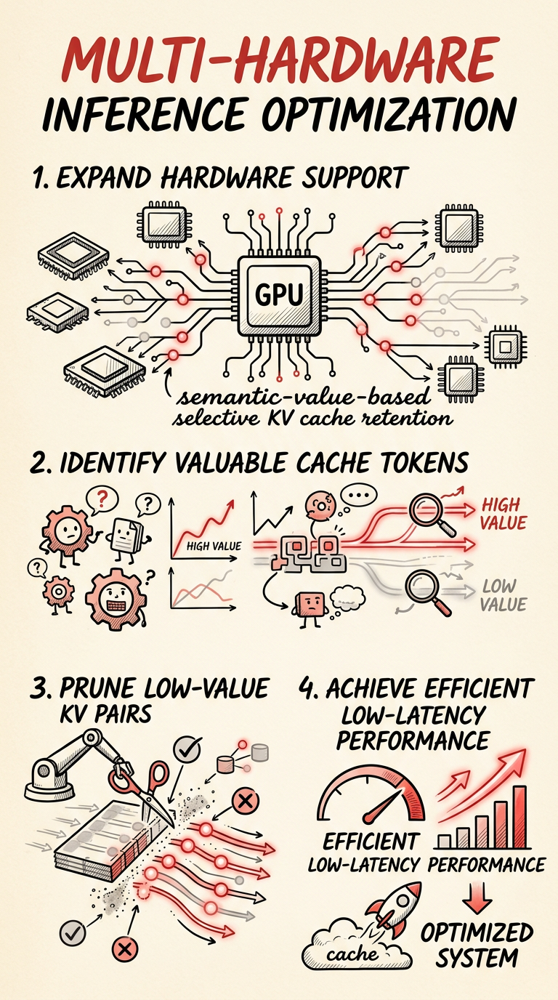

# 今日焦点：TRT-LLM 全力冲刺 DeepSeek 推理产品线，Mooncake 引入语义级 KV 缓存管理

**📅 2026-05-09**

> 推理框架竞争从"谁先支持新架构"进入"谁的模型路线跑得更快更稳"；KV cache 管理正从机械淘汰转向语义价值智能保留。

---

## 推理侧

**TRT-LLM 48 小时连合 6 个 DeepSeek PR，把 R1/V3/V4 推理当独立产品线推进[1-6]** - AutoDeploy 为 DeepSeek-R1 启用 multi-stream MLA/MoE 和 shared expert overlap，直接瞄准 decode throughput 瓶颈；V4 的 rotate activation gating 被条件化到 `HAS_FAST_HADAMARD` flag，做精细化硬件能力适配而非一刀切；expert 路由扩展到 1024 个，配合 MegaMoEDeepGemmFusedMoE 后端 wrapping DeepGEMM 的 fp8_fp4_mega_moe kernel，指向超大 expert 池场景的计算效率优化。disagg serving 方向 KV reuse transceiver v2 实现跨节点 KV block 复用，MoE autotune 通过环境变量可配置化降低调优门槛。从 MLA attention 到 MoE kernel 到 disagg 通信链路形成完整覆盖，NVIDIA 以 TRT-LLM 为载体逐个模型系列做深度垂直优化的策略已经非常清晰。属于 **[持续更新]**。

**SGLang decode 热路径逐环节消除 stall[7-10]** - 阻塞式 H2D copy 被 removal，JIT custom allreduce 默认开启避免 worst-case 延迟，FP8 KV 路径切换到原生实现并去掉不必要的 bf16 assert。四个改动叠加起来对 decode 延迟的改善是结构性的——不是某个 kernel 快了 5%，而是把 decode 路径上每个会 stall 的环节逐一消除。

**SGLang AMD ROCm diffusion 全栈推进[11-13]** - FP8 MLA attention kernel 替换 per-tensor flash attention，Conv3D 通过 temporal unfolding 数学等价变换为 Conv2D，RMSNorm 从 naive triton 实现替换为 aiter 实现、单 kernel 从 430us 降到 290us。SGLang 正在把 AMD diffusion 推到和 CUDA 同等优先级。属于 **[持续更新]**。

---

## KV 缓存

**Mooncake 合入 Engram 条件记忆，首次在生产级 KV cache 系统实现 keyword-level 语义保留[14]** - 来自 DeepSeek 论文"Conditional Memory via Scalable Keyword-Level KV Cache Compression"。系统可以根据 KV block 的语义价值决定是否保留，而非简单按 LRU 或 TTL 淘汰。对 prefix caching 和 disagg serving 的存储层来说，跨请求的 KV 复用率有望显著提升，因为被保留下来的恰好是最有价值的语义 anchor。这是一个范式级的变化。

**Mooncake 多硬件与稳定性同步加固[15-18]** - AMD CDNA4 (ROCm/HIP) 平台支持合入，P2P proxy 重构为 credit-based flow control，两轮 RDMA use-after-free 修复说明 Mooncake 在多硬件、高并发场景下快速积累稳定性，正在从 NVIDIA-only 转向真正的多硬件 KV cache 中间件。属于 **[持续更新]**。

---

## 生产部署侧

**推理部署生态同日突破四条非 NVIDIA / 非 x86 路径[19-23]** - NIXL 将 Intel XPU 设备识别为 VRAM；LMCache 加入 Azure Blob NIXL 后端和 AMD GPU operator 支持；llama.cpp 支持 Vertex AI 兼容 API；tokenspeed 为 MI300/MI350 硬编码 LDS size 并探测 xGMI 拓扑。推理栈的硬件和云平台选择正在从事实上的单一标准变成多选项，选定推理框架后切换底层硬件或云平台的迁移成本正在被中间层逐步消化。

---

## 训练侧

**Megatron-LM 砍历史包袱、加固稳定性基础设施[24-29]** - 连续删除 legacy transformer 和 legacy GPT 代码，新增 GPU sniff test 检测硬件 straggler、optimizer CG 内存池共享、fine-grained offload 节流，配合 26.04-alpha.rc2 发布。清理和可观测性同步推进，说明 Megatron 在为下一个大规模训练周期做架构准备。

**Ray Serve 为 LLM 应用启用 direct streaming[30]** - 绕过 Serve proxy 直连后端 ASGI，对长文本流式场景的延迟改善应该很明显。属于 **[持续更新]**。

**trl 修复 5 GB+ CUDA 显存泄漏[31]** - activation offloading 场景下的严重内存泄漏被修复，同时新增 MFU 计算辅助函数[32]。

---

## 工具链

**llama.cpp 多项优化与新模型支持[33-36]** - 合入 MiMo V2.5 支持、CUDA snake activation 5-op 融合、batch out_prod cublas 优化，b9080 release 支持 Gemma4_26B_A4B_NVFP4。属于 **[持续更新]**。

**DeepSpeed 发布 v0.19.0[37]** - 常规版本迭代。

---

> 一句话结论：**TRT-LLM 用产品线化的节奏证明推理竞争已进入"垂直深度"阶段，而 Mooncake 的语义级 KV cache 管理指向了更底层的范式切换。**

---

## 参考

[1] AutoDeploy: Optimize DeepSeek-R1 model performance：https://github.com/NVIDIA/TensorRT-LLM/pull/12946

[2] Gate DeepSeek V4 rotate activation on HAS_FAST_HADAMARD：https://github.com/NVIDIA/TensorRT-LLM/pull/13889

[3] Update deepseek routing — expand to 1024 experts：https://github.com/NVIDIA/TensorRT-LLM/pull/13186

[4] Add MegaMoEDeepGemmFusedMoE backend wrapping DeepGEMM：https://github.com/NVIDIA/TensorRT-LLM/pull/13384

[5] Introduce KV reuse in transceiver v2：https://github.com/NVIDIA/TensorRT-LLM/pull/13115

[6] Improve TRTLLM MoE autotune in DEP：https://github.com/NVIDIA/TensorRT-LLM/pull/13667

[7] logits: remove blocking H2D copy：https://github.com/sgl-project/sglang/pull/24627

[8] Turn on JIT custom AR implementation by default：https://github.com/sgl-project/sglang/pull/24363

[9] fix(aiter): drop FP8 KV upcast; use native FP8 path：https://github.com/sgl-project/sglang/pull/24129

[10] Remove unnecessary bf16 assert in rotate_activation：https://github.com/sgl-project/sglang/pull/24686

[11] Support fp8 MLA for diffusion model (AMD)：https://github.com/sgl-project/sglang/pull/20319

[12] Temporal-unfolded batched Conv2D for ROCm VAE decode：https://github.com/sgl-project/sglang/pull/22971

[13] Replace naive triton RMSNorm with aiter RMSNorm for diffusion：https://github.com/sgl-project/sglang/pull/24360

[14] Support Engram — conditional memory：https://github.com/kvcache-ai/Mooncake/pull/1483

[15] Add AMD CDNA4 (ROCm/HIP) platform support：https://github.com/kvcache-ai/Mooncake/pull/2021

[16] Refactor P2PProxy with credit-based flow control：https://github.com/kvcache-ai/Mooncake/pull/1971

[17] Add reference counting to RdmaTask to prevent UAF：https://github.com/kvcache-ai/Mooncake/pull/2047

[18] Fix use-after-free crash in ibv_post_send：https://github.com/kvcache-ai/Mooncake/pull/1903

[19] Recognize Intel XPU devices as VRAM：https://github.com/ai-dynamo/nixl/pull/1534

[20] Add support for AZURE_BLOB NIXL backend：https://github.com/LMCache/LMCache/pull/3160

[21] Add gpuVendor field to support AMD GPUs in operator：https://github.com/LMCache/LMCache/pull/3211

[22] server: support Vertex AI compatible API：https://github.com/ggml-org/llama.cpp/pull/22545

[23] Hardcode MI300/MI350 LDS size; probe xGMI topology：https://github.com/lightseekorg/tokenspeed/pull/25

[24] Remove legacy transformer and modules：https://github.com/NVIDIA/Megatron-LM/pull/4207

[25] Remove legacy GPT code：https://github.com/NVIDIA/Megatron-LM/pull/4322

[26] Add periodic GPU sniff tests to detect hardware stragglers：https://github.com/NVIDIA/Megatron-LM/pull/4662

[27] Allow optimizer CG to share the same pool as full-iter CG：https://github.com/NVIDIA/Megatron-LM/pull/4521

[28] Add a knob to throttle max allowed inflight offload：https://github.com/NVIDIA/Megatron-LM/pull/4690

[29] Megatron-LM 26.04-alpha.rc2 release：https://github.com/NVIDIA/Megatron-LM/releases/tag/26.04-alpha.rc2

[30] Enable direct streaming for Ray Serve LLM apps：https://github.com/ray-project/ray/pull/63167

[31] Fix 5 GB+ CUDA memory leak in activation offloading：https://github.com/huggingface/trl/pull/5700

[32] Add MFU helpers：https://github.com/huggingface/trl/pull/5698

[33] Add MiMo V2.5 model support：https://github.com/ggml-org/llama.cpp/pull/22493

[34] Fuse snake activation in CUDA：https://github.com/ggml-org/llama.cpp/pull/22667

[35] Batch out_prod inner loop with cublasSgemmStridedBatched：https://github.com/ggml-org/llama.cpp/pull/22651

[36] llama.cpp b9080 release: Gemma4_26B_A4B_NVFP4：https://github.com/ggml-org/llama.cpp/releases/tag/b9080

[37] DeepSpeed v0.19.0 release：https://github.com/deepspeedai/DeepSpeed/releases/tag/v0.19.0
