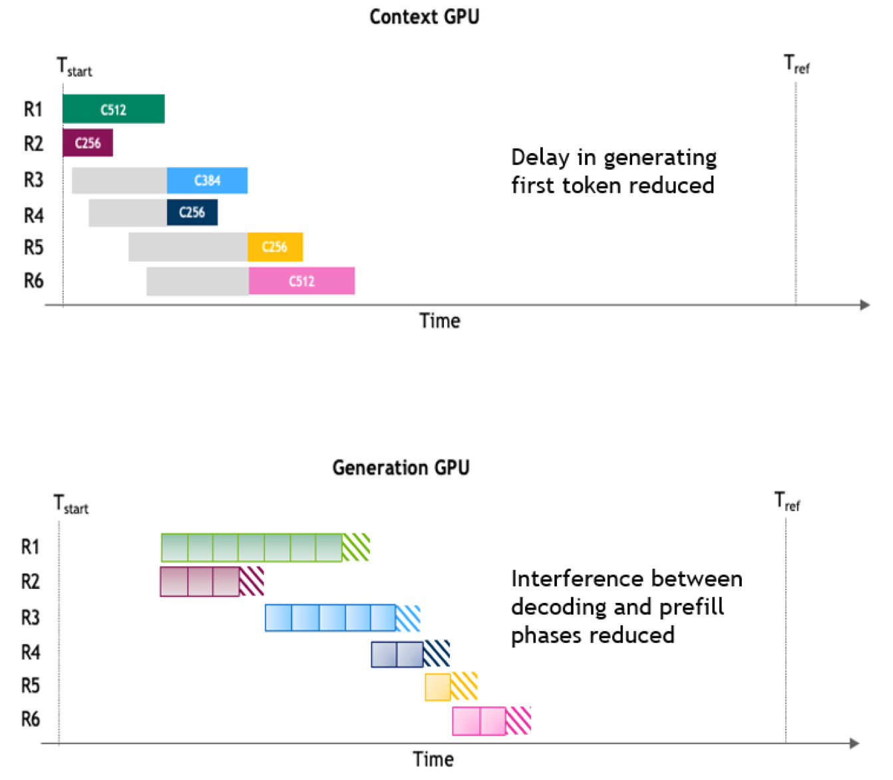
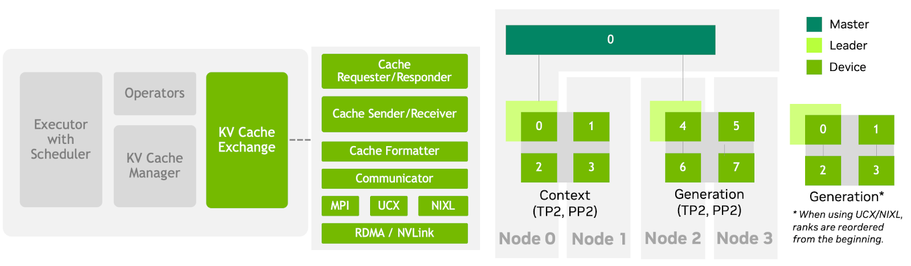
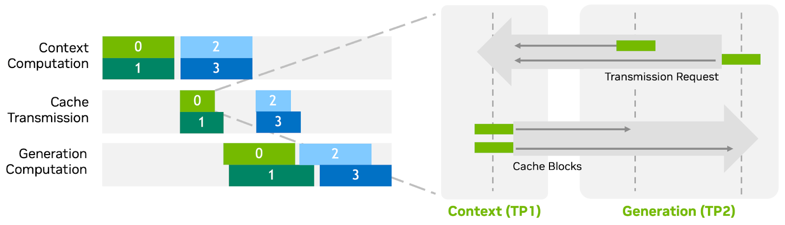
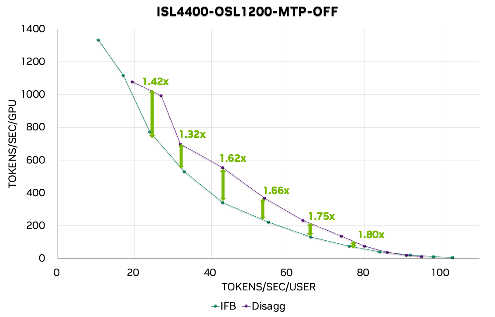

# TensorRT-LLM 如何管理 KVCache：优先级淘汰、硬件级卸载与事件驱动的集群路由

> 如果说 vLLM 把 KV cache 变成了运行时中枢，SGLang 把共享前缀做成了核心资产——那 TRT-LLM 给每一个 block 贴上了优先级标签，并让缓存状态变成了集群路由可消费的实时事件流。

---

## 一、三种引擎，三条路

2026 年上半年，KV cache 的管理方式正在经历一场静默的分化。三套主流推理引擎——vLLM、SGLang 和 TensorRT-LLM——虽然都在解决"如何高效利用缓存"这个问题，但各自的起点和路径越来越不同。

我们在前两篇文章里梳理了 vLLM 和 SGLang 的路线。vLLM 的核心叙事是"KV cache 是运行时中枢"：PagedAttention 把存储变成分页管理，block table 和 slot mapping 让调度器直接感知缓存状态，Mooncake Store 把这套本地抽象延伸到跨实例的集群缓存池。SGLang 走了另一条路——"共享前缀是第一资产"：radix tree 本身就绑定 KV 的生命周期，HiCache 在 GPU/CPU/分布式存储之间自动分层，HiSparse 和 ShadowRadix 进一步为稀疏注意力和混合注意力场景定制了多池隔离方案。

TentorRT-LLM 的路线和他们都不一样。它不是从"如何共享前缀"切入的，而是从一个更硬的约束出发：**block 的物理布局在引擎编译时就固定了，你不能在运行时重新组织它**。这个看似技术细节的约束，塑造了 TRT-LLM 整个 KVCache 架构的气质——它把缓存当作一组需要被定价、被搬运、被暴露给路由层的有限资源，而不是一颗可以自由生长的树。

## 二、Block 是硬件合同，不是软件抽象

要理解 TRT-LLM 为什么这样设计，得先理解一个前提：TensorRT 的 Attention kernel 在编译时就把 KV cache 的张量形状写死了。每个 block 对应各层各头一块固定大小的显存切片，多层共用一个 block 的物理位置。内核的地址访问是编译进去的，运行时没法改。

这和你在 vLLM 里看到的 block 是两种东西。vLLM 的 block 是 PagedAttention 层面的软件抽象——物理上分散的 page 通过 block table 映射成逻辑连续序列，调度器可以灵活调整映射关系。TRT-LLM 的 block 是一个硬件接口合同：这个 block 在引擎启动时就已经被编译成固定的形状和地址，你的工作是管理它的生命周期——分配、复用、降级、回收——而不是重写它的定义。

这个约束带来的第一个影响是，TRT-LLM 把前缀复用放在 block 层之上，而不是让前缀树本身承担缓存管理。前缀树在这里是一个叠加的索引服务，告诉你"这段 token 序列曾经被算过，对应的 block 在哪"；block 当前的状态——在不在 GPU 上、被几个请求引用、优先级是多少——记录在 block 自己的元数据里，不依附于树。

回想一下 SGLang 的设计：在 SGLang 里，radix tree 节点直接持有 KV 的当前状态——`lock_ref` 告诉你有没有请求在用它，`host_value` 告诉你它在哪一层，`priority` 告诉你在淘汰时它值多少。树就是缓存管理器，两者是一体的。TRT-LLM 把它拆开了：树管查找，block pool 管存储。这种分离在工程上牺牲了一部分简洁性，换来的是调度和存储可以独立优化——当你需要新 block 时，从 pool 里取一个空闲的就行，不需要在树的结构上动手术。

block 大小默认 128 tokens，可以配置成 2 的幂次。这个选择是 I/O 效率和匹配细度之间的经典权衡：128 token 的 block 在大部分场景下能填满、适合批量搬运；但如果你只共享了几个 token，就会有内部碎片。这个权衡，vLLM 和 SGLang 也在面对，但 TRT-LLM 额外受 kernel 编译约束的限制，不能随意调整。

## 三、系统提示和用户闲聊，价值不该一样

生产环境下的多租户推理有一个被广泛讨论但很少被系统化解决的问题：同一个用户发来的请求里，不同 token 段落的复用价值完全不同。系统提示——"你是一个有用的 AI 助手……"——可能出现在每一个请求的开头，复用价值极高。解码阶段模型自己生成的那些 token，出了当前请求就毫无意义。用户的多轮对话历史介于两者之间：下一轮可能复用，但出不了这个 session。

vLLM 和 SGLang 对这个问题的默认态度是"让 LRU 自己去判断"。LRU 的策略很简单：最近被访问过的 block 优先保留，越久没碰就越容易被淘汰。在大多数场景下这是个好策略，但它有一个盲区：一个刚刚被访问过一次的解码 token block 和一个刚刚被访问过一次的系统提示 block，在 LRU 眼里权重是一样的。实际上，后者在下一秒钟就可能被一百个新请求同时命中。

TRT-LLM 的做法是把"价值判断"从引擎内部拿出来，暴露给应用层。你可以在请求级别指定不同 token 范围的优先级——比如系统提示的前 512 个 token 赋优先级 100 且永不超时，用户输入赋 50 且 30 秒后自动降级，解码生成的 token 赋 20 且 10 秒后就按普通 block 处理。淘汰时，系统先清空低优先级段的所有 block，再碰下一个优先级段的。这相当于给高价值 block 发了一张"免死金牌"——它不会在低价值 block 还活着的时候被踢出去。

还有一个很实用的参数：你可以设置一个"卸载门槛"——优先级低于某个值的 block 被淘汰时，直接从 GPU 丢弃，不保存到主机内存。默认值是 35。这个设计隐含了一个重要判断：**主机内存不是无差别的回收站，而是一个有入门资格的二级缓存**。只有"值得保留"的 block 才值得消耗 GPU→CPU 的传输带宽。低价值的 block 不值得搬运——这一轮没命中，下一轮大概率还是不会命中。

NVIDIA 的测试显示，优先级淘汰可以把缓存命中率提升约 20%。这个数字当然依赖工作负载——如果你的系统提示占比很高，提升会更显著；如果所有请求都是零上下文的一次性调用，优先级系统没什么用。但关键是它打开了一扇门：缓存管理不再是一个只有引擎自己知道的内部决策，应用层可以定义不同 cache 的留存策略。

## 四、从 GPU 到 NVMe：让硬件自己搬运

vLLM 的 Mooncake Store 用 RDMA 把 KV blocks 在 GPU HBM 和分布式 DRAM/SSD pool 之间搬运。SGLang 的 HiCache 用三层分层——GPU 是桌面，CPU 内存是书架，分布式存储是仓库。TRT-LLM 的三层方案在理念上类似，但在实现上走得更"硬"。

TRT-LLM 源头上就把存储分成两层：GPU 显存（primary）和主机内存（secondary）。第三层 NVMe 不是作为独立的存储层引入的，而是作为一种"传输模式"接入——块数据可以不经过 CPU 中转，直接通过 GPUDirect Storage 从 GPU 写进 NVMe 固态盘，也可以反过来直接读回 GPU。这条路径绕过了两次内存拷贝（GPU→CPU→NVMe），对带宽和延迟都有明显收益。

这个设计在普通 PCIe 系统上提升有限，但在 Grace-Hopper（GH200）架构上能找到真正的用武之地。GH200 的 900 GB/s NVLink-C2C 连接让 GPU 和 CPU LPDDR5 之间的带宽达到 PCIe Gen5 的 7 倍，480 GB 的 CPU 内存和 96 GB 的 GPU 显存共享统一地址空间。在这种硬件上，host offloading 的延迟大幅降低——原本因为传输代价太高而不划算的卸载策略，突然变得合理了。

这里有一条隐藏的叙事线：**TRT-LLM 的缓存管理深度绑定 NVIDIA 硬件生态**。GDS 需要 cuFile 库和兼容的 NVMe 驱动，Grace-Hopper 的高带宽才让频繁 offload/onboard 成为现实，NIXL 依赖 InfiniBand/NVLink 做 KV 传输。这和 vLLM 在 Mooncake Store 上走的"通用分布式存储"路线、SGLang 的"用社区插件接入各种 backend"路线，形成了三种不同的硬件耦合姿态。TRT-LLM 选择了最紧的耦合，换来了最深的优化空间。

另一个值得记住的设计是：不同请求可以把自己的 KV 卸载到不同的存储目标。高优先级的 block 卸载到主机 DRAM（更快但容量有限），低优先级的卸载到 NVMe（容量大但延迟高）。每个请求在自己的生命周期里指定首选卸载路径——缓存不只是一个"在哪"的问题，也变成了一个"按什么路由去哪"的问题。

## 五、让搬运和计算同时跑

把 block 从 GPU 搬到主机内存，或从主机内存搬回 GPU，如果和模型的前向计算串行执行，会产生一个明显的瓶颈：kernel 算完一批之后要等搬运完成才能算下一批，搬运本身还要等 GPU 把上一批结果写完。

TRT-LLM 的解法是：给搬运操作独立的 CUDA stream。主 stream 管 prefill 和 decode 的计算，两个搬运 stream 分别专管 GPU→主机和主机→GPU 的数据移动。

但异步的关键不在分离，在同步点的选择。每步迭代开始时，搬运 stream 先等主 stream——确保上一步的计算结果已经写完，才能开始搬；这一步的所有满载入请求发出后，主 stream 再等搬运 stream——确保下一轮 kernel 需要的 block 已经回到 GPU 上。两个同步点之间的窗口里，搬运和计算可以并行执行。

*图 1：聚合 serving 里 prefill 和 decode 交替执行，长 prefill 阻塞 decode，短 decode 浪费 prefill 算力。分离式 Serving 把两个阶段放到不同 GPU 池，KV cache 在 prefill 完成后通过网络传输给 decode worker。来源：TRT-LLM tech_blog5。*

这个设计还附带了一个运维视角的收益：系统会统计每次迭代里 onboard（搬回 GPU）和 offload（搬出 GPU）的 block 数量。如果 onboard 始终远多于 offload，说明主机缓存利用率偏低——太多 block 一搬出去就被要回来，可能该调整卸载门槛或增大主机缓存池。

## 六、集群里的路由器也应该知道谁有什么缓存

这是 TRT-LLM 最不像推理引擎设计的一个模块，也最有意思。

单机场景下，prefix caching 在本地就能解决。但一旦你的服务部署了多个 GPU 节点，前端必须决定把每个新请求发给哪台机器。如果路由只做无差别的负载均衡——轮询、最少连接——那整个集群的 prefix cache 命中率会很差。同样的前缀可能在机器 A 上已经算过了，但下一个带着相同前缀的请求被发到了机器 B，B 只能重新 prefill。

SGLang 的 cache-aware load balancing 在 v0.4 版本里就尝试了类似的路由优化。vLLM 的 Mooncake Store 用外部 connector 和 master 节点来协调跨实例的 cache 发现。TRT-LLM 选择了另一种方式：**把单机缓存的状态变化当作事件流，推送给任何想知道的订阅者**。

这套事件 API 定义了四种事件类型。初始化时告诉外部"我这台机器上总共有多少可用的缓存 block"；当某个 block 被填满并入前缀树时，告知"这个 block 的哈希值、所属请求的 tokens 范围、当前优先级和缓存层级"；当某个 block 被淘汰时，告知"哪些哈希对应的 block 已经不存在了"；当优先级或状态变化时，推送更新。

外部路由器订阅这些事件，就能在内存里维护一张"哪台机器持有哪些前缀 block"的映射表。下一个带着相同系统提示的请求进来时，路由器直接查表，把它优先发给已经缓存了这些前缀的机器。

值得注意的一个设计选择是**最终一致性**：事件 API 返回的不是精确快照，而是稍有延迟的近似视图。这个选择有清晰的工程判断——路由决策不需要毫秒级精度，缓存状态的微小滞后对命中率几乎没有影响。但反过来，如果设计成强一致，每次 block 操作都要同步等待事件确认，锁竞争就会直接挂在关键路径上。

TRT-LLM v0.20 把 KV cache-aware router 作为一个正式特性引入。在 Attention Data Parallelism 场景里（多个数据并行 rank 各自维护缓存子集），系统会在 rank 0 上启动一个独立线程，周期性地把各 rank 的事件汇总，再由外部订阅者消费——多卡场景下的缓存可见性不会因为数据并行而割裂。

## 七、分离式 Serving：让 prefill 的 GPU 和 decode 的 GPU 各干各的

把推理拆成 prefill 和 decode 两个阶段、放在不同 GPU 池上跑，是 2026 年 AI Infra 领域最重要的架构趋势之一。理念很简单：prefill 是计算密集的（一次处理整个 prompt），decode 是内存带宽密集的（每次只生成一个 token 但要访问全部 KV 历史），把两者混在同一张 GPU 上会导致互相拖累——长 prefill 阻塞 decode，短 decode 又浪费 prefill 的算力。

但拆开之后立刻出现一个难题：prefill 算完的 KV cache 怎么送到 decode 那边去？

TRT-LLM 在这件事上做了两层抽象。内部管理——block 在单机上的分配、复用、降级——由 KV Cache Manager 负责。跨 worker 传输——prefill 实例产出的 block 如何被 decode 实例接收并纳入本地缓存——由另一套 Connector 接口负责。两套抽象各自独立，分层清楚。

Connector 暴露的核心接口其实就一个："对于这个新请求，有多少 token 的 KV 我已经可以从远端拿到了？"Decode worker 接到请求后，先查这个数值，再决定还需要 prefill 多少 token。如果 Connector 报告说"前 2000 个 token 的 KV 已经就绪"，decode worker 只需要 prefill 新出现的部分，甚至可以直接跳过 prefill。

*图 2：TRT-LLM 分离式 Serving 的 KV cache 传输后端架构。NIXL 把底层协议选择下放给环境变量，使同一套代码能适配不同网络拓扑。来源：TRT-LLM tech_blog5。*

传输的后端支持 MPI、UCX 和 NIXL。NIXL（NVIDIA Inference Xfer Library）是现在的主推方案，底下可以切换 UCX（走 InfiniBand/NVLink）或 LIBFABRIC 插件——环境变量决定协议，上层代码不用改。这种设计把"具体走哪条网络链路"从 Connector 的业务逻辑里剥离出来了。

*图 3：分离式 Serving 中 KV 传输与计算的 overlap 时序。prefill 完成后，KV 传输和其他请求的 decode 计算在时间轴上有重叠，降低了传输对吞吐的影响。来源：TRT-LLM tech_blog5。*

还有两个工程层面的设计值得一提。第一个是零拷贝路径——prefill worker 直接把 block 地址暴露给 decode worker，不经过中间缓冲区，前提是两端的内存都通过 RDMA 可见。第二个是 layout 转换——当 prefill 和 decode 使用不同的并行策略（比如 prefill 用 TP2、decode 用 PP2），KV block 在 tensor 维度上的切分方式也不一样，传输层需要自动做布局转换。这两点对最终性能的影响不小，但容易在设计文档里被一笔带过。

来看看数字：在 GB200 GPU 上跑 DeepSeek R1，输入 4400 token、输出 1200 token 的配置下，分离式 Serving 能带来 1.4-1.8 倍吞吐提升，叠加 Multi-Token Prediction 时达到 1.6-2.5 倍。短生成长上下文（输入 8192/输出 256）的场景提升更明显，达到 2 倍。Qwen 3 的提升范围更大——1.7 倍到 6.11 倍不等，高端数字主要来自 prefill 瓶颈更严重的配置。

*图 4：DeepSeek R1（ISL 4400/OSL 1200）上分离式 vs 聚合 serving 的 Pareto 曲线，横轴吞吐量（tokens/s），纵轴 TTFT（ms）。分离式配置在同等延迟下吞吐提升 1.4-1.8x。来源：TRT-LLM tech_blog5。*

## 八、Dynamo：从单机缓存到数据中心编排

如果 TRT-LLM 的 KVCache 管理是单机的"内脏"，那 Dynamo 就是把多台机器的内脏连成一套神经系统。

Dynamo 做了三件事。第一是智能路由：前面说的 KV Event API，Dynamo 的 smart router 是它的最大消费方。多个 TRT-LLM 实例把各自的缓存状态事件推给 Dynamo，router 据此把请求发到命中概率最高的实例。第二是 prefill 旁路：decode worker 接到路由器发来的请求后，先在本地查缓存——前缀已经就绪的部分直接跳过 prefill，Connector 确认实际可以省略多少计算。路由器和 Connector 在这里形成一个闭环：路由尽量把请求发到已有缓存的 worker，Connector 负责验证到底有多少能复用。第三是 K8s operator：prefill 和 decode 的 GPU 池可以独立伸缩，按实时负载动态调整。

这三件事和前面的六个模块放到一起，就能看到 TRT-LLM KVCache 的完整图景：单机的 block pool、优先级淘汰、三层存储和流式搬运是底层资源管理；事件 API 和 Connector 是中间层的状态暴露和传输通道；Dynamo 是上层的集群编排——把每一层"当前谁持有什么"的信息汇聚成全局视图，再做路由和扩缩决策。

对比来看：vLLM 的 Mooncake Store 用 master 节点 + RDMA 做跨实例 KV pool，是"把缓存从单机 copy 到集群"的思路；SGLang 的 cache-aware load balancing 是"让请求尽量落在已有前缀的 worker 上"的思路；TRT-LLM + Dynamo 的组合是"把缓存状态作为一等事件流接入集群控制平面"的思路。三层抽象各有权衡，没有哪一种绝对更优——但三层代表了三种不同的架构哲学。

## 结语：第三种哲学

把三篇文章放在一起看，一个清晰的三角形就出来了。

vLLM 的答案是：**把 KV cache 变成运行时资源中枢**。PagedAttention 奠定了分页化的底层基座，block table 和 slot mapping 让调度器直接感知缓存布局，Mooncake Store 把这套布局从单机拉到集群。它的主线是资源抽象——缓存不再是一个被动的内存分配问题，而是调度决策的一部分。

SGLang 的答案是：**把共享前缀当作第一资产**。radix tree 不是缓存之上的索引，树本身就是缓存管理器。HiCache 在 GPU/CPU/分布式存储之间做自动分层，HiSparse 和 ShadowRadix 进一步为稀疏和多头注意力定制了池隔离方案。它的主线是结构匹配——缓存的组织方式应该和请求的前缀结构天然对齐。

TRT-LLM 的答案是：**把缓存当作需要定价、搬运、暴露给路由层的异构资源**。block 是一个硬件接口合同，前缀树只是叠加在上面的索引。每个 block 都有一张"价格签"——优先级决定了它能在 GPU 上留多久、被淘汰时是保存到主机内存还是直接丢弃。缓存的状态通过事件流实时推送给集群路由层，让"哪个 worker 持有哪段前缀"成为路由决策的一等输入。它的主线是资源调度——缓存的本质不是存储，而是有限资源的分配效率。

三套系统都在讲同一个问题，但各自的起点不同，塑造了不同的技术选择。

目前 TRT-LLM 这条线上还有一些开放边界。MLA 和分离式 Serving 的完整组合在 v1.1 才开始启用，长上下文的稳定性还在社区验证中。GDS 路径依赖特定的 NVMe 硬件和驱动，异构集群里的配置管理成本不低。Connector 接口目前只暴露了"有多少已缓存 token"这一个查询，对于更复杂的缓存所有权转让和校验语义，完整的 API 规范还没成型。

但整条技术线的方向是清楚的：单机 block 管理、优先级驱动淘汰、事件驱动的缓存路由、硬件级卸载——这四块拼在一起，已经把 KV cache 从"引擎内部的存储机制"推到了"推理基础设施的一等调度对象"的位置上。

---

> 一句话结论：**vLLM 把 KV cache 变成了资源中枢，SGLang 把共享前缀做成了结构中心——TRT-LLM 选择了第三条路：给每段缓存定价，让定价驱动路由。**

---

## 参考

[1] KV Cache System — TensorRT-LLM 官方文档：https://nvidia.github.io/TensorRT-LLM/latest/features/kvcache.html

[2] Introducing New KV Cache Reuse Optimizations in NVIDIA TensorRT-LLM：https://developer.nvidia.com/blog/introducing-new-kv-cache-reuse-optimizations-in-nvidia-tensorrt-llm/

[3] Accelerate Large-Scale LLM Inference and KV Cache Offload with CPU-GPU Memory Sharing：https://developer.nvidia.com/blog/accelerate-large-scale-llm-inference-and-kv-cache-offload-with-cpu-gpu-memory-sharing/

[4] Disaggregated Serving in TensorRT-LLM：https://nvidia.github.io/TensorRT-LLM/blogs/tech_blog/blog5_Disaggregated_Serving_in_TensorRT-LLM.html

[5] Disaggregated Serving — TensorRT-LLM 官方文档：https://nvidia.github.io/TensorRT-LLM/features/disagg-serving.html

[6] KV Cache Transfer in Disaggregated Serving — NVIDIA Dynamo Documentation：https://docs.nvidia.com/dynamo/latest/backends/trtllm/kv-cache-transfer.html

[7] Fast and Expressive LLM Inference with RadixAttention and SGLang：https://lmsys.org/blog/2024-01-17-sglang/

[8] Release Notes — TensorRT-LLM：https://nvidia.github.io/TensorRT-LLM/release-notes.html