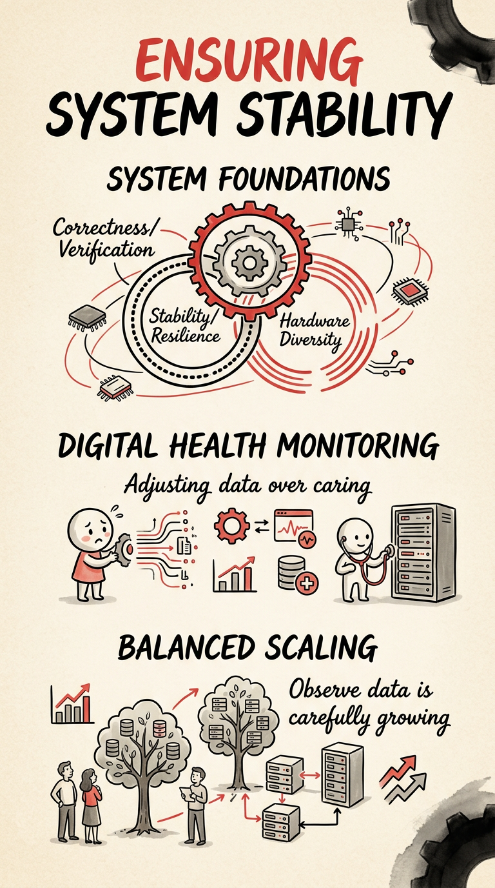

# 今日焦点：推理框架从"能跑"转向"跑得稳"

**📅 2026-05-10**

> 推理框架的竞争正从"能跑起来"转向"跑得稳"——正确性成为生产硬门槛，异构覆盖定义硬件自由，体系化程度决定能力上限。

---

## 推理侧

**SGLang Two-phase reasoning grammar[1]** - reasoning 模型在 grammar 约束下容易丢失 `think_end` token，单阶段 grammar 无法区分 thinking 和 answer 两个语义区间的约束边界。Two-phase 方案在 grammar 后端时序上显式划分两个阶段，配合 `--enable-strict-thinking` 标志，是 constrained generation 在 reasoning 模型上的架构级修正。

**SGLang PDL 可编程依赖延迟[2]** - MoE 推理中 kernel launch 的依赖关系过去硬编码写死，PDL 把调度权交给可编程依赖描述层，可根据模型结构和硬件拓扑动态编排时序，使大 MoE 的端到端延迟首次有了可调的调度自由度。

**SGLang Eagle3 扩展 Gemma3/4[3]** - speculative decoding 的模型覆盖从 Llama/Qwen 推向 Google 模型线，附带 FA3 page table 地址翻译修复保证 topk>1 场景下 spec metadata 正确性。Grammar 层保正确性，PDL 层控延迟，Eagle3 层扩吞吐覆盖——约束解码在 SGLang 有了清晰的层级分工。

---

## 生产部署侧

**LMCache 断线重连[4]** - LMCache MP server 重启后 vLLM worker 的 KV-cache 注册信息丢失，所有 STORE/RETRIEVE 调用失败，缓存静默降级为无缓存且调用方完全无感知。注册恢复机制让服务重启后的缓存关系自动重建。

**LMCache Azure Blob Storage 后端[5]** - Azure Blob Storage 作为 NIXL 对象存储后端的 drop-in replacement 被纳入，打破 KV 缓存此前几乎绑死在 NVIDIA + 本地盘上的硬约束。

**LMCache ROCm CacheBlend[6]** - 用 Triton kernel 替代 FlashInfer，让 AMD GPU 也能用非 prefix KV cache 复用。

**LMCache token 级可观测[7]** - 新增 `lmcache_blend.lookup_requested_tokens` 和 `lmcache_blend.lookup_hit_tokens` 计数器，把缓存命中率从 request 级变为 token 级。Request 级命中率是二值判断（有/无命中），token 级命中率度量命中比例，对成本核算才有实操意义。

---

## 推理侧

**TRT-LLM 支持 Gemma4[8]** - 完整支持 Gemma4 四个变体（26B-A4B-it MoE / E2B-it KV sharing PLE / 300M / 1.7B），覆盖 text + vision + audio 多模态。需要 NvFp4 权重转换修复才能跑起来。

**llama.cpp MiMo-V2.5[9]** - 完成 text-to-text 推理，但非对称 head size（K=192, V=128）导致 flash attention 回退到 CPU，被迫追加 MMA/Tiles 模板。新模型落地的工程代价在上升。

**vLLM Cohere Eagle[10]** - 新增 Cohere Eagle 模型支持，附带 speculative decoding 配置能力。跨框架响应速度在加快，但"换个 config 就行"的时代已经过去。

---

## 工具链

**llama.cpp SYCL 后端补齐[11]** - 集中补齐 FILL 到 GATED_DELTA_NET 六个此前缺失的算子，让依赖这些算子的模型不再回退到 CPU。Q5_K/Q8_0 快速路径、BF16 GET_ROWS、flash attention buffer 复用策略同步落地。

**llama.cpp Hexagon HTP[12]** - GATED_DELTA_NET 和 L2_NORM 专用 HVX kernel，让 Qwen3.5 等 GDN 模型的 recurrence 完全在端侧运行。

**llama.cpp Adreno OpenCL[13]** - 新增 Q4_0 MoE GEMM 加速，移动端推理性能持续上探。"每个后端都能编译"和"每个后端都有合理推理性能"之间的差距，靠 6 个算子、一批量化调优和几次内存分配策略改动填上。

---

## 推理侧

**vLLM Hopper GDN 精度修复[14]** - Hopper GPU（sm_90, H20）上 GDN `chunk_scaled_dot_kkt` 精度丢失，`tl.dot` 操作数布局与 WGMMA 不兼容，导致 lm_eval gsm8k 得分为 0。这是静默错误的典型：模型能跑、不报错、输出像合法 token，但本质是随机结果。

**SGLang DSV3 Triton MoE 性能回退[15]** - PyTorch 2.11 升级后 Triton 3.6.0 缺少 tuned config 导致 DeepSeek V3 推理性能回退，暴露 MoE 路径对底层软件栈版本的敏感。

**TRT-LLM DSv4 门控修复[16]** - 门控单元测试 multi-GPU CI 暴露 FP32 reference 运算错误，伴随 FP8 workspace 尺寸计算修复和 Hadamard rotation 条件门控。

---

> 一句话结论：**推理框架竞争换挡，正确性成为生产硬门槛，异构覆盖定义硬件自由，体系化程度决定能力上限。**

---

## 参考

[1] Two-phase reasoning grammar + --enable-strict-thinking：https://github.com/sgl-project/sglang/pull/23953

[2] Enable PDL for DSV32/GLM5 kernels：https://github.com/sgl-project/sglang/pull/23965

[3] Gemma3/4 + Eagle3 speculative decoding：https://github.com/sgl-project/sglang/pull/23976

[4] vLLM reconnect after LMCache restart：https://github.com/LMCache/LMCache/pull/3208

[5] Azure Blob NIXL backend：https://github.com/LMCache/LMCache/pull/3160

[6] ROCm Triton block-sparse attention for CacheBlend：https://github.com/LMCache/LMCache/pull/3092

[7] Blend token-level hit-rate counters：https://github.com/LMCache/LMCache/pull/3196

[8] Gemma4 multimodal in TRT-LLM：https://github.com/NVIDIA/TensorRT-LLM/pull/12932

[9] MiMo-V2.5 text-to-text in llama.cpp：https://github.com/ggml-org/llama.cpp/pull/22493

[10] Cohere Eagle + MoE fix in vLLM：https://github.com/vllm-project/vllm/pull/42078

[11] SYCL: FILL, CUMSUM, DIAG, SOLVE_TRI, SSM_SCAN, GATED_DELTA_NET：https://github.com/ggml-org/llama.cpp/pull/22149

[12] Hexagon HTP: GATED_DELTA_NET HVX kernel：https://github.com/ggml-org/llama.cpp/pull/22837

[13] OpenCL: Adreno Q4_0 MoE GEMM：https://github.com/ggml-org/llama.cpp/pull/22731

[14] GDN KKT precision loss on Hopper GPUs：https://github.com/vllm-project/vllm/pull/42076

[15] DSV3 Triton MoE perf regression on SM90：https://github.com/sgl-project/sglang/pull/24562

[16] DSv4 gate test fix：https://github.com/NVIDIA/TensorRT-LLM/pull/13932
