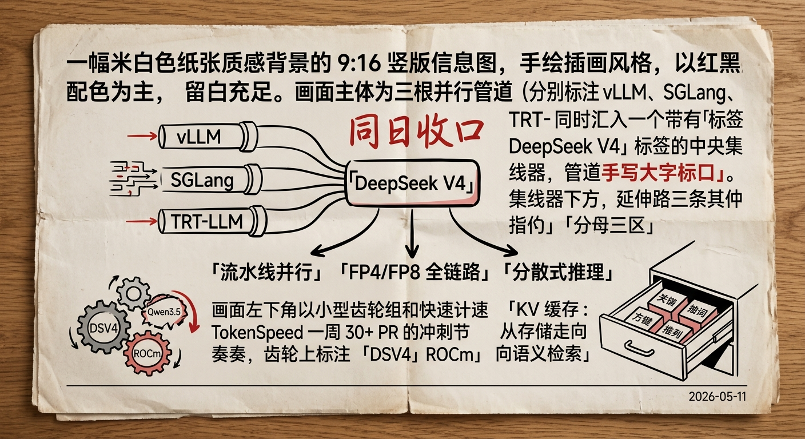

# 今日焦点：DeepSeek V4 推理全栈量产就绪

**📅 2026-05-11**

> 三大推理框架在同一天窗内各自合入 DSV4 生产部署所需的收口能力，开源推理生态集体发出量产信号。

---

## 生产部署侧

**vLLM 补齐 DSV4 并行策略最后拼图 [1][2][3]** - Pipeline Parallelism 支持让 DSV4 节点间扩展不再受限；NVFP4 all-gather + GEMM fusion 接入 AsyncTP，打通 FP4 量化 + 序列并行 + 异步 TP 的完整推理管线。v0.20.2 patch release 专修 sparse attention bug，已进入修边角阶段。

**SGLang 统一 DSV4 dispatch 路径 [4][5]** - 消除独立 state_type 判别器带来的路径分歧；修复 mooncake disaggregation 场景下 NIXL 传输缺失分支，补上分散式推理关键链路。

**TRT-LLM 首次打通 DSV4 FP8 全链路 [6][7][8]** - o_a_proj 保持原生 FP8 格式，移植 vLLM fused_inv_rope_fp8_quant；dynamic sparse attention 专用 kernel 和 disaggregation CI 覆盖 b200/b300 同批合入，Blackwell 平台正式验证已启动。

---

## 工具链

**TokenSpeed 一周 30+ PR 完成概念验证到可评测的跳跃 [9][10][11][12][13]** - 覆盖 DSV4-Flash 性能路径、Qwen3.5 runtime prepare 优化、Mamba 前缀缓存、O(k log N) 驱逐算法和 AMD ROCm 支持。Mamba 前缀缓存的 scheduler-side slot 管理和 COW restore 设计表明这不是简单模型适配，而是在缓存策略层面有独立路径。O(k log N) 驱逐用持久 LRU 集合替代每次 O(N log N) 重建堆，工程上干净的选择。

---

## 推理侧

**MoE kernel 走向编译器驱动融合 [14][15][16]** - Gemma4 Attention RMSNorm 三次 kernel launch 融合为一次；DeepGemm tf32_hc_prenorm_gemm 融入 big_fuse；TRT-LLM 用 CUTEDSL 为 Nemotron-H 引入编译器驱动的 activation fusion——编译器开始替代手工 kernel 调优。

**异构硬件路线加速 [17][18]** - Mooncake 为 Metax MACA C500 打通 intra-node P2P 传输层；LMCache ROCm Triton block-sparse attention backend 让 KV cache 复用在 AMD GPU 上跑通。非 CUDA 路线正从"能编译"走向"能高性能运行"。

**KV 缓存从容量管理升级为语义检索 [19][20]** - Mooncake Engram 支持基于 DeepSeek Conditional Memory 论文，实现 keyword-level 语义检索复用——缓存不再只管内存够不够，而是管什么值得留在缓存里。磁盘副本回读全链路修复让此前持续返回错误的磁盘路径重新可用。

---

> 一句话结论：**DSV4 三大框架同日收口，PP、FP4、FP8 全链路就位——这不是巧合，是开源推理生态对 DSV4 生产部署的集体确认。**

---

## 参考

[1] vLLM DSV4 Pipeline Parallelism 支持：https://github.com/vllm-project/vllm/pull/41694
[2] vLLM NVFP4 all-gather + GEMM fusion 接入 AsyncTP：https://github.com/vllm-project/vllm/pull/41882
[3] vLLM v0.20.2 release 修 DSV4 sparse attention 等 bug：https://github.com/vllm-project/vllm/releases/tag/v0.20.2
[4] SGLang 统一 DSV4 dispatch 路径：https://github.com/sgl-project/sglang/pull/24888
[5] SGLang 修复 DSV4 mooncake disaggregation NIXL 传输：https://github.com/sgl-project/sglang/pull/24878
[6] TRT-LLM DSV4 FP8 o_a_proj + fused_inv_rope_fp8_quant：https://github.com/NVIDIA/TensorRT-LLM/pull/13938
[7] TRT-LLM DSV4 MLA dynamic sparse attention kernel：https://github.com/NVIDIA/TensorRT-LLM/pull/13652
[8] TRT-LLM DSV4 disaggregation CI 覆盖 b200/b300：https://github.com/NVIDIA/TensorRT-LLM/pull/13874
[9] TokenSpeed DSV4-Flash 性能路径：https://github.com/lightseekorg/tokenspeed/pull/30
[10] TokenSpeed Qwen3.5 runtime prepare 开销优化：https://github.com/lightseekorg/tokenspeed/pull/32
[11] TokenSpeed Mamba 前缀缓存：https://github.com/lightseekorg/tokenspeed/pull/15
[12] TokenSpeed O(k log N) 驱逐算法：https://github.com/lightseekorg/tokenspeed/pull/18
[13] TokenSpeed AMD ROCm MI355 eval CI 支持：https://github.com/lightseekorg/tokenspeed/pull/36
[14] SGLang Gemma4 Attention RMSNorm kernel 融合：https://github.com/sgl-project/sglang/pull/24696
[15] SGLang MHC pipeline DeepGemm fusion 优化：https://github.com/sgl-project/sglang/pull/24775
[16] TRT-LLM CUTEDSL MoE backend 编译器驱动 activation fusion：https://github.com/NVIDIA/TensorRT-LLM/pull/12884
[17] Mooncake maca_transport Metax MACA C500 intra-node P2P：https://github.com/kvcache-ai/Mooncake/pull/2059
[18] LMCache ROCm Triton block-sparse attention backend：https://github.com/LMCache/LMCache/pull/3092
[19] Mooncake Engram 语义缓存支持：https://github.com/kvcache-ai/Mooncake/pull/1483
[20] Mooncake GPU KV cache 磁盘副本回读修复：https://github.com/kvcache-ai/Mooncake/pull/2004