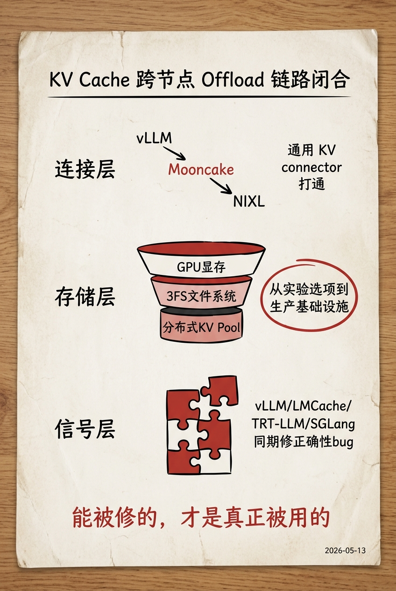

# 今日焦点：KV Cache Offload 跨框架打通，推测解码升格为系统组件

**📅 2026-05-13**

> KV cache offload 链路在 vLLM、LMCache、NIXL、TRT-LLM 四个项目同步闭合从连接器到存储后端到正确性修复的拼图；推测解码的 bug 修复密度说明它已被认真用起来。

---

## 推理侧

**MooncakeStoreConnector 合入 vLLM[1]** - vLLM 此前只能走自研 KV connector 访问 offload 存储，此 PR 让任何走 KV connector 的场景都能访问 Mooncake 分布式 KV pool，扩展的是 offload 接入面而非单点优化，属于 **[持续更新]**。

**vLLM 修 KV offload 可靠性与接口协议化[2][3][4]** - `wait_for_save=False` 路径下 store 被静默丢弃的可靠性 bug 修复[2]；hybrid 模型新增带语义标签的 KV cache metadata 事件为 LMCache 等外部消费者提供稳定接口[3]；NIXL connector 依赖升级到 1.x 锁定上游[4]，属于 **[持续更新]**。

**LMCache 接入 3FS 存储 tier + PD 全异步[5][6]** - 字节 3FS 分布式文件系统首次进入 offload 存储 tier[5]；PD backend 变 fully async，`batched_submit_put_task` 不再阻塞 worker 线程等 RDMA 完成，PD 路径延迟直接改善[6]，属于 **[持续更新]**。

**TRT-LLM 修 KV 页面泄漏与 token offset 错误[7][8]** - V2 delay batching 路径下 context 请求关闭不释放 KV 页面导致内存泄漏[7]；分布式 KV 跨节点传输中 token offset 计算有误[8]。这类补丁不性感，但直接影响长时间运行稳定性。

整套 offload 链路的关键转变：从单框架实验选项变为跨框架、跨存储层级的协作基础设施，每个补丁都在消除"能跑"和"可靠跑"之间的缝隙。

**PEagle 接入 vLLM speculators[9]** - parallel_drafting 开箱即用；MRV2 rejection sampler 切 synthetic mode 与 MRV1 对齐[10]，消除路径分歧。

**TRT-LLM 修 Eagle3 内存与 Blackwell 稳定性[11][12]** - 每次 CUDA graph capture 重分配 hidden_states buffer 改为预分配复用，warmup 内存开销大幅下降[11]；修了 SM120 上 allReduce cluster launch 未生效导致 Eagle3 四卡测试不稳[12]。

**SGLang 修 Eagle RoPE position 与 hidden_states 冗余[13][14]** - `positions.add_(1)` 在 forward 前执行导致 position 偏移[13]；STANDALONE draft worker 不需要 hidden_states 却仍在 capture 和 copy，现在 optional schema 让整条路径跳过[14]。

**llama.cpp 合入 parallel drafting[15]** - draft context 可为多 sequence 并行生成推测。

四个框架在同一窗口内修 Eagle 系列生产 bug——这种修复密度说明推测解码已从探索特性转为需要常规维护的系统组件。

**vLLM MoE 重构五 PR 集中合入[21][22][23][24][25]** - eplb_state 替换 enable_eplb flag[21]；RoutedExperts alias 引入并移除 SharedExperts[22]；expert map 逻辑独立为 ExpertMapManager[23]；experts 类收口到独立目录[24]；sequence parallel 测试覆盖[25]。全部指向大规模 Expert Parallelism 重构，已进入不可逆阶段。

## 生产部署侧

**vLLM 合入 MXFP4 linear layers[16]** - 对接 compressed-tensors 量化路径，MXFP4 从 Blackwell 专属特性走向通用服务框架。W8W8 group quant kernel 用 2D grid 消除 divmod 开销[17]。

**llama.cpp WebGPU 首次支持 MXFP4 MUL_MAT[18]** - gpt-oss-20b 成为可运行目标。同一个量化格式在 CUDA 服务框架和 WebGPU edge runtime 同步落地，MXFP4 已越过 Blackwell 专属特性的阶段。

**SGLang 释放 NVFP4 冗余 source scale tensors[19]** - 权重处理后不再读取的 scale 直接释放，降低显存占用。

**TRT-LLM 修 MoE FP8+FP4 混合精度 autotune 性能[20]** - autotune 路径下混合精度性能回归得到修复。

## 应用侧

**llama.cpp 三个异构后端同期提速[26][27][28]** - Hexagon HVX 用 splat helper 消除 scalar VTCM load，matmul 和 flash attention 均受益[26]；Adreno OpenCL 新增 xmem F16xF32 GEMM prefill 路径[27]；Metal 把 batch divisor 升为 function constant 减少 dispatch 开销[28]。五个 release 密集发出，edge/mobile 推理从"能跑"进入"要跑快"。

**llama.cpp CUDA 内部 AllReduce 与 Vulkan FA[29][30]** - CUDA provider 内部 AllReduce kernel 让 tensor parallelism 在无 NCCL 的 Windows 环境下性能大幅改善[29]；Vulkan FA 支持不对称 K/V 类型[30]。

---

> 一句话结论：**KV offload 链路跨四项目从实验走向生产，推测解码从探索特性转为系统组件——能被修的东西才是真正在被用的东西。**

---

## 参考

[1] vLLM: Add MooncakeStoreConnector for KV cache offloading：https://github.com/vllm-project/vllm/pull/40900

[2] vLLM: Fix store deferral in kv_offload：https://github.com/vllm-project/vllm/pull/41945

[3] vLLM: feat(kv-events): emit KV cache metadata：https://github.com/vllm-project/vllm/pull/40984

[4] vLLM: [PD] Bump NIXL connector dependency to 1.x：https://github.com/vllm-project/vllm/pull/42364

[5] LMCache: Support 3FS storage backend：https://github.com/LMCache/LMCache/pull/3120

[6] LMCache: fully async PD backend：https://github.com/LMCache/LMCache/pull/3038

[7] TRT-LLM: Release deferred ctx KV pages in V2 delay batching：https://github.com/NVIDIA/TensorRT-LLM/pull/13805

[8] TRT-LLM: Decouple cached prefix from KVSlice token_range：https://github.com/NVIDIA/TensorRT-LLM/pull/13937

[9] vLLM: Added peagle speculators support：https://github.com/vllm-project/vllm/pull/41826

[10] vLLM: Apply synthetic mode to probabilistic rejection sampler：https://github.com/vllm-project/vllm/pull/41035

[11] TRT-LLM: Reuse hidden_states buffer across CUDA graph captures in Eagle3：https://github.com/NVIDIA/TensorRT-LLM/pull/13920

[12] TRT-LLM: Fix cluster launch enablement for SM120 GPUs：https://github.com/NVIDIA/TensorRT-LLM/pull/13169

[13] SGLang: Fix Eagle draft decode positions：https://github.com/sgl-project/sglang/pull/25015

[14] SGLang: spec: STANDALONE skips hidden_states end-to-end：https://github.com/sgl-project/sglang/pull/25037

[15] llama.cpp: spec: parallel drafting support：https://github.com/ggml-org/llama.cpp/pull/22838

[16] vLLM: MXFP4 Support for linear layers + compressed-tensors integration：https://github.com/vllm-project/vllm/pull/41664

[17] vLLM: Use 2D-grid to eliminate divmod in W8W8 group quant：https://github.com/vllm-project/vllm/pull/42153

[18] llama.cpp: ggml-webgpu enables running gpt-oss-20b：https://github.com/ggml-org/llama.cpp/pull/22906

[19] SGLang: perf(nvfp4): free unused source scales after weight processing：https://github.com/sgl-project/sglang/pull/25107

[20] TRT-LLM: Follow-up patch for MoE autotune in DEP：https://github.com/NVIDIA/TensorRT-LLM/pull/13971

[21] vLLM: MoE Refactor - EPLB refactoring for FusedMoE：https://github.com/vllm-project/vllm/pull/41055

[22] vLLM: MoE Refactor - Introduce RoutedExperts alias：https://github.com/vllm-project/vllm/pull/40735

[23] vLLM: MoE Refactor - Move expert map code into ExpertMapManager：https://github.com/vllm-project/vllm/pull/41046

[24] vLLM: MoE Refactor - Move remaining experts classes to experts directory：https://github.com/vllm-project/vllm/pull/42334

[25] vLLM: MoE Refactor - Add sequence parallel tests：https://github.com/vllm-project/vllm/pull/41299

[26] llama.cpp: hexagon: eliminate scalar VTCM loads via HVX splat helpers：https://github.com/ggml-org/llama.cpp/pull/22993

[27] llama.cpp: ggml-opencl: add opt-in Adreno xmem GEMM for prefill：https://github.com/ggml-org/llama.cpp/pull/22755

[28] llama.cpp: metal: promote mul_mv/mul_mm batch divisors to function constants：https://github.com/ggml-org/llama.cpp/pull/22711

[29] llama.cpp: internal AllReduce kernel for CUDA provider：https://github.com/ggml-org/llama.cpp/pull/22299

[30] llama.cpp: vulkan: Support asymmetric FA in scalar/mmq/coopmat1 paths：https://github.com/ggml-org/llama.cpp/pull/22589