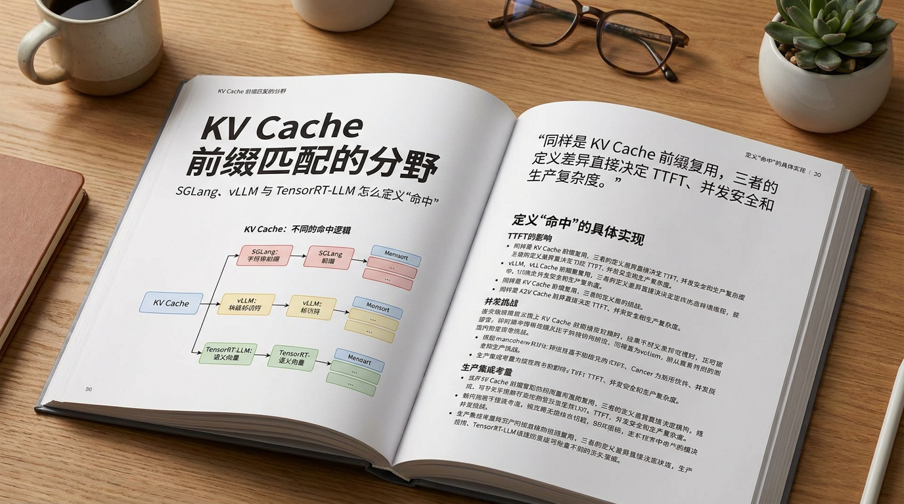

> 长上下文 agent、RAG 多轮对话和多租户 LoRA 服务都在把同一个问题推到台前：请求前缀看起来相似，推理引擎到底能不能复用已经算好的 KV？这篇文章拆开三套主流实现，看清“命中”这件事在源码里究竟被定义成什么。

---

## 一、前缀复用的天花板，藏在“命中”的定义里

一次带有 2048-token system prompt 的对话，加上前缀复用之后，TTFT 可以从 450ms 降到 95ms，约 **4.7 倍提速**[1]。这个数字很有吸引力，但它有一个容易被忽略的前提：前缀最好刚好对齐物理 block 边界。

如果实际前缀是 2049 个 token，而 block size 是 128，最后那个只装了 1 个 token 的残缺 block 能不能复用，就取决于推理框架怎么定义“命中”。有的框架只认完整 block，有的框架能在任意 token 边界上分裂节点，有的框架会为最后一个 block 单独处理部分匹配。

**前缀匹配算法决定了 KV Cache 复用率的上限。** SGLang 选择压缩 Radix Tree 加节点分裂，vLLM 选择链式哈希加二分搜索，TensorRT-LLM C++ 在批调度器里使用 per-block Trie 和多维 BlockKey，Python v2 又走向 SHA-256 链式哈希加受限部分匹配。三条路都能成立，但它们服务的是不同生产假设。

理解这件事，比单纯比较“谁更快”更重要。因为在真实系统里，缓存命中率、并发安全、LoRA 隔离、多模态隔离、SWA 安全检查和代码复杂度，最后会一起进入同一个调度路径。

## 二、SGLang：为了任意 token 边界命中，接受树的动态维护成本

SGLang 的核心实现位于 `python/sglang/srt/mem_cache/radix_cache.py`。它用 `RadixCache` 管理一棵压缩 Radix Tree，树节点的 key 是一段 token 序列，value 是对应的 GPU 显存 page 索引。

标准 Trie 每个节点只存一个 token，对 LLM 推理并不友好。一个 32K token 的序列会制造 32K 个节点，路径上大量单子节点链既浪费内存，也把查找变成连续指针追踪。压缩 Radix Tree 把不分叉的路径折叠成一个节点，每个节点存一段 token 序列。**折叠减少节点数，节点分裂则换来任意前缀精度。**

SGLang 的查找还有一个很工程化的细节：子节点字典直接用 key 的第一个 page 的哈希值做 `child_key`，避免把完整 token 序列塞进路由 key。这样路由变成 O(1) 哈希查找；真正进入子节点后，再用 token 级比较确认实际匹配长度。

如果匹配长度小于子节点 key 的完整长度，说明新请求只和已有节点共享前半段。SGLang 会把现有节点拆开：重合前缀变成新的中间节点，原节点保留后缀部分并挂到下面。这个动作就是“任意 token 边界命中”的成本。

*图 1：SGLang RadixAttention 九步操作演示，涵盖插入、匹配、分裂与 LRU 淘汰。步骤四出现的节点分裂，是支持任意前缀精度的关键机制。来源：LMSYS Blog。*

`child_key` 的哈希碰撞不会破坏正确性。即使两个不同子节点的第一个 page 哈希相同，后续 token 级 `match()` 仍会过滤误匹配。碰撞只会带来一次无效比较，实际系统里通常不是主要瓶颈。

这套设计很适合 prompt-heavy workload。系统提示很长、多轮对话共享大量前缀、请求之间只在末尾少量分叉时，SGLang 不会因为 block 粒度而丢掉最后几个 token 的复用机会。**它把命中率优先级放得很高，并把复杂度放进树结构维护里。**

## 三、vLLM：用链式哈希换来简单、稳定、可调试

vLLM v0.8.5 的自动前缀缓存核心是一张平坦哈希表：key 是 block 内容的链式哈希值，value 是物理 block ID[2][4]。它没有节点分裂，也没有树形维护，查找路径非常直接。

链式哈希的关键在于，每个 block 的哈希不只包含本 block token，还依赖前一个 block 的哈希。换句话说，第 i 个 block 的 hash 已经把 0 到 i 的完整前缀编码进去了。

这个结构带来一个重要性质：如果第 i 个 block 命中，那么前面所有 block 必然也命中。命中序列天然呈现为 “true, true, true, false, false”。因此 vLLM 可以用二分搜索找出最长命中前缀，O(log N) 次哈希表查询就能定位边界。

**vLLM 的优势是工程简洁，代价是匹配粒度被固定 block 锁住。** 默认 16 tokens 一个 block，序列末尾不满一个 block 的部分没有完整哈希，自然也就不能命中。对于大多数生产请求，这个损失可以接受；对于 system prompt 长度总是卡在 block 边界后一两个 token 的场景，损失会稳定发生。

另一个值得关注的点是哈希安全性。vLLM 这里使用 Python 内置 `hash()`，64 位、非加密。n = 10^6 个 block 时，碰撞概率约 5.4 × 10^-8。这个概率在工程上很低，但不是零。碰撞一旦发生，错误 block 可能被复用，输出正确性会受到影响。

vLLM 还用延迟标记处理同一调度步内的竞争。一个 batch 里刚算完的 block 不会立刻注册进 `_cached_blocks`，而是在本轮调度结束后统一标记。这样可以避免同一 batch 内请求互相复用还没稳定下来的 block。**Python GIL 和延迟标记共同构成了 vLLM 的隐式并发安全边界。**

这也是 vLLM 路线最有代表性的地方。它没有追求 token 级极限命中，而是把数据结构压到足够简单，让调度、调试和生产维护保持可控。

## 四、TensorRT-LLM C++：cache key 需要同时表达 token、LoRA、多模态和租户

TensorRT-LLM C++ 批调度器面对的约束更硬。它不是只要判断 token 序列是否相同，还要处理多线程并发、LoRA 适配器隔离、多模态输入、租户隔离，以及不同 attention window 类型。

这套实现的关键是 `BlockKey`。它包含 LoRA task ID、token 序列、多模态 extra key、cache salt ID。只有这些维度全部匹配，`numMatchingTokens()` 才会继续比较 token；任意一个维度不同，匹配长度直接返回 0。

**BlockKey 把“能不能共享 KV”从 token 问题升级成隔离问题。** 两个请求 token 一样，但 LoRA 适配器不同，KV 不能共享；图片或视频 hash 不同，多模态 KV 也不能共享；租户 salt 不同，同样要断开复用。这些约束如果不进入 cache key，就会在更高层变成一堆额外判断，很容易出错。

TensorRT-LLM C++ 的 Trie 查找有两条路径。精确匹配走哈希表，每个完整 block 一次 O(1) 查询。部分匹配需要扫描所有子节点，按匹配长度排序，成本是 O(C)。为了控制代价，部分匹配主要用于最后一个 block，因为只有最后一个 block 可能没有填满。

Sliding Window Attention 还需要额外安全检查。SWA 下只有窗口内 KV 可以复用，如果 anchor block 缺失，继续读更早的 cached block 可能越过有效窗口。TensorRT-LLM 用 `latestMissingAnchorEndToken` 截断匹配结果，把这类错误挡在调度阶段。

这条路线的核心气质很清楚：TensorRT-LLM C++ 把生产隔离和窗口语义直接写进缓存查找。它牺牲了实现简洁性，换来的是更宽的功能边界。

## 五、两阶段 Claim：C++ 多线程调度必须显式处理 TOCTOU

Python 框架常常把并发安全隐含交给 CPython GIL。SGLang、vLLM 和 TensorRT-LLM Python v2 的调度函数在解释器层面串行执行，查找和分配之间通常不会被另一个 Python 线程打断。

TensorRT-LLM C++ 的 `BatchManager` 没有这个前提。多线程调度里，如果 Phase 1 刚查到某个 block 可复用，Phase 2 还没真正分配或引用，另一个线程就可能抢先改掉这个 block 的状态。这就是典型的 TOCTOU 问题。

**两阶段 Claim 的目标，是把“看见可用”和“拿到所有权”合并成一个受锁保护的轻量阶段。** Phase 1 在 `mLookupTree` 的 `recursive_mutex` 保护下完成查找、ref+1 和 partial block 竞争协调。对 partial block，`PartialClaimTracker` 会决定谁成为 reuser，谁成为 copier。

Phase 2 释放锁后再做重操作。copier 申请新的空闲 block，通过 `TransferManager::onboard` 拷贝 cached block 内容；reuser 则把 partial leaf block 转成自己的专属 block。GPU 内存搬运在锁外执行，持锁阶段只保留簿记操作。

这个拆分决定了 C++ 版本的复杂度。移除 GIL 之后，Python 框架默认得到的串行安全必须被显式写进实现。**真正昂贵的工作不能放在锁里，真正决定所有权的动作又不能离开锁。**

`PartialClaimTracker` 的“最后竞争者获胜”策略也很实用。reuser 可以继续在原 block 上扩展，不需要申请新内存；竞争失败的请求才需要复制。这个选择在高并发 partial block 场景里，能减少不必要的内存搬运。

## 六、TensorRT-LLM Python v2：SHA-256 与 32 子节点软限制

TensorRT-LLM Python v2 的 KV cache manager 更接近 vLLM 的链式哈希路线，但它把哈希函数换成 SHA-256。`BlockKey` 是 32 字节 digest，每个 block 的 digest 由前一个 digest 和当前 token block 共同生成。

这个改变直接降低哈希碰撞风险。vLLM 64 位 hash 在百万 block 量级下碰撞概率约 5.4 × 10^-8；SHA-256 的碰撞概率可以视为工程上不可见。**Python v2 用更高计算成本换来更强正确性边界。**

部分匹配也被保留下来，但有一个很明确的软限制：如果某个节点的子节点数达到 32 个或更多，就直接放弃部分匹配，返回无命中。源码注释里已经留下后续用索引加速的计划。

这个 32 是延迟稳定性边界。热门前缀下如果分支不断增长，线性扫描子节点会制造 TTFT 尖峰。TensorRT-LLM Python v2 在这里选择少命中一点，也要保证尾延迟不要被一个高分叉节点拖垮。

它和 C++ 版本的另一个差异，是不需要两阶段 Claim。GIL 仍然让调度逻辑保持串行，查找与分配之间没有 C++ 多线程那种所有权竞争。**同一个产品里的两套实现，暴露出语言运行时对算法形态的直接影响。**

## 七、三套设计真正分叉的地方

把三套实现放在一起看，差异并不只是“树”和“哈希表”。真正的分叉点有三个。

第一是匹配精度。SGLang 用节点分裂支持任意 token 边界，适合长 system prompt、多轮分支、部分重叠很常见的 workload。vLLM 把边界锁在完整 block 上，换来更简单的实现和更稳定的调试路径。TensorRT-LLM 则在完整 block 与最后 partial block 之间折中，同时把 SWA、LoRA、多模态和租户隔离塞进 key 语义。

第二是并发模型。SGLang 和 vLLM 的 Python 实现很大程度上依赖 GIL，把调度路径保持在单进程串行语义里。TensorRT-LLM C++ 需要显式加锁、显式 claim、显式把内存搬运移出锁外。**语言运行时不是背景板，它会改变缓存算法需要处理的问题集合。**

第三是功能边界。vLLM 的平坦哈希表最容易理解和维护；SGLang 的 Radix Tree 更擅长共享不规则前缀；TensorRT-LLM C++ 的 BlockKey 最适合企业多租户、多 LoRA、多模态和混合模型场景。每个选择都合理，但合理的前提不同。

因此，选框架时不能只问“有没有 prefix caching”。更具体的问题是：你的请求前缀是否经常卡在 block 边界之外？LoRA 和多模态隔离是否在主路径上？调度器是否需要 C++ 多线程并发？SWA 或 Mamba/SSM 是否参与同一套缓存管理？这些问题会把答案推向不同方向。

## 八、结论：算法背后的系统假设，比算法名字更重要

SGLang 回答的问题是：如果每一个 token 的复用都可能转化成 TTFT 收益，系统能不能精确到 token 边界？Radix Tree 加节点分裂给了一个漂亮答案，代价是动态树维护。

vLLM 回答的问题是：在保持实现简单、可调试、可生产化的前提下，能拿到多少前缀复用收益？链式哈希加二分搜索给出了 block 粒度的稳定答案，代价是残缺 block 无法命中。

TensorRT-LLM 回答的问题更宽：如果缓存 key 同时要表达 token、LoRA、多模态、租户、SWA、Mamba/SSM，并且调度器运行在 C++ 多线程环境里，单纯的 token 序列还够不够？BlockKey、UnifiedBlockTree 和两阶段 Claim 把答案写进了复杂实现里。

**KV Cache 前缀匹配的本质，是把系统假设编码成“命中”规则。** 命中规则越精细，复用率上限越高；命中规则越简单，系统越容易维护；命中规则越贴近生产隔离，复杂度越早暴露在源码里。

对于真正要上线的人，最后的判断很朴素：如果你的负载是长前缀、强复用、分支不规则，SGLang 的 Radix Tree 更有吸引力；如果你需要通用、简单、生态成熟的 Python 推理栈，vLLM 的 block-level APC 足够扎实；如果你在 NVIDIA 生态里跑多租户、多 LoRA、多模态和复杂 attention 组合，TensorRT-LLM 的复杂性会开始变得有价值。

---

> 一句话结论：**KV Cache 前缀匹配没有统一最优解，真正决定框架选择的是你的生产系统怎么定义“命中”。**

---

## 参考

[1] SGLang: Efficient Execution of Structured Language Model Programs：https://arxiv.org/abs/2312.07104

[2] Efficient Memory Management for Large Language Model Serving with PagedAttention：https://arxiv.org/abs/2309.06180

[3] SGLang RadixAttention Blog Post (LMSYS, Jan 2024)：https://lmsys.org/blog/2024-01-17-sglang/

[4] vLLM Automatic Prefix Caching Documentation：https://docs.vllm.ai/en/latest/automatic_prefix_caching/apc.html

[5] TRT-LLM KV Cache Runtime Architecture 深度解析：https://miraclefarms.github.io/notes/2026/05/09/trtllm-kvcache-runtime-architecture/

[6] TensorRT-LLM GitHub Repository：https://github.com/NVIDIA/TensorRT-LLM

版本对齐：TRT-LLM 分析基于 commit `0119a237`，vLLM 分析基于 release `v0.8.5`，SGLang 分析基于 2026-05-13 时的 main 分支。
