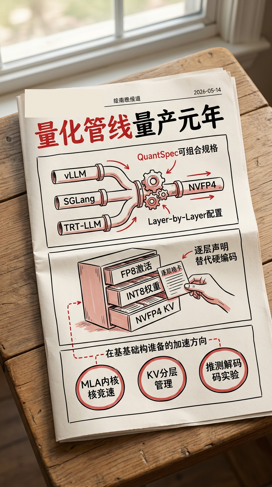

**📅 2026-05-14**

> DeepSeek V4 与 GPT-OSS 的量化上线窗口正在一起压缩：今天 vLLM、SGLang、TRT-LLM 的 NVFP4 PR，决定新格式能不能从实验配置进入默认服务。

---

## 推理侧

**QuantKey/QuantSpec 量化配置重写[1]** - 原来 OnlineQuantScheme 枚举无法按层精确覆盖激活量化方式，vLLM 引入 QuantSpec(weight, activation) 替代枚举，允许按 layer name 精确寻址并独立覆盖 activation 量化方式，"第 37 层用 FP8 激活、其余层用 INT8"从手动 hack 变成配置声明。同窗口合入 Quark NVFP4 checkpoint 加载[2]和 NVFP4 KV sliding window page size 修复[3]，让 GPT-OSS 在 NVFP4 全链路可正确运行。SGLang 修复 NVFP4 权重热重载崩溃[7]——当量化变成 per-layer 规格组合，权重生命周期管理也要跟上，属于 **[持续更新]**。

**NVFP4 跨框架同日就位[5][8]** - SGLang 接入 MXFP4 MoE[5]，TRT-LLM 正式支持 DSV4 NVFP4[8]。NVFP4 作为 DeepSeek V4 / GPT-OSS 的主力量化格式，今天跨三大框架同时就位，是该规格系统的首次量产验证。

**推测解码开放自定义提案者[17]** - 原来只能用厂商预置的 drafter 方案，vLLM 合入自定义 callable proposer 后端，研究者可直接传 Python callable 当 drafter，不用加载完整 HF 模型——这是推测解码从"厂商预置方案"走向"研究者可快速实验新策略"的分界点。配套地，hidden-state 提取支持 Qwen3.5 等混合注意力模型[18]，verifier 移除硬编码白名单改为能力检测[19]。EAGLE3 侧 lm_head 从 94μs 继续下压[23]，drafter 循环里每微秒都在被榨干，属于 **[持续更新]**。

**MLA 内核竞速白热化[26][29]** - SGLang 正式集成 tokenspeed_mla 覆盖 fp8 KV cache 和 Blackwell[26]，vLLM 在 ROCm 侧接入 aiter mhc 内核[29]。SGLang 补齐 MLA LoRA 的 q_b_proj / kv_b_proj 支持[27]，修复 AMD 双重 RoPE 旋转[28]。DeepSeek MLA 已经成为跨框架、跨硬件的内核竞争焦点，属于 **[持续更新]**。

---

## 生产部署侧

**KV Offload 从"通不通"转到"怎么管"[10][11]** - 搬完 KV 之后的管理成为新焦点：vLLM 合入多级 KV offload 框架，扩展链式二级 tier[10]，为 OffloadingManager 注入 per-request 身份追踪[11]。LMCache 把 PD 后端改为 fire-and-forget enqueue，worker 不再阻塞等待远程 alloc + RDMA write[12]，用 batched_contains() 替代逐 key 串行查询[13]。Mooncake 引入 ObjectDataType 枚举让元数据层感知存储类型[14]，扩展 DSA 式分配策略基准[15]。分层存储、类型感知、非阻塞传输——KV offload 核心竞争力从"能不能搬"变成"搬完怎么管"，属于 **[持续更新]**。

---

## 工具链

**TokenSpeed 从概念验证到一行命令可用[33]** - `ts serve` 合入 SMG gateway + gRPC 引擎，一行命令启动 OpenAI 兼容推理服务[33]。CLI 体验补齐：默认端口 8000[34]、position model 参数[37]、启动 banner[36]。Kimi K2.5 专属优化链成型，mamba prefix cache 消除 snapshot 中的 cudaStreamSynchronize[39]。一周前还是 30+ PR 的概念验证，今天已经是 `pip install && ts serve model` 就能跑起来的推理服务，属于 **[持续更新]**。

---

> 一句话结论：**量化配置从枚举硬编码走向可组合规格，NVFP4 跨三大框架同日就位是规格系统的首次量产验证——新格式和新模型的适配周期将被大幅压缩。**

---

## 参考

[1] vLLM #41566: Rework quantization_config to use QuantKey：https://github.com/vllm-project/vllm/pull/41566

[2] vLLM #35859: Support loading Quark NVFP4 checkpoints：https://github.com/vllm-project/vllm/pull/35859

[3] vLLM #42464: Patch SlidingWindowSpec for nvfp4 kv：https://github.com/vllm-project/vllm/pull/42464

[5] SGLang #24816: Add FlashInfer SM90 MXFP4 MoE backend：https://github.com/sgl-project/sglang/pull/24816

[7] SGLang #25190: Fix nvfp4 hot-reload crash：https://github.com/sgl-project/sglang/pull/25190

[8] TRT-LLM #14026: Support NVFP4 dsv4：https://github.com/NVIDIA/TensorRT-LLM/pull/14026

[10] vLLM #40020: Add multi-tier KV cache offloading framework：https://github.com/vllm-project/vllm/pull/40020

[11] vLLM #42507: Add req_id to ReqContext for per-request tracking：https://github.com/vllm-project/vllm/pull/42507

[12] LMCache #3038: Fully async PD backend：https://github.com/LMCache/LMCache/pull/3038

[13] LMCache #2966: Add batched_contains()：https://github.com/LMCache/LMCache/pull/2966

[14] Mooncake #1719: Add ObjectDataType enum：https://github.com/kvcache-ai/Mooncake/pull/1719

[15] Mooncake #2080: Add DSA-like workload allocation strategy：https://github.com/kvcache-ai/Mooncake/pull/2080

[17] vLLM #39487: Support custom callable proposer backend：https://github.com/vllm-project/vllm/pull/39487

[18] vLLM #39949: Support hybrid attention models in hidden state extraction：https://github.com/vllm-project/vllm/pull/39949

[19] vLLM #42536: Remove verifier model type check：https://github.com/vllm-project/vllm/pull/42536

[21] TokenSpeed #78: Fuse embeds and hidden norm in MLA eagle3：https://github.com/lightseekorg/tokenspeed/pull/78

[22] TokenSpeed #124: Enable AR-Norm fusion and fused FP8 decode for MLA Eagle3：https://github.com/lightseekorg/tokenspeed/pull/124

[23] TokenSpeed #126: Optimize lm_head：https://github.com/lightseekorg/tokenspeed/pull/126

[26] SGLang #24925: Integrate tokenspeed_mla prefill/decode kernels：https://github.com/sgl-project/sglang/pull/24925

[27] SGLang #25001: MLA attention LoRA q_b_proj / kv_b_proj support：https://github.com/sgl-project/sglang/pull/25001

[28] SGLang #24148: Add _skip_rope_for_aiter_fused_mla：https://github.com/sgl-project/sglang/pull/24148

[29] vLLM #41946: Add aiter mhc support：https://github.com/vllm-project/vllm/pull/41946

[33] TokenSpeed #97: ts serve — smg gateway + gRPC engine：https://github.com/lightseekorg/tokenspeed/pull/97

[34] TokenSpeed #114: Default SMG serve port to 8000：https://github.com/lightseekorg/tokenspeed/pull/114

[36] TokenSpeed #127: Print TokenSpeed banner on ts serve startup：https://github.com/lightseekorg/tokenspeed/pull/127

[37] TokenSpeed #128: Accept positional model arg in ts serve：https://github.com/lightseekorg/tokenspeed/pull/128

[39] TokenSpeed #77: Optimize mamba prefix cache performance：https://github.com/lightseekorg/tokenspeed/pull/77
